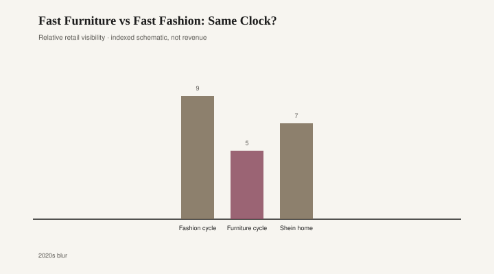

# Fast Furniture vs Fast Fashion: Same Clock?

*Draft stub — copy and body pending editorial pass. Graphics are staged for layout.*

<figure class="fffb-figure">
  
  <figcaption>Typical trend half-life (schematic, not corporate disclosure).</figcaption>
</figure>
