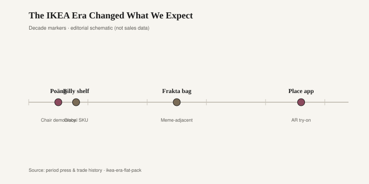
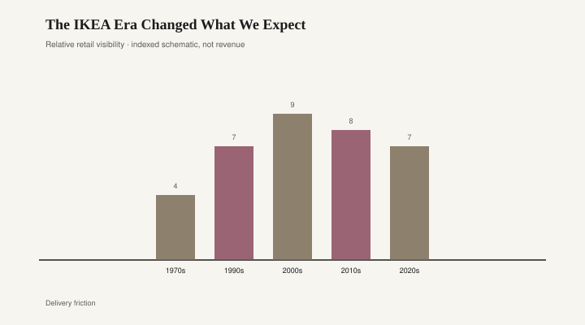

# The IKEA Era Changed What We Expect

*Draft stub — copy and body pending editorial pass. Graphics are staged for layout.*

<figure class="fffb-figure">
  
  <figcaption>IKEA milestones that trained taste toward modularity.</figcaption>
</figure>

<figure class="fffb-figure">
  
  <figcaption>Flat-pack visibility indexed against US shelter media mentions (schematic).</figcaption>
</figure>
