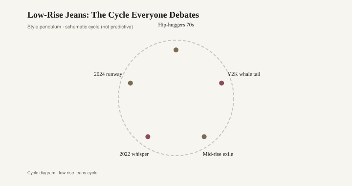

# Low-Rise Jeans: The Cycle Everyone Debates

Denim is the fastest clock in the closet. Hem widths and rises move on a shorter beat than almost any other garment, because jeans are cheap enough to replace and visible enough to argue about. The low-rise debate is not really about comfort. It is about where a generation draws a line on the hip, and how quickly the next generation redraws it.

A rise is a number on a tech pack: the inches from crotch seam to waistband. Designers move that number the way they move a hem. The 2000s version is easy to picture because it was photographed so often. Britney Spears stepping out of a car in a pair that sat on the pelvic bone. Christina Aguilera in the "Dirrty" video. Paris Hilton and Nicole Richie on a sidewalk in Los Angeles, midriff between a cropped knit and a belt that was doing structural work. The jeans themselves came from a short list of labels that defined that decade's denim floor: True Religion with the thick stitching and the horseshoe on the pocket, 7 For All Mankind, Citizens of Humanity, later Joe's and Hudson. A splash of whiskering. A hint of flare or a bootcut that stacked on a mule. Von Dutch trucker hats and Juicy Couture velour sat in the same photograph. The rise was the point.

There had been low waists before. The 1970s hip-hugger, the 1990s version on Kate Moss and on a Calvin Klein billboard, the club kid who bought a pair at Trash and Vaudeville. The 2000s made the cut a default. Department stores stacked it. Mall brands copied it. A teenager who wanted a "normal" jean was sold a low one, often in a stretch blend that clung and then bagged at the knee.

Then the line climbed. By the early 2010s, high-rise skinny jeans — Topshop's Joni, later Madewell and a dozen others — had become the new default. The low-rise pair went to the back of the closet or to a donation bag. People spoke about it the way they speak about a haircut they regret: with affection and a wince in the same sentence.

<figure class="fffb-figure">
  
  <figcaption>Denim rises trace youth marketing more than ergonomics.</figcaption>
</figure>

The revival arrived in public around 2021 and ran hard through 2023. Bella Hadid wore a pair that looked pulled from a 2003 nightclub. Hailey Bieber did the same in a cleaner, more editorial register. Blumarine, under Nicola Brognano, put a rhinestone butterfly on a low waist and made the reference explicit. Diesel, after Glenn Martens took over, treated denim as a joke that still fit. Miu Miu's micro-mini and hip-slung waistband did the work on a runway. Depop and The RealReal filled with True Religion and faded Citizens. The rise dropped again, not because hips changed, but because a cohort that had grown up on high-rise wanted the photograph their older cousins had.

The argument that followed was familiar. Commentators called the cut unflattering, dated, or a plot against women. Wearers called it a waistband that sits where they want it. Both sides talked as if a jean could be morally settled. It cannot. Rise is a fashion measurement. It moves because fashion moves, and denim moves first because the supply chain is built to reprint a rise in a season.

If there is a furniture rhyme, it is not "jeans equal sofas" in a cute caption. It is the height of a skirt on a sofa, and whether a leg is allowed to show. A skirted sofa of the 1990s and early 2000s — chintz or a plain cotton duck, the fabric running to the floor — hides the legs the way a high-rise hides the hip. A mid-century piece on tapered walnut, or a 2010s apartment sofa on thin metal, exposes the structure. When taste wants more flesh in the photograph, the sofa loses its skirt and the jean loses its rise. When taste wants cover, both get dressed again.

You can see the swing in the same living rooms that bought a cloud-soft sectional and then, a few years later, a vintage Knoll or a thrifted Danish teak piece with the legs left bare. The room is not copying Britney. It is running the same clock: how much support do you show, and how much do you drape?

The low-rise jean will recede again. It always does. Someone will keep a pair because they like them, which is the only durable reason to own denim. The rest is youth marketing, a camera, and a waistband that can be moved an inch for a new season. That is not a scandal. It is how the fastest clock in the closet keeps time.
