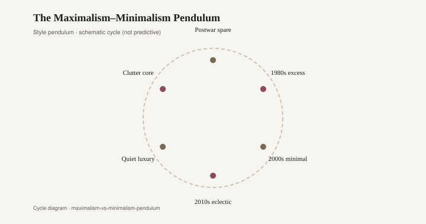

# The Maximalism–Minimalism Pendulum

*Draft stub — copy and body pending editorial pass. Graphics are staged for layout.*

<figure class="fffb-figure">
  
  <figcaption>Shelter media tends to overcorrect every seven to ten years.</figcaption>
</figure>
