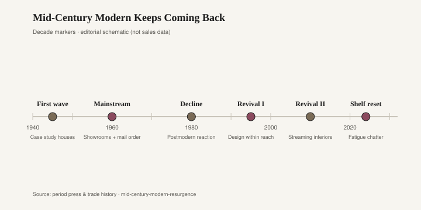
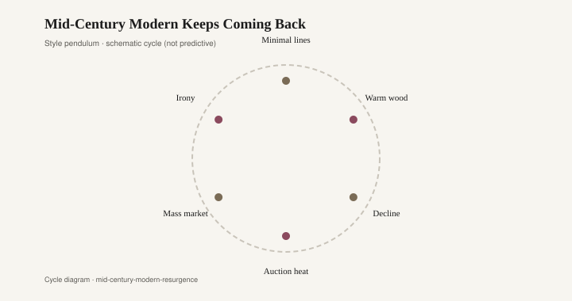
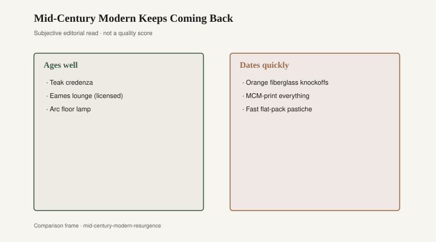

# Mid-Century Modern Keeps Coming Back

The drink is sweating on the ottoman, which is how you know the lounge is off duty. Across from it sits a molded plywood shell — or a photograph of grain repeating every eighteen inches — and a metal spine that is either welded or merely implied. Charles and Ray Eames sent the lounge and ottoman out of Herman Miller in 1956 as a factory argument, priced like one, never meant to be the whole room. In the apartment in front of you it is often the password. If the silhouette reads from the kitchen, the listing can say “Eames style” and stop. The name once meant Zeeland, Michigan, and two designers in California. It now means a shape that can arrive by Friday.

Mid-century modern was never a single year. It was a twenty-year argument: George Nelson at Herman Miller; Florence Knoll and Eero Saarinen at Knoll; the Danish export wave — Hans Wegner’s Round Chair (often called The Chair), Finn Juhl, Arne Jacobsen’s Series 7 for Fritz Hansen. American suburbs took a thinner version — blonde suites from Bassett and Lane, a kidney coffee table, a starburst clock — and called it modern because the legs were tapered. The factory in Michigan and the factory in Virginia were not doing the same work. They were answering the same wish: a house that did not look like grandmother’s mahogany.

The first hangover arrived on time. By the mid-1970s, modern looked cold to a country buying Mediterranean oak and harvest gold. The Eames chair did not vanish; it went into offices and into the houses of people who had never believed the oak. Everyone else bought a carved suite and hung a macramé owl. That is a cycle, not a fall. The chair waited.

<figure class="fffb-figure">
  
  <figcaption>When MCM moved from architect-led to algorithm-led discovery.</figcaption>
</figure>

The boom people mean when they say “mid-century is back” started as retail education. Rob Forbes founded Design Within Reach in 1999; he has said the idea came in 1998, when he tried to furnish an apartment with the London modern an American trade gate would not let through. Early catalogs put designer biographies next to SKUs. Herman Miller, which had not been a mall brand, sold through DWR’s paper and then its stores. Herman Miller acquired DWR in 2015 — a tidy ending for a story about access: the factory absorbed the shop that had taught people to want the factory.

*Dwell* arrived on newsstands in October 2000, Lara Hedberg Deam’s magazine. Karrie Jacobs’s “Fruit Bowl Manifesto” insisted that modern houses were lived in — fruit on the table, not airless. The magazine did not invent the revival. It gave the revival a kitchen. Then *Mad Men* (AMC, 2007–2015) gave it a whiskey and a sofa people could point at without saying “Saarinen.” Television is a more efficient catalog than a catalog. You do not have to admit you are shopping.

What the boom sold, after a while, was not the chair. It was the password. West Elm, launched by Williams-Sonoma in 2002, put tapered legs on prices a first apartment could stand. Article, AllModern, Wayfair’s modern filters, the “mid-century walnut” finish that was a photograph of walnut — these made a silhouette into a default. Status changed. In 1962 the Eames lounge said you knew architects. In 2012 the knockoff said you watched the right show and you were not your parents’ Tuscan kitchen. Same silhouette, different boast.

<figure class="fffb-figure">
  
  <figcaption>The modern line tends to widen before it simplifies again.</figcaption>
</figure>

Authorized production is not innocent. Herman Miller and Vitra have spent decades policing a shape. Licensed chairs stay expensive because the name is the product as much as the shell. A person who buys the licensed chair is buying a factory’s continuity and a lawyer’s file. A person who buys the cheap version is buying a picture. Both are allowed. Only one will still be a chair when the picture is tired.

The hangover now is not that modern looks dated. Parts of it refuse to date, which is the problem. A Wegner wishbone — the CH24, Carl Hansen & Søn, from 1949 — still looks like a chair because it was a chair: steam-bent back, paper cord, a joint you can read. The hangover is the apartment in which every object is a wishbone’s cousin, in a walnut print, under a replica Sputnik, above a rug that is a copy of a copy of a David Hicks. The room does not look like 1956. It looks like 2014, a year that already has a flea-market section.

Danish teak of the 1950s and 1960s has a cleaner hangover because the originals were so often better than the copies. Real teak oilers know the weight. The copies are rubberwood or something called “teak finish.” Estate-sale prices for a Finn Juhl-attributed piece and a dining set that is only brown have split so far that the word “Danish” in a listing is a test of the seller, not the object. Chairish and 1stDibs made that split a market. Craigslist still hides the sleeper a person who knows joints can find.

What ages is almost insultingly simple. Molded plywood that is actually plywood. A metal base with a real weld. Leather that can be conditioned and, later, replaced. A teak table whose top is teak through the thickness. A case piece in solid hardwood — the kind a mill town still knows how to make — will outlast the password used as wallpaper. Bradley Brand Furniture, in Warren, Arkansas, puts the claim in company copy that is lumber-mill plain: Bradley Lumber, 1902; solid hardwood; no particleboard [CITE NEEDED]. That is a different boast from “Eames style” on a box that contains none of his decisions.

What dates is the password as décor: hairpin legs on a particleboard desk, the sunburst clock that was already a joke in 1998, sincere again in 2011, and a joke again if you wait. Knoll and Herman Miller had always sold to architects first. The revival sold to people who wanted to live as if an architect had already been there. Florence Knoll’s interiors were spare because the furniture was the decision. The hangover interiors are crowded because the furniture is the costume.

<figure class="fffb-figure">
  
  <figcaption>Materials and proportion age; novelty prints rarely do.</figcaption>
</figure>

Retail taught a generation that “authentic” was a SKU. Design Within Reach sold authorized pieces and also sold the idea that you were now the kind of person who knew the difference. The stores — glass, pale oak floors, a lounge on a plinth — were classrooms with price tags. You left knowing a designer’s name you had not known at lunch. That is a public service. It is also how a silhouette becomes homework. Once the homework is widely assigned, the knockoff is the crib sheet.

The cycle will turn again. It always does. A tapered leg is not a religion; it is a proportion that keeps being useful. The object that lasts is the one that was a chair, a table, a case — wood through the thickness, a joint you can read — not the one that was a password. The drink on the ottoman will ring. The licensed shell can take that. The printed ribbon of fake rosewood cannot.
