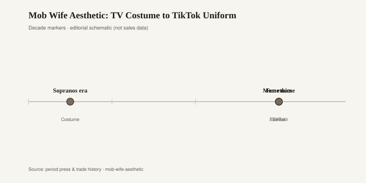

# Mob Wife Aesthetic: TV Costume to TikTok Uniform

In the winter of 2024 a costume left the television and clocked in as a uniform. TikTok called it mob wife: animal print, a fur-look coat that never met an animal, gold that arrived in sets, a nail long enough to hold a cigarette it would not light. The reference reel was obvious. Carmela Soprano’s camel coats. *The Real Housewives* of several counties. A hundred movies in which the wife waits in the car while the plot happens inside. Nobody needed a historian. The algorithm needed a search term.

Quiet luxury had spent 2023 asking everyone to whisper in beige. Mob wife was the answer that refused to whisper. It was also, in the way internet aesthetics are, already over as soon as it could be shopped. Shein and Amazon listed “mob wife coat” before the think pieces finished their openings. A look that began as a joke about *The Sopranos* became a shopping category with a size chart.

The clothes were never the invention. Animal print has been cycling since at least the 1960s, when Diane von Furstenberg’s jersey and a pile of fake leopard coats taught suburbs how to look expensive on a Friday. Fur-look is older than the app. Gold jewelry as armor is older than both. What 2024 added was the package and the caption. Wear the whole set at once, name the set, film the set getting into an SUV. Television costume, compressed.

Rooms have been running this program under a cleaner name. Hollywood Regency — Dorothy Draper’s cabbage roses and lacquer, later William Haines’s shine — never really left the coastal houses that could afford a second living room. Kelly Wearstler spent the 2000s and 2010s putting the volume back into print: leopard, snake, a chair that wanted to be a coat. Restoration Hardware’s animal-print pillows and ottomans did the mall version, which is to say the version you could return. The mob-wife winter was Wearstler with a Jersey accent and a shipping estimate.

<figure class="fffb-figure">
  
  <figcaption>Timeline for Mob Wife Aesthetic: TV Costume to TikTok Uniform.</figcaption>
</figure>

The fad’s speed was the tell. A television costume is designed to read in one establishing shot. That is also how a TikTok outfit is designed. You get three seconds to establish wife, money, threat, joke. Leopard does that work. A cashmere crewneck does not. So the feed chose leopard, then chose a new word the next month. Ballet-core, office siren, whatever the next costume was. Mob wife did not fail. It completed the assignment.

What lasts, if anything, is a single piece rather than the set. A good animal-print coat can outlive a caption if you wear it with jeans that are not also performing. A gold hoop is not a trend; a stack of gold that spells a thesis is. The 2024 uniform failed when every item shouted the same noun. Rooms fail the same way. A leopard ottoman in a quiet room is a decision. A leopard ottoman, a snake vase, a gold palm lamp, and a faux-fur throw is a showroom for a show that ended.

Wearstler’s interiors, at their best, treat print as structure rather than costume. That is the difference between Hollywood Regency as a practiced style and “mob wife” as a two-month cart. RH’s animal print is closer to the cart: a SKU you add when the algorithm is hungry, then sit on until the next catalog. Neither is a crime. One has a longer attention span.

The class story is messier than the joke. *The Sopranos* dressed Carmela as a woman who had money and wanted the neighbors to see the cut of it. Quiet luxury dressed a woman who had money and wanted the neighbors to wonder. TikTok’s mob wife split the difference: it wanted the neighbors, and it wanted the comments. Costume always wants an audience. The 2024 version just admitted it.

Fashion weeks did not need to ratify the look. Some did, in the lazy way a house will put leopard in a lookbook when leopard is the noun of the season. The interesting part happened in comment sections, where people argued about whether the aesthetic was camp, class tourism, or just a coat. All three can be true of the same coat.

If you buy one thing from a costume winter, buy the thing that still works when the noun dies. A black wool coat with a strong shoulder will survive. A branded “mob wife” faux fur with a TikTok watermark in the listing photo will not. The room version: one Wearstler-grade print, or even one RH pillow if you like it, against furniture that is not also auditioning. Hollywood Regency understood surplus. Surplus is not the same as a checklist.

The aesthetic will come back the next time beige gets accused of moral superiority. It always does. Animal print is a reliable opposition party. The 2024 name will look as dated as “normcore” looks now — a word that did a season’s work and then became a trivia question. The coat, if it was a good coat, will still be in the hall.

Television taught the silhouette. TikTok taught the checkout. The room, if it is paying attention, takes the print and leaves the plot.
