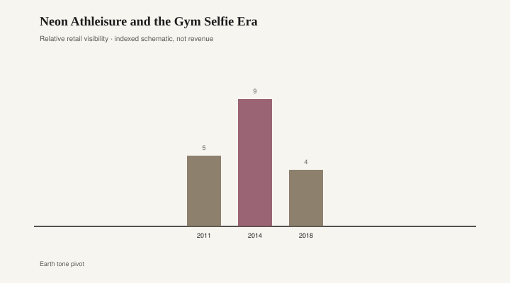

# Neon Athleisure and the Gym Selfie Era

For a stretch of the 2010s the gym was a lighting department. Fluorescent tubes upstairs, phone flash downstairs, and a body in between wearing a color that could be seen from the parking lot. Neon was not a trim. It was the outfit. Zumba studios in 2011 looked like a safety vest had learned salsa. Nike’s Flyknit runners, first widely seen around 2012, arrived in volt, hyper punch, and other names that sounded like energy drinks. The shoe was a technical claim — knitted upper, less waste, a foot that looked wrapped in a highlighter — and a camera claim. You could prove you had gone without showing the treadmill.

Athleisure had already loosened the old rule that sweat clothes stayed home. Lululemon made the yoga pant a commute pant. The neon years added a demand: the commute should glow. A charcoal pair of tights could have been sleepwear. A pair in electric coral could only have been for being seen leaving a class. The gym selfie, which Instagram rewarded with a square crop and a filter named after a decade, needed a subject that read at thumbnail size. Neon reads.

Stella McCartney’s work with Adidas in those years kept a cleaner line, but even the cleaner line picked up acid yellow when the season asked. Outdoor Voices later tried to walk the color back to dusty pastels; that was a later correction. Mid-decade, the mall and the specialty shop agreed: if it flexed, it fluoresced.

Rooms caught the same light. Bedroom walls that had been rental beige grew a neon script sign — *Good Vibes Only*, *It Was Always You*, a first name in cursive pink. The sign was cheap, plug-in, and photogenic. It did for a headboard what Flyknit did for a foot: it announced a mood in a color that cameras love and mornings regret. Millennial pink sat next door. Pantone’s 2016 pairing of Rose Quartz and Serenity gave the decade a blush that felt softer than volt green and still belonged to the same family of colors that exist to be posted.

<figure class="fffb-figure">
  
  <figcaption>Retail-era visibility for Neon Athleisure and the Gym Selfie Era.</figcaption>
</figure>

The retail clock was short because the clothes were already close to costume. A volt running shoe in 2013 said *I train*. The same shoe in a 2018 closet said *I trained then*. Color that loud carries a date stamp the way a festival wristband does. You can still run in it. You cannot pretend the year is new.

What made the era stick in memory was not one designer. It was the stack: a boutique fitness boom (Zumba, SoulCycle, CrossFit boxes with painted walls), a phone camera that finally worked in dim rooms, and brands willing to dye technical fabric like a rave. Nike, Adidas, Asics, and a dozen private-label lines at Target and Old Navy all shipped the same temperature of green. The differences were in the knit and the price. The photograph flattened those.

Athleisure outlived the neon. That is the part people forget when they write obituaries for the decade. Black and heather gray tights became furniture: always there, rarely discussed. The fluorescent layer peeled off first, the way a bedroom loses the neon sign when someone moves in a real lamp. The category stayed. The costume left.

The furniture rhyme is the sign and the blush, not the sofa. A neon script over a bed is the Flyknit of home decor — bought in a burst, photographed against white pillows, unplugged when the joke got old. Millennial pink walls and blush throws from 2016 sit in the same bin: a color that felt like a personality and aged like a filter. You can still like pink. You cannot still claim it is a new neutrality.

A few pieces from the gym years still look honest. A well-cut black tight. A gray hoodie that was gray on purpose, not gray because the neon faded. A trainer in a color you would wear to an airport. Those were never the selfie. The selfie wanted volt.

By the early 2020s the feed had moved on to earth tones, then to a brown so committed it needed a name (mushroom, mocha, “quiet”). Neon retreated to actual night runs and actual construction sites, which is where high-visibility color earns its keep. Fashion will pick it up again; it always picks up a highlighter when the feed looks muddy. The next time it will arrive with a new fiber story and the same thumbnail problem.

If you kept a pair of Flyknits from 2014, they are now an artifact with laces. If you kept the neon sign, it is in a closet with the Christmas lights, which is the correct storage for a light that was never about reading in bed. The decade did not invent working out in public. It invented a uniform that treated the sidewalk as a studio and the bedroom wall as a caption. Both uniforms dated on schedule.

The honest leftover is the habit, not the hue. People still photograph the gym. They just do it in colors that pretend not to be asking.
