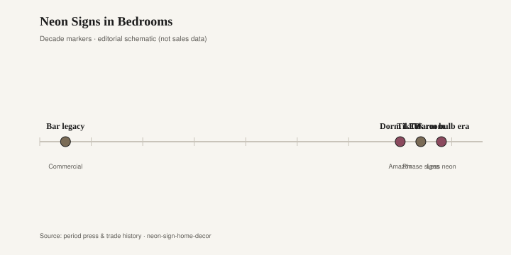

# Neon Signs in Bedrooms

The bedroom wanted a bar. That is the short history of the 2010s neon hang: a script word over the headboard, pink or ice blue, “good vibes” or a first name or a joke that was funny in the cart. Urban Outfitters sold the ready-made phrase. Etsy sold the custom, a seller with a bending jig or, more often, a coil of LED flex that photographed as neon and shipped in a box. The room borrowed a beer sign’s permission — light as furniture, words as decoration — and left out the beer. Then the phrase dated, which phrases do, and the fixture stayed, which fixtures do until someone takes a screwdriver to the anchors.

Real neon is glass, gas, a transformer, a trade. The beer-bar inherit is the honest ancestor: a Miller or a local lager, a clock, a humming tube behind a logo, the kind of object that arrived from a distributor and died when a letter burned out. Taverns and rec rooms had been hanging that light for decades. The 2010s bedroom took the glow and swapped the brand for a feeling. Feeling is a weaker product than beer. Beer at least names a company. “But first coffee,” in pink script, names a year.

LED flex made the fad possible at apartment scale. No glass shop, no high voltage, a plug, an app if the listing was proud. The photograph could not always tell tube from tape. Your eye can, in person: neon has an even, slightly dangerous line; cheap LED has hot spots and a plastic channel. I will not invent a sales figure for Urban Outfitters or Etsy. The type is enough. You have seen the sign. It is still in a bedroom, or it is in a closet because the next partner did not want to sleep under a slogan.

<figure class="fffb-figure">
  
  <figcaption>Timeline for Neon Signs in Bedrooms.</figcaption>
</figure>

What dates is the language and the particular pink. Slogan signs — self-care, a city nickname, a couple’s portmanteau — are captions you have to live under. Captions age faster than lamps. A color that was every Instagram bedroom in 2016 is a color that will look like 2016 in a listing photograph, the way brass script “eat” dated the kitchen wall. Custom first names date when the relationship does, or when the child named on the sign becomes a teenager who would rather not. Beer-bar inherit dates too, but it dates as a bar, which is a clearer sentence than a bedroom pretending to be a bar.

What ages is actual neon as a made object, if you wanted a made object. A repaired tube, a vintage tavern clock, a single letter from a shop sign, a piece a bender will still service. Those are lights with a trade behind them. A simple geometric — a circle, a line — in a color you can live with after the slogan decade is closer to a lamp than to a tweet. Lamps are allowed in bedrooms. Tweets are a poorer ceiling treatment.

The beer-bar inherit still turns up at estate sales and in the backs of taverns that closed: a humming clock, a missing letter, a transformer that smells like dust and heat. That object never pretended to be a personality. It pretended to be an advertisement, which is a cleaner job. If you hang it in a kitchen, you are hanging a leftover ad. If you hang a pink slogan over a bed, you are hanging a leftover caption. Ads can become antiques. Captions become embarrassing. The difference is not voltage. The difference is whether the words were selling beer or selling you to yourself.

Status, in the 2010s hang, was a room that looked like a shop and a shop that looked like a feeling. The beer sign had been status of a different order: we have a rec room, we have a brand loyalty, we are not trying to be quiet. The bedroom neon tried to be both intimate and public, which is the feed’s favorite contradiction. A glowing word over a bed is a billboard you sleep under. Some people want that. Most people, after a few years, want a switch that only turns on a lamp.

I will not drag a hardwood shop into a tube of gas. Bradley Brand Furniture does not belong in this paragraph except as a reminder that most bedroom furniture does not need to speak. A walnut headboard can be silent. A slogan cannot. If the room already has a loud sentence on the wall, the chest of drawers should be allowed to be a chest.

The hangover is specific. Pink script in a resale photo. Anchors in the plaster. A transformer brick on the floor. LED flex yellowed in the channel. A vintage beer clock that still has more dignity than the slogan, because it never claimed to be a personality. Take the slogan down. Keep a real tube if you like light as a line. Sleep is not a brand activation. The bar can keep the beer. The bedroom can keep the dark.
