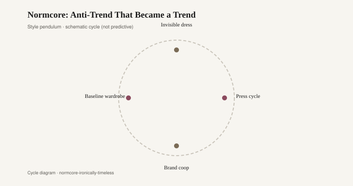
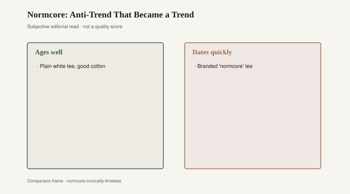

# Normcore: Anti-Trend That Became a Trend

In 2014 a short, ugly word left a PDF and walked onto sidewalks. *Normcore.* Trend writers treated it as a joke that had already come true: the coolest people in New York were dressing like they had given up. White sneakers that could have belonged to a dentist. Dad jeans. A fleece that looked stolen from a rental-car counter. The point, as the street-style cameras told it, was to stop pointing.

The word itself is usually pinned to a K-HOLE report from that moment — the art-collective-as-forecast-shop that had been issuing PDFs since 2011. The exact title of the document that put “normcore” in circulation is still argued in captions [CITE NEEDED: exact report title; later citations often point to *Youth Mode: A Report on Freedom*, sometimes dated 2013]. What 2014 did was not invent the clothes. It named the refusal, then sold the refusal back as a look.

That is the oldest trick in a closet and a living room. Call it “I am not trying.” The trying is in the calling.

Fiona Duncan’s *New York* magazine piece that year did the translation work the PDF could not: it showed faces. Editors who had spent a decade hunting for the rare sneaker were suddenly hunting for the common one. Uniqlo and Gap, which had never needed a theory, received one. J.Crew’s catalog already looked like the manifesto. Jerry Seinfeld’s sneakers, once a sitcom punchline, became a citation. The anti-trend required a reading list, which is how you know it was a trend.

Rooms ran the same program under a different paint chip. Greige arrived as a moral position. Not beige, which your grandmother chose because the sofa had to hide gravy. Greige: a gray that wanted credit for being a color without committing to one. Restoration Hardware catalogs and a thousand open houses between 2013 and 2017 sold the same sentence the sneakers sold. This room is not decorating. This room is declining to decorate. The decline had a SKU.

<figure class="fffb-figure">
  
  <figcaption>Style cycle schematic for Normcore: Anti-Trend That Became a Trend.</figcaption>
</figure>

K-HOLE’s actual argument, as later readers reconstructed it, was less about khaki than about opting into sameness after a decade of “Mass Indie” — the exhaustion of proving you were the only person who knew the band [CITE NEEDED: pagination and wording in the original PDF]. Fashion, being fashion, kept the outfit and dropped the sociology. A Patagonia fleece over a white tee became a password. If you wore it without irony you were basic. If you wore it with a theory you were early. The garment did not change. The caption did.

By 2016 the caption had a store. “Normcore” sat on hangtags next to “effortless,” a word that has never described an effortless person. Balenciaga and Vetements made the dad shoe expensive, which is how an anti-status look pays rent in Paris. The common sneaker became uncommon again, which was the plot twist everyone should have seen. You cannot stay invisible in a magazine.

Greige had the same plot twist. A wall sold as “quiet” is quiet until every listing in the zip code uses the same swatch. Then the quiet is a chorus. House-flippers learned that a greige open-plan photographed well and offended no one, which is another way of saying it pleased the algorithm. The room that claimed it was not trying had tried very hard to be sellable. Normcore’s closet and the greige living room were both answers to a market that punished taste that could be named — until the answer itself got a name.

What ages is the theory, not the tee shirt. A plain white sneaker from 1998 still looks like a sneaker. A 2014 blog post about the sneaker as philosophy looks like a time capsule. Same for the sofa. A linen slipcover in a color with no name can last twenty years if nobody photographs it with a manifesto. Photograph it as “the end of color” and you have dated the room to the year the manifesto trended.

The 2020s tried to bury normcore under “quiet luxury,” a cousin that kept the beige and added a price. Same refusal, better lighting. The fleece gave way to a cashmere crewneck that still pretended not to perform. Rooms followed: greige grew warmer, then got accused of being sad, then came back as “organic modern.” The sentence under the paint did not change. I am not trying. Please notice.

A useful distinction, if you still want one: clothes you reach for because they fit and wash are not a movement. Clothes you reach for because they announce that you have left the movement are the movement’s last product. The K-HOLE PDF was, in its own odd way, warning about the second kind. Street style heard a shopping list.

The furniture rhyme is earned in the hallway, not the essay. Walk into a 2015 condo and the walls will tell you the owners wanted to be un-choosing. Walk into a closet from the same year and the sneakers will tell you the same story. Neither is a crime. Both become funny when the owner insists the choice was an absence of choice.

<figure class="fffb-figure">
  
  <figcaption>What tends to age well versus date quickly in Normcore: Anti-Trend That Became a Trend.</figcaption>
</figure>

Keep the jeans if they fit. Repaint if you are tired of the chorus. Leave the word in 2014, where it did its job: it made a refusal visible enough to sell. After that, the only honest normcore is the outfit you forgot you were wearing.
