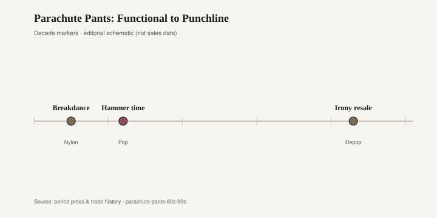
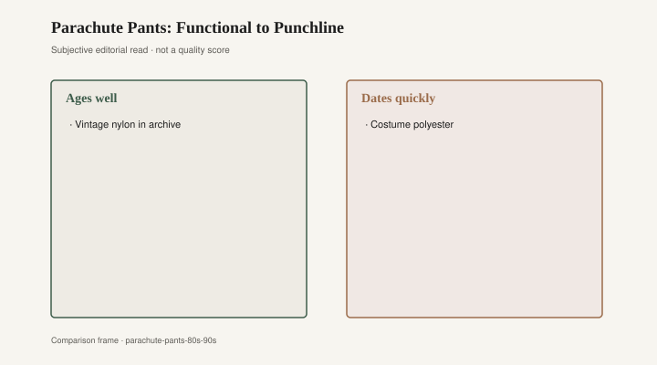

# Parachute Pants: Functional to Punchline

Breakdancers in early-1980s New York and Los Angeles needed fabric that would slide on linoleum without eating a knee. Nylon did that work. The pants that followed — zipper farms down the shin, a crotch that dropped like a hammock, a silhouette that filled with air when you spun — were kit before they were costume. Kids called them parachute pants because the cloth sounded like a tent in a gust. The name stuck harder than any designer label.

By 1984 the look had left the rec-center floor. You could buy a pair at a mall that had never hosted a battle. The cut still advertised motion: extra room for a windmill, extra pockets for a Walkman. Function was the alibi. Then television got hold of the volume.

MC Hammer did not invent the pants. He scaled them. On the *Please Hammer Don't Hurt 'Em* tour and the videos that ate MTV in 1990, the trousers became a logo — acres of pleated fabric, gold trim, a man moving inside a portable weather system. Hammer pants were parachute pants with a press agent. Every variety-show host learned the joke in one rehearsal: walk out, shake the legs, wait for the laugh. A garment built to keep a breaker from burning his thigh became a punchline that outlived the hits.

The slide from kit to gag is short when the material itself is shiny. Nylon photographs like a wet table. Under arena lights it looks expensive for one season and cheap for the next twenty. That is the same trick a dining room played in the late 1980s, when high-gloss black lacquer chairs — stacked, lacquered, almost wet — sat around glass tables in new condos. They read as money on a Saturday night. By 1996 they read as a sitcom set. Nobody needed a critic to explain it. The sheen did the explaining.

<figure class="fffb-figure">
  
  <figcaption>Timeline for Parachute Pants: Functional to Punchline.</figcaption>
</figure>

The 1990s did not kill volume so much as they changed the excuse. Hip-hop kept baggy, but the fabric went matte: denim, fleece, heavy cotton. Matte forgives. Shine does not. A leftover pair of silver zip-offs in a 1994 yearbook photo dates the wearer faster than a haircut. Halloween catalogs picked the silhouette up and never put it down. Once a pant is a costume, the street version has to work twice as hard to look sincere.

Fashion tried a few sincere revivals. Streetwear in the 2010s flirted with nylon track pants and cargo zips; a few runway shows in the early 2020s sent out Hammer-adjacent volume with a straight face. The audience remembered the joke first. That is the tax on a silhouette that spent a decade as a sitcom prop. You can restyle the zipper. You cannot restyle the memory of a man dancing in a tent.

Rooms keep the same ledger. Those lacquer chairs did not become ugly overnight. They became *dated*, which is worse, because dated means the owner can still see the receipt. A matte oak chair from the same years can look merely old. A piano-black dining set looks like a decision. Parachute pants are the dining set you wore. The photograph is the receipt.

What ages is not volume itself. Wide trousers come back whenever a generation wants to hide a shoe or a knee. What dates is the combination of slick fiber, loud hardware, and a celebrity who turned the cut into a catchphrase. Hammer was good at the dance. The culture was better at the impression. After enough impressions, the original motion looks like a bit.

Breakers still need slick cloth. Some still wear nylon because the floor is still the floor. That pair is not a fad; it is equipment. The fad is the mall copy that never saw a spin, bought because the video was on, retired because the video became a meme. Equipment survives in the gym bag. The mall copy survives in a plastic bin labeled “80s night.”

The furniture analog holds if you keep it honest. A glossy lacquer chair that someone still sits in every Tuesday is not a joke. A set bought to match a mirrored wall, then covered with a tablecloth the first time guests came after 1995, is the punchline. Same chemistry: a surface that promised future and delivered a timestamp.

You can still find the pants. Vintage sellers list them by zipper count. Costume shops list them by decade. The difference is the listing photograph. One shows wear at the knee, which is evidence of a floor. The other shows a hanger and a wig. Fashion keeps both. The room keeps the chairs in the basement, because lacquer chips when you stack it, and nobody wants to explain the chips.

If a revival ever sticks, it will be matte, quieter, and stripped of the gold braid. The silhouette can return. The sheen has to stay in the closet with the dining chairs that used to look like money.

<figure class="fffb-figure">
  
  <figcaption>What tends to age well versus date quickly in Parachute Pants: Functional to Punchline.</figcaption>
</figure>

A useful test, for pants or chairs: would you still choose the material if the celebrity left the building? Nylon that slides is a yes. Nylon that shines for the camera is a no. Hammer left. The camera stayed. The punchline is what we kept.
