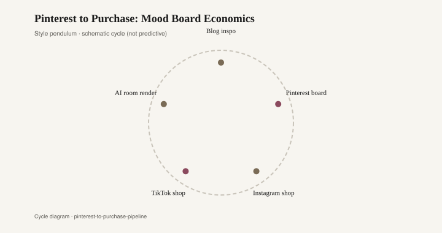
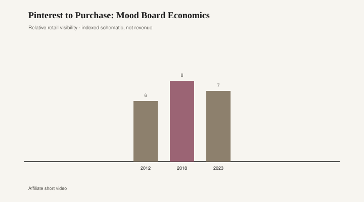

# Pinterest to Purchase: Mood Board Economics

The picture arrived before the chair for a century. Pinterest only made the wait shorter.

Sears sold houses from a catalog. The Wish Book sold a Christmas morning before anyone touched a toy. Design Within Reach, founded at the end of the 1990s, sold modern furniture the way a fashion book sells a coat: a photograph, a name, a promise that the object in the picture could be yours if you accepted the lead time. IKEA's catalog, 1951 to 2020, was the mass version — a year of rooms printed in the tens of millions, a lookbook that came in the mail and sat on the coffee table it was trying to replace. [CITE NEEDED] for any single-year print run. The ancestor is the same in each case. You fell in love with a rectangle of ink. The object showed up later, or it didn't.

Houzz opened in 2009 as a house-picture engine for people about to spend real money: kitchens, baths, a contractor in the next county. Pinterest opened to the public in 2010 — Ben Silbermann, Evan Sharp, Paul Sciarra — and turned the same hunger into a grid you could keep adding to after midnight. A pin was not a purchase. It was a rehearsal. You built a board called "living room" the way a stylist builds a board called "spring." The chair you could afford sat next to the chair you could not. That adjacency is the economics. Desire got cheap. Delivery stayed expensive.

Instagram launched in October 2010 and joined Facebook in April 2012. For a while it was still a photograph of a life, not a store. Shopping tags and checkout came later — Instagram Shopping in the late 2010s, checkout experiments around 2018–2019. [CITE NEEDED] for the exact product-launch memo you want to footnote. By then the pipeline was obvious. Houzz had taught the renovation. Pinterest had taught the collage. Instagram taught the shoppable still. The picture no longer pointed at a catalog page. It pointed at a cart.

<figure class="fffb-figure">
  
  <figcaption>Style cycle schematic for Pinterest to Purchase: Mood Board Economics.</figcaption>
</figure>

Furniture suffers this pipeline more than a dress does. A dress can be in the apartment tomorrow. A sofa is a photograph for weeks: a pin, a saved Reel, a "similar items" carousel, a wait, a freight delivery that scrapes the stair. In that gap the picture hardens. You are no longer buying a place to sit. You are buying the rectangle you stared at. If the real arm is thicker, or the velvet is cheaper, the object feels like a counterfeit of its own ad. That is mood-board economics. The image is the product. The chair is the shipping.

The old catalogs knew this and admitted the delay. Sears gave you a drawing and a season. DWR gave you a lead time and a designer name. IKEA gave you a warehouse date and an Allen key. Pinterest hid the delay inside infinity. There is always another pin. The board never says "out of stock." It says "more like this." More like this is how a single oak table becomes a species, then a glut, then a joke.

Shelter blogs sat in the middle of the decade, between the printed catalog and the shoppable grid. Apartment Therapy, Design*Sponge, the regional design blogs that posted a room on a Tuesday — they were already doing Pinterest's job with permalinks. The 2010 grid just removed the editor. Anyone could pin a High Point showroom shot next to a flea-market find and call it a plan. Houzz kept a professional residue: you could message a contractor. Pinterest kept the daydream. Instagram, once the shops opened, kept the impulse. TikTok Shop is the latest station on the same line. The cycle in the figure is not a prophecy. It is a commute.

Retailers learned to manufacture the pin before they manufactured the chair. A styled corner goes live, the save-count climbs, then the factory is told to pour the foam. That reversal is new relative to the Sears drawing, which at least began with a SKU the warehouse held. When the picture leads, the misshipment is aesthetic. You receive the object the algorithm needed, not the object the room needed.

A buyer who still starts from the room — sit in it, measure the wall, then look at a picture — is working against the pipeline. So is a floor like bbfur that would rather sell a chair you have sat in than a chair you have only saved. The save is free. The freight is not. The landfill does not take screenshots.

None of this makes Pinterest a villain. The board is a useful tool if you treat it as a notebook. The trouble starts when the notebook becomes the store, and the store becomes the only memory of what you wanted. People now walk into a furniture floor holding a phone like a swatch. They are not wrong to want a match. They are wrong if the match is to a lighting condition that never existed in their apartment — a north-facing pin, a filter, a wide-angle lie.

<figure class="fffb-figure">
  
  <figcaption>Retail-era visibility for Pinterest to Purchase: Mood Board Economics.</figcaption>
</figure>

The honest sequence is still the old one, only faster. Picture, then money, then wait, then object. Sears knew it. DWR knew it. IKEA printed it for seventy years. Pinterest in 2010, Houzz beside it, Instagram shops after, did not invent the order. They collapsed the pause in which you used to change your mind. That pause was where a lot of ugly sofas used to die. Some of them deserved to. Some of them were the right chair, killed by a prettier pin. The pipeline does not care which. It only cares that the picture moved.
