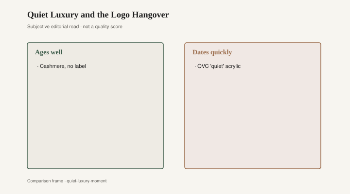
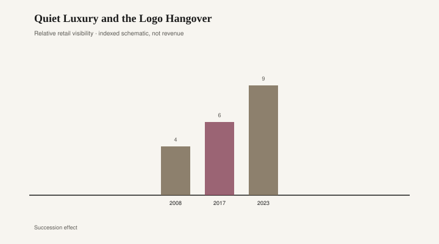

# Quiet Luxury and the Logo Hangover

The table is pale oak and there is nothing on it except a linen runner that looks as if it were ironed once and then allowed to forget. The walls are plaster, or a paint that wants to be plaster. No monogram. No metal word. A sofa in a cloth that photographs as oatmeal. The listing, if this were a listing, would say quiet luxury and mean 2023. Two miles away, in a walk-up, a different oak table is coming out of a carton: the grain repeats, the edge is paper, the cams are in a plastic bag. Same word, oak, two objects. One of them is a refusal. One of them is a cart.

Quiet luxury, as a phrase, is a 2022–2023 fashion tag. The Row. Loro Piana. The costumes on *Succession*, which taught a wide audience that the richest people in a fiction might dress as if they had forgotten to dress. No logo was the logo. The phrase migrated into rooms the way fashion phrases do: linen, oak, plaster, a brown that is ashamed of being a color. Shelter feeds and the better catalogs picked it up because it was a useful correction after a decade of farmhouse jewelry and a shorter binge of blush velvet. The room that refused a claim became a claim. That is not hypocrisy. That is how status works when it gets tired of shouting.

The fashion houses that originated the silence were not in the dresser business. The Row and Loro Piana sell cloth and a refusal. Rooms borrowed the refusal because rooms were tired of hardware that shouted 2016. A plaster wall and a linen sofa are a pleasant correction. They become a fad when the correction is sold as a personality. A person who wants less metal on the cabinets is not performing quiet luxury. A person who buys a logo-less look as a kit, down to the book on the table that is not being read, is performing it. Both rooms can be comfortable. Only one of them needs the phrase to stay standing.

<figure class="fffb-figure">
  
  <figcaption>What tends to age well versus date quickly in Quiet Luxury and the Logo Hangover.</figcaption>
</figure>

Fast furniture is older than the phrase that scolds it. IKEA arrived in the United States in 1985, Plymouth Meeting, Pennsylvania, and made a philosophy of the flat box. Wayfair, 2002, made a philosophy of the infinite aisle. Those two are not one speed. IKEA still designs a system and a store you can walk. Wayfair designs a search. The quiet-luxury thumbnail at a Thursday price — printed oak, oatmeal upholstery, a plaster-look wallpaper — is the cart’s answer to The Row. It is not a moral failure to need a table before an heirloom. It is a material fact that printed oak cannot change its mind. The paper is the design. When the pale wash dates — and pale washes date, they just date softly — there is nothing to sand toward. Paint on paper is a painted photograph.

Retail did not wait to be scolded. The same companies that sold barn doors in 2016 sold “organic modern” and “quiet” oak in 2023, sometimes from the same warehouse, a different finish code. RH had already been in the linen-and-scale business. Pottery Barn softened the iron. West Elm put a pale wood on the same tapered leg that had been walnut-print in 2012. IKEA, which had never needed a luxury phrase, already had birch and white and a table you could carry. The phrase did not create a new factory. It created a new caption. Captions are cheap. Oak is not.

<figure class="fffb-figure">
  
  <figcaption>Retail-era visibility for Quiet Luxury and the Logo Hangover.</figcaption>
</figure>

What ages is almost rude in its simplicity. Solid hardwood, or a thick honest veneer over a stable core, named as such. A finish you can name. Joinery you can get back into. Linen that is linen and can be cleaned or replaced. Plaster that is plaster, which is a wall, not a furniture essay, except that the wall is how the furniture is being sold. What dates is the phrase used as a product: “quiet luxury” on a tag, a logo-less look that is a SKU, a beige that exists to photograph as restraint. Fast furniture dates on a shorter clock because it was built for the clock — the lease, the move, the next filter.

The hangover of quiet luxury will be quieter than the hangover of barn doors, which is the danger. A beige room does not look foolish in a photograph even when it looks like every other beige room. Wayfair and IKEA printed oak date louder and more honestly: the edge gone white, the cam lock stripped, the grain that repeats every eighteen inches. People will keep buying both, because rooms have to be lived in now. A student needs a table. A person who just got the job that *Succession* was parodying may want the silence and be able to pay for it. Neither need is a moral test. The test is whether the object can survive the end of the caption.

Bradley Brand Furniture, in Warren, Arkansas, sells hardwood that does not need the phrase. The company’s own copy still says no particleboard and dates Bradley Lumber Co. to 1902; treat the date as company copy until a primary record sits beside it [CITE NEEDED]. I am not turning a shop in Warren into The Row. I am pointing at a mechanical fact the fashion phrase keeps trying to steal: quiet is easier when the table is oak through the thickness. A photograph of oak has to keep talking. It talks in the repeat of the grain, in the chip at the corner, in the way you cannot refinish a picture.

I have watched people unpack both kinds of table in the same week. The oak one needed two people and a pad. The paper one needed an Allen key and a movie on a phone. Both dinners happened. Both rooms looked finished for a night. In five years the question will not be which owner had better taste. It will be which table is still a table. Fashion will have a new phrase by then. It may be loud again. It may be another silence. The hardwood will not have needed the memo. The carton table will have needed a second carton, or a curb.

If you want the refusal, buy the refusal in material, not in a caption. If you want the cart, buy the cart and admit the year. The linen can stay wrinkled. The runner can stay off. The table, if it is a table, does not require a logo to refuse a logo. It requires a board.
