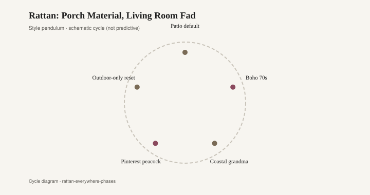
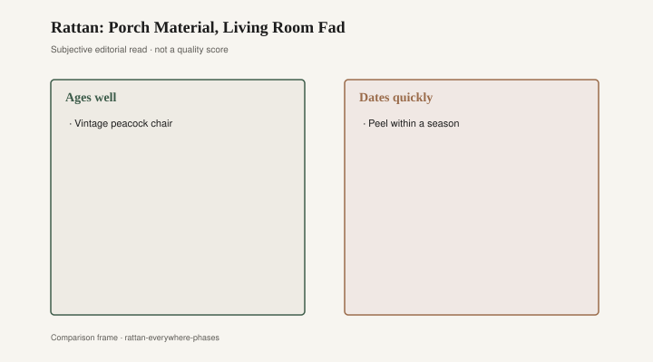

# Rattan: Porch Material, Living Room Fad

The seat is a grid of cane, seven-by-seven or thereabouts, the glossy outer skin of rattan pulled through holes in a hardwood rail. One strand has snapped. The break is clean. You can see the hollow where the cane left the hole. This is a chair that can be recaned. It is also, depending on the year you bought it, a Victorian porch leftover, a 1970s peacock throne, a 1980s sunroom leftover, or a 2021 Instagram bed frame with a cane headboard from West Elm. The material keeps returning. The quality does not.

Cyrus Wakefield started with discarded rattan used as dunnage on clipper ships — the usual founding story, told in the American Heritage account of the wicker dressing stand (May/June 1993) and in the National Register write-up of the Wakefield Rattan Company. He was in South Reading, Massachusetts, by the mid-1850s; the town later took his name. Heywood Brothers competed hard. In 1897 the rivals merged as Heywood Brothers & Wakefield Company; the name shortened to Heywood-Wakefield in 1921. Victorian wicker from those shops is a specific object: steam-bent or hardwood frames, reed and cane in curlicues, sometimes a motif in the back. It was porch furniture and parlor furniture. It was not a print. If you find a Wakefield or Heywood label, keep it. The labels are how you date a piece through the name changes. The furniture itself, if the frame is sound, can be rewoven.

The peacock chair is the 1960s–70s object everyone thinks they remember sitting in. A high, fanning back of rattan or wicker, a wide seat, a throne for a studio and a living room. It was photographed with the counterculture and with anyone who had a roll of backdrop paper. I will not invent a celebrity sit. The chair does not need a famous lap. It needed a photographer, and it got thousands. Department stores and import shops sold versions. Some were honest rattan, built like a basket with a spine. Some were already the cheaper cousin: thinner poles, glue, a fan that flattened if you leaned. The peacock is a shape. The shape outlived the decade. The cheap ones did not outlive the move to the next apartment.

<figure class="fffb-figure">
  
  <figcaption>Style cycle schematic for Rattan: Porch Material, Living Room Fad.</figcaption>
</figure>

The 1980s put rattan in the sunroom as a set. Loveseat, two chairs, a glass-topped coffee table with a rattan base, maybe a baker’s rack. Pale cushions with a chintz or a tropical leaf. The sunroom was a suburban invention that needed furniture which said *outdoor* while staying in. Rattan did that work. It also dated the room the minute the cushions faded. Those sets still turn up complete, which is a curse. Complete means matching, and matching rattan from 1986 looks like 1986. A single good chair from the set can be recushioned and live. The four-piece conversation group cannot, not without irony, and irony is a thin seat.

Then the feed returned the weave. Around 2020–2021, cane became a bedroom and a dining chair again: Urban Outfitters, CB2, West Elm, the cane bed, the cane-front credenza, the Breuer-adjacent chair that was not a Marcel Breuer but wanted the same grid. Instagram liked the light through the hexagons. A cane headboard photographs as texture without asking for a color commitment. Some of those pieces used real cane on a hardwood or engineered frame. Some used a plastic sheet printed or molded to look like cane, stapled into a rebate, interchangeable with a speaker grille. The photograph cannot always tell. Your fingernail can.

Indoor rattan has a climate problem the catalogs skip. Rattan is a climbing palm. Cane is its skin. Both want some humidity. In a dry-heat house — forced air, a winter in Denver, a summer with the air conditioning at 68 — the cane shrinks, the bindings loosen, the seat goes slack and then pops. Victorian porches were often unheated; the furniture lived in weather that at least had moisture. A 2021 cane bed in a desert condo is a different contract. You can mist a seat. You cannot mist a listing. People blame the cat. The cat is not the whole story.

<figure class="fffb-figure">
  
  <figcaption>What tends to age well versus date quickly in Rattan: Porch Material, Living Room Fad.</figcaption>
</figure>

What ages is a well-caned seat on a frame built for holes, not for a staple gun. Recaning is a trade. There are still people who do it: strand cane, sheet cane, rush as a cousin skill. They will tell you whether the rail can take a new piece of cane or whether the holes have blown out. A chair that was made to be recaned will have a rebate or a drilled rail with enough wood left. A chair that was made to be replaced will have a molded “cane” panel and a receipt.

What dates is plastic wicker printed to look like cane. Resin wicker on an aluminum frame has a legitimate outdoor life; it is not trying to be a Heywood porch. The indoor plastic sheet that mimics a seven-way cane pattern is trying, and that is why it dates. The pattern yellows. The edges lift. You cannot recane a print. You can only buy the next revival.

Heywood-Wakefield’s later fame is Streamline maple, not wicker, which is a reminder that a company can ride two fashions and be remembered for the second. The wicker still exists in attics and on porches in towns that never threw it away. It is heavier than the Instagram cane. It has more curl. It looks less like a grid and more like a plant. If the frame is intact, it is worth more than the 2021 headboard that will be out of the feed in five years. Worth, here, is not auction-house worth. It is whether a seater will take the job.

Bradley Brand Furniture in Warren, Arkansas, is a hardwood shop in the company’s telling — Bradley Lumber, 1902; solid wood; no particleboard — and a cane seat is one of the old ways hardwood and a plant fiber share a chair. [CITE NEEDED on the 1902 date; company copy.] The shop does not need to weave cane to understand the test: can the seat be remade without throwing away the frame? A particleboard headboard with a cane print fails that test on arrival. A maple or oak chair with a blown cane seat is a morning’s conversation with someone who still owns a pegs-and-awl kit.

The cycle will run again. Cane is too useful a photograph and too old a technology to die. The useful question is not whether you like the grid. It is whether the grid is a plant in a hole, or a picture of a plant on a sheet. Buy the first if you want a chair that can come back. Let the second live in the sunroom of a year you are willing to lose. Victorian Wakefield knew the difference. The 2021 feed did not always. Your fingernail still does.
