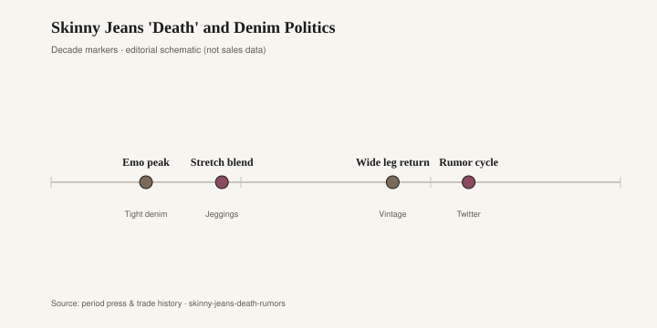

# Skinny Jeans 'Death' and Denim Politics

Every few years a newspaper or a feed declares a garment dead. In 2022 the garment was the skinny jean. The obituaries were confident, funny, and unbothered by the fact that millions of people still owned a pair and planned to wear them on Tuesday. Fashion discourse loves a funeral. Closets are slower.

The skinny jean's long default run sits roughly between 2006 and 2016, with plenty of wear on either side. It did not arrive from nowhere. Punk and the 1970s had a tight leg. The mid-2000s indie and emo years — tight black denim, a Converse, a side-swept bang — made the cut a youth uniform before it became a mall uniform. Then stretch arrived in force. J Brand, Paige, 7 For All Mankind, Citizens of Humanity, and Topshop's Jamie sold a jean that behaved like a legging and photographed like a cigarette pant. Jeggings, the portmanteau that still makes denim people wince, were the logical end of that blend: cotton, polyester, a lot of elastane, a fade printed on. A generation tucked them into riding boots, then into ankle boots, then into a ballet flat. The silhouette was one line from waist to shoe.

For about a decade you could ignore other cuts. Straight and wide existed; they were not the default. A "nice jean" meant a dark skinny. An office-casual jean meant a dark skinny. A weekend jean meant a lighter skinny with a hole at the knee. The politics were quiet: the tight leg was modern, the wide leg was either vintage or a mistake.

The wide-leg return had been building in vintage shops and on a few runways before 2022. Agolde, Reformation, and a wave of 1990s Levi's 501 restocks made a looser hip look current. Dad jean, boyfriend, barrel, horseshoe — the names multiplied. TikTok and Twitter (the rumor cycle lived there) treated the skinny as a tell: wear them and you were dated, possibly morally so, in the jokey way the internet assigns morals to trousers. Think pieces followed. Retailers leaned into wide and extra-long. The skinny did not vanish from stores. It lost the microphone.

<figure class="fffb-figure">
  
  <figcaption>Timeline for Skinny Jeans 'Death' and Denim Politics.</figcaption>
</figure>

There is no honest death date to print. No single week, and no clean percentage of shoppers, turned the cut off. Anyone who offers you that number is guessing or selling a story. What happened is ordinary: a default became a choice again. People who like a tight leg still have a tight leg. People who felt squeezed bought a wider one. Teenagers who had only ever seen their parents in skinnies treated the slim ankle as costume. That is a cycle, not a coroner's report.

Denim politics are real in a smaller sense. Rise and width have been made to stand in for age, gender, class, and whether you "get it." The 2022 conversation often framed the skinny as a millennial relic and the wide as a correction. Relics keep walking around. A 2012 J Brand in good fabric still looks like a well-cut pant on the right shoe. A 2023 barrel jean in a bad stretch blend will look tired before the decade is out. Cut is not virtue. Cloth and proportion are what last.

The furniture analog is the greige sectional — the oatmeal-to-greige, low, deep sofa that became the jean of rooms in the 2010s. It was the default. You could buy it at every price. It went with a white wall and a black window frame. It photographed as tasteful and un-specific. When shelter media and TikTok tired of it, the obituaries started: the cloud couch as joke, the greige open-plan as a hangover, the call for color or for a vintage sofa with legs. Nobody issued a death certificate that a warehouse had to honor. The sectionals stayed in the houses that had paid for them. New buyers split: some still wanted the calm blob, some wanted a tailored mid-century or a slipcovered piece with a skirt.

That is the useful rhyme. The skinny jean and the greige sectional were both defaults that did a lot of quiet work. They flattened decision-making. They also flattened rooms and outfits until a younger eye wanted an edge again. Declaring them dead is a way to sell the next default. Living with them is a way to admit that a good dark jean and a comfortable sofa are allowed to outlast a discourse.

If you like your skinnies, wear them. If you like your greige sofa, sit on it. The rumor cycle will pick a new victim. Denim will still be in the dryer. The only stat that would matter — how many pairs actually left circulation — is not a number this magazine has, and it is not a number a headline usually has either. [CITE NEEDED] for any claim that a particular year "killed" the cut. The cut is in the closet. The debate is online. Those are different places.
