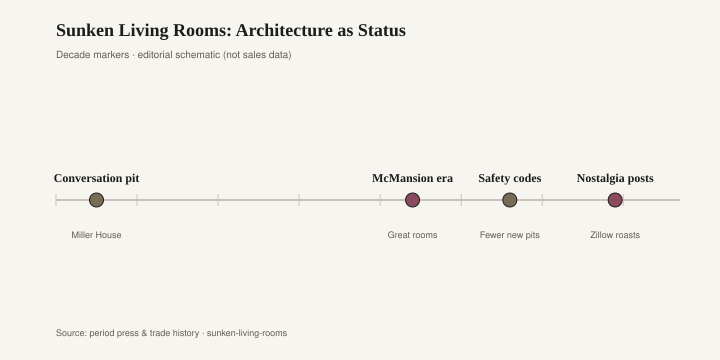
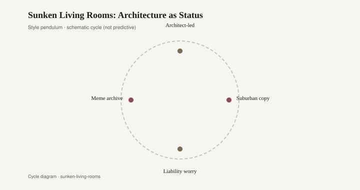

# Sunken Living Rooms: Architecture as Status

You step down twice and the conversation drops with you. The rest of the house rises around your shoulders. Someone remaining in the hallway speaks to the tops of heads. The square in the floor is maybe fifteen feet on a side, lined in fabric, with a table in the middle that has nowhere to go except down. That is the conversation pit at the Miller House in Columbus, Indiana, finished in 1957: Eero Saarinen on the house, Alexander Girard on the interiors, Dan Kiley on the grounds. The pit is Girard’s. The clients were J. Irwin and Xenia Miller. The house now belongs to Newfields, the Indianapolis Museum of Art, and you tour it on their terms.

A sunken living room is architecture that decided to be furniture, or furniture that decided to be a room. Either way, it is a sectional that cannot be rearranged without a contractor. The Miller version is the one the histories keep because the clients could afford Saarinen and Girard and a town that already understood modern as a civic project. The pit is specific: built-in, upholstered, scaled to a house that was never going to be flipped. It is also the ancestor of every dropped living room in a 1970s subdivision — the half-flight, the tufted bench, the fireplace you stepped down to as if it were a shrine.

Status, at the Miller House, was commission. We hired this. We live at the level of the rug because the architect cut the floor. Status, in the suburban copies, was inclusion. The builder offered a “conversation area” the way a later builder offered a bonus room. You were current. You were not your parents’ sofa-and-two-chairs. You had poured a furniture arrangement into concrete and called it design. Both versions are sincere. Only one was a one-off. Copies are how a private solution becomes a fad.

<figure class="fffb-figure">
  
  <figcaption>Timeline for Sunken Living Rooms: Architecture as Status.</figcaption>
</figure>

By the late 1960s and through the 1970s, production housing dropped living rooms a half-flight and ringed the depression with shag, vinyl tufting, a sunken hearth, sometimes a wet bar at the rim. The great room was being invented in the same years; the pit was its more theatrical cousin. You entertained down there. Children fell down there. Drinks spilled down there and stayed. The social diagram was intimacy by excavation: we are in the conversation, you are on the ledge. It is a powerful diagram. It is also a floor plan that future owners cannot edit with a moving day.

Those pits aged the way built-ins age when the fabric dates. You cannot slide them to the wall. You cannot sell them with the house unless the next buyer wants a conversation. A lot of them were filled in. The fill is a hangover you can still find if you know what a patched floor looks like in a 1974 ranch — a rectangle of newer hardwood, or a change in the pad under the carpet, the ghost of a social idea. Real-estate listings still say “filled-in conversation pit” the way they say “original kitchen,” as a warning or a boast depending on the decade of the buyer.

The 1980s and 1990s stood the idea back up and sold it as a leather sectional at grade. Rooms To Go, from 1991, made the pit portable: same inward-facing crowd, no contractor. The 2010s sold the Cloud and the modular sprawl — a pit that forgot to sink. The architectural version never quite died. Shelter magazines and certain architects keep drawing a step-down living room whenever a client has the volume and the nerve. Current revival talk treats the pit as a lost glamour, a rebuke to the open plan that has no place to sit that is not also a thoroughfare. The talk is cheaper than the excavation.

Saarinen is said, later, to have worried that the pit had become a cliché [CITE NEEDED — the remark circulates in secondary write-ups; the sentence is not in hand here]. If he said it, he was watching the copy, not the original. The Miller pit is still the Miller pit: Girard textiles, a square with a job, a house that holds it. The suburban pit was a year. The difference is the difference between a commissioned room and a package of extras. Architecture as status works when the architecture is specific. When it is a builder option, it is fashion with a foundation.

What ages is the house that can afford the pit as a decision — the Miller House, now a museum object, tourable, photographed, still about fifteen feet of committed floor. What ages, in a lesser key, is a step-down that was built with decent bones and later given a quieter fabric. What dates is the shag, the tufted vinyl, the mirrored wet bar at the rim, the sunken hearth that became a trip hazard and a liability paragraph. What dates hardest is the fill: a floor that used to mean something and now means a patch.

Furniture can leave. A sofa can go to the next apartment. A sunken room cannot. That is why the fad is sharper than a sofa fad, and why the hangover lasts in the joists. People who want the revival should want the commission, not the option. A step that has a reason — light, a garden, a change of use — will still be a step when the word “conversation” has moved on. A depression that exists to prove you saw a photograph of Columbus, Indiana, will be filled by the next owner, who will have seen a different photograph.

<figure class="fffb-figure">
  
  <figcaption>Style cycle schematic for Sunken Living Rooms: Architecture as Status.</figcaption>
</figure>

Newfields keeps the original because the original was never trying to be a subdivision. You walk through on a timed ticket and look down into a square that still works as a room. That is the privilege of patronage and of a civic collection. The rest of us live on floors that have to stay floors. If you want the social diagram without the contractor, you buy a sectional and admit it. If you want the architecture, you hire someone and you live with the hole. Status, in this story, was never the fabric. It was the willingness to cut the house and not take it back.
