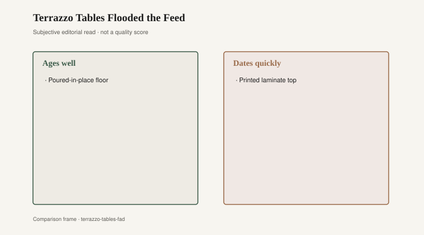
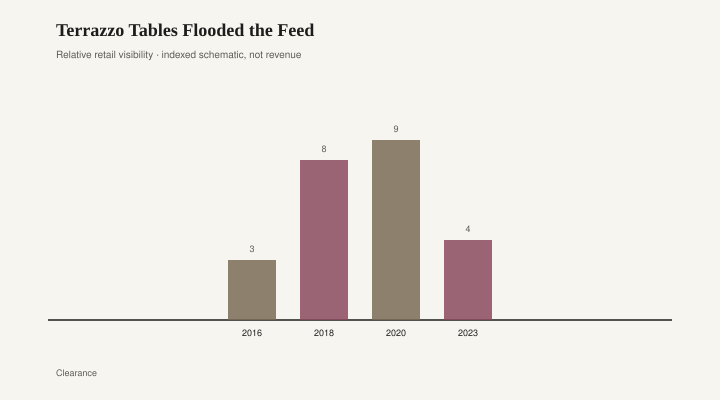

# Terrazzo Tables Flooded the Feed

Venetian terrazzo is a floor that earned its chips. Marble fragments in a cement binder, ground and polished until the surface is one plane and many stones, a technology older than the coffee table that later borrowed its photograph. Italian palazzi and apartment stairs, mid-century lobbies, a kitchen in a building that still has a terrazzo landing — that is the tradition. Enzo Mari’s Italy is not a terrazzo-table brand; it is a design culture that treated floors and objects as work, not as a print. I will not invent a Mari cocktail table. The useful adjacency is attitude: chips that are stone, a binder that is a binder, a surface you can refinish because the material goes through the thickness.

The 2018–2022 coffee table was a different contract. Pale resin, pastel chips, a terrazzo *print* on a top thin enough to flex if you sat on the edge, sold by CB2, West Elm, Urban Outfitters, and the infinite aisle as a Mediterranean souvenir that had never seen Venice. Instagram liked the confetti. A round table with speckles photographed as cheerful without asking for a color commitment. Design blogs called it a revival. Shops called it a collection. Some tops were honest aggregate in a resin matrix, ground like a small floor. Most were a picture of aggregate: a printed sheet, a molded speckled pour with chips that sat on the surface like cereal. The fingernail test works here too. A chip you can feel as a chip is a material. A chip you can only see is a year.

Terrazzo as fashion had a wider run than the table. Planters, coasters, phone cases, a laminate that wanted to be a lobby. The table was the furniture version of a floor that had become a mood. Moods are cheap to SKU. Floors are not. A Venetian or mid-century terrazzo floor can be ground again; the chips are still there under the dull. A resin topper with a printed speckle cannot be ground toward anything except a duller print, or a plywood you were not supposed to see.

<figure class="fffb-figure">
  
  <figcaption>What tends to age well versus date quickly in Terrazzo Tables Flooded the Feed.</figcaption>
</figure>

Resin toppers had a practical pitch, and the pitch was not all costume. A sealed pour takes a wet glass. A small apartment wants a light table. Parents want a surface that does not mourn a marker. Fair. The problem was the caption. “Terrazzo” on a hangtag in 2019 meant: we have seen a floor in a hotel and we have a mold. It did not mean a fabricator who knew how to grind. Italian floors, and the better American terrazzo of schools and civic buildings, were a trade. The coffee-table version was a graphic. Graphics date faster than trades.

What ages is a top that is the material through the thickness. Real terrazzo, if someone actually poured and ground a table — they exist; they are heavy; they are closer to a fragment of floor than to a catalog oval — can be honed. A stone or concrete top with aggregate you can name is in the same family. A hardwood table with a top you can sand is a different family and a more honest one for most houses. What dates is the pastel speckle of 2019, the mint-and-coral chip that matched a thousand stories, the oval whose only Venetian credential is a caption. Pale washes date softly. Confetti dates loud.

Status, in the feed years, was knowing the word and owning the cheerful. A terrazzo table said you had been to a boutique hotel, or wanted the lobby without the marble bill. Enzo Mari’s famous stubbornness about honest construction is a useful scold here, not a product placement. If the chips are a photograph, you bought a photograph. If the chips are stone, you bought a small floor and should treat it like one: no lemon left overnight, no faith that a resin will behave like calcite. I will not invent a hotel name or a sales figure. The type is enough. You have seen the table. It is in a closet now, or it is still in the feed under a new word.

<figure class="fffb-figure">
  
  <figcaption>Terrazzo visibility in shelter trade press (schematic index).</figcaption>
</figure>

Retail did not invent terrazzo. Retail invented the SKU. The same warehouses that sold marble-look quartz and cane-print beds sold speckled tops because the photograph was cheap and the mood was current. When the mood cooled — and it cooled, the way pale pink cooled — the tables did not become floors. They became leftover ovals. A leftover oval is not a crime. It is a season you can admit.

Bradley Brand Furniture, Warren, Arkansas, is not in the terrazzo business. Company copy still dates Bradley Lumber to 1902 and talks hardwood, no particleboard. [CITE NEEDED.] The quiet contrast is the sanding question. A thick oak or maple top can lose a bad year with a plane. A printed speckle cannot. Sand the fashion off a print and you have a duller print. That is not a sermon about Arkansas. It is a thickness.

I have put a drink on both kinds of table in the same month. The poured one was cold and slightly ringing, like a lobby. The printed one was warm and slightly flexing, like a tray. Both were terrazzo in the caption. The caption is a search term. Italian floors do not owe the tray a sequel. The tray owes the floor a more accurate hangtag: resin, picture of chips, this year.

If you want terrazzo, buy a floor, or a fragment of one, or a top a fabricator will sign as aggregate and grind. If you want a cheerful oval for a lease, buy the oval and do not call it Venice. Venice is a city. Confetti is a year. Years are allowed. Floors, when they are floors, do not need a coffee table to prove they exist.
