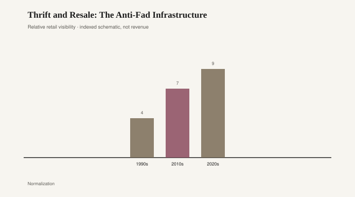

# Thrift and Resale: The Anti-Fad Infrastructure

*Draft stub — copy and body pending editorial pass. Graphics are staged for layout.*

<figure class="fffb-figure">
  
  <figcaption>Secondhand share of closet inflows (schematic).</figcaption>
</figure>
