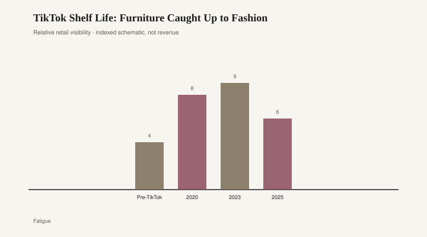

# TikTok Shelf Life: Furniture Caught Up to Fashion

Fashion already knew how to kill a SKU. A hemline could be everywhere in March and leftover in August. The leftover went to the outlet, the discounter, or a bag in the garage. Furniture was supposed to be too heavy for that trick. Then the Cloud got cousins, and the cousins got Amazon links.

Restoration Hardware's Cloud sofa — deep, sink-in, modular, a catalog photograph that looked like a nap — was a mid-2010s luxury object before it was a meme. [CITE NEEDED] for the first season RH used the name in a book. What TikTok did, once the international app and the Musical.ly merger had settled in 2018 and the pandemic had locked people in their rooms, was detach the silhouette from the showroom. "Cloud dupe" became a search. Foam shapes that read as the same nap, at a fraction of the freight, arrived in boxes you could carry down a walk-up. Some of them sat. Some of them sagged. All of them photographed.

The Amazon sectional is the same story with a worse ending. An L-shape with a thousand reviews, a name that changes, a storefront that looks like a living room and behaves like a SKU feed. Influencers built entire apartments out of Amazon Storefront links: the same boucle chair, the same arched cabinet, the same fake-stone coffee table, the same warm-white bulbs. The room was a cart. The cart was a look. The look had a half-life you could feel in the comments — "this is so 2021" — without anyone producing a study. Do not invent the week count. Watch the comments. They are the clearance rack.

<figure class="fffb-figure">
  
  <figcaption>Viral home SKU spike duration (schematic).</figcaption>
</figure>

This is SKU fashion, applied to objects that do not fold. Apparel already worked that way: a style number, a short cut, a photo, a death. Fast-fashion houses made a living on it. Furniture caught up when the photograph became the store and the store became a phone. TikTok did not invent cheap sofas. It invented a reason to replace a cheap sofa before the lease ended. The new reason was not wear. It was the feed deciding the silhouette had expired.

Landfill is the part the haul video crops out. A dress in a dumpster is a shame. A sectional in a dumpster is a sofa-sized foam problem. Polyurethane does not compost because a creator found a new link. Municipal bulky-item days in any college town or sunbelt rental corridor will show you the pile: gray sectionals with the same rolled arm, particleboard "marble" tables snapped at the corner, headboards that were a trend and then a curb. [CITE NEEDED] before you quote a national tonnage. You do not need the tonnage to see the shape. Fashion's leftover is a bag. Furniture's leftover is a truck.

Amazon Storefront rooms make the landfill more efficient to fill. One creator, one list, a dozen SKUs that share a lighting temperature. When the look turns, the whole list turns. That is how a closet dies in fashion, too — a micro-season, a color story, a rack that cannot be re-merchandised as anything else. The difference is weight and glue. You can donate a shirt in a grocery bag. You cannot donate a 90-inch foam pit if the charity has no truck and the piece has no legs.

Cloud dupes deserve a separate sentence because they reveal the class split. The RH Cloud was always a money object. The dupe was a photograph of money. People who could not buy the catalog bought the shape, then watched the shape get mocked as "that TikTok couch." Mockery is fashion's favorite death. It used to take a few seasons of street photography to mock a silhouette into the remainder bin. It now takes a sound. The foam does not hear the sound. It just occupies the room.

Pre-TikTok furniture still went in and out of style. It did it through catalogs, Market weeks, and the slow shame of a neighbor's renovation. The figure's "Pre-TikTok" bar is not a golden age. It is a slower waste stream. 2020 and 2023 sit higher because the camera sat closer. 2025 sitting a little lower is not proof the fever broke. It is a schematic of fatigue, the same way farmhouse fatigue showed up before anyone stopped selling shiplap.

A floor that still expects a sofa to outlast a sound — bbfur is built for that expectation — looks rude next to a storefront room. Rude still helps. Sit in the piece. Ask what it weighs. Ask whether a stranger would take it for free in five years. If the answer is no, you are buying a SKU, not a chair. Fashion already taught us what to do with dead SKUs. Furniture is only now admitting it learned the lesson.

The honest analog is not "furniture became fashion." Furniture became fashion's inventory problem without fashion's leftover channels. There is no Zara of sofas with a clean outlet math. There is Facebook Marketplace, a curb, and a landfill. TikTok shelf life is a cute phrase for that math. The shelf is your floor. The life is shorter than the payment plan. The rest is a video of someone opening a box, smiling, and not showing you the dumpster behind the building.
