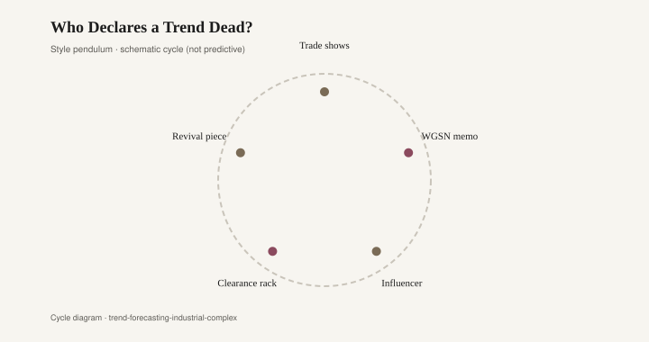
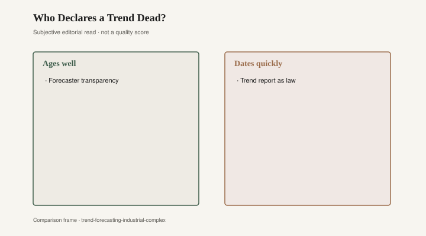

# Who Declares a Trend Dead?

Someone has to say the sofa arm is dead. The question is who gets paid to say it, and who has to live with the leftover frames.

WGSN was founded in 1998 in West London by Julian and Marc Worth as Worth Global Style Network. Emap bought it in 2005. It later absorbed Stylesight, grew a product called WGSN Interiors, and now sells the idea that a brand can subscribe to next year. Fashion factories already knew they needed a weather report for color and silhouette. Furniture factories were slower, then they bought seats. A memo that says "softened arms, lighter woods, less chrome" is cheaper than guessing wrong on a container.

Pantone's Color of the Year began as a millennium stunt. The Pantone Color Institute named Cerulean — 15-4020 — the color of 2000, a sky blue meant to calm Y2K nerves. Laurie Pressman later said they had not planned an annual franchise; the reception made the calendar. Every December since, a committee has given the press a swatch and a paragraph. Marsala in 2015. Living Coral. A lot of blues. *The Devil Wears Prada* (2006) already had Miranda Priestly explaining Cerulean as a hand-me-down from a runway to a sweater bin. The joke was fashion. The same joke now lands on a throw pillow. Home mills dye to the swatch because a swatch is a purchase order with a press release attached.

<figure class="fffb-figure">
  
  <figcaption>Style cycle schematic for Who Declares a Trend Dead?.</figcaption>
</figure>

Furniture's WGSN is not a London login. It is a town in North Carolina. High Point Market has been the American furniture show since 1909, twice a year, April and October. Buyers walk showrooms the way fashion editors walk a fair: looking for the arm that will not embarrass them in eighteen months. A rolled English arm can be alive on Monday and tired by Thursday if three major lines have already moved to a knife-edge track. No single press conference kills it. A hundred order pads do. The declaration is a pile of "we'll pass" notes.

Who speaks, then?

Trade shows speak first, in unfinished wood and sample covers. A High Point introduction is a trial balloon with freight. If the balloon sells, the factory cuts more. If it sits, the arm is already dying and nobody has written the obituary.

WGSN and its peers speak second, in slide decks. They do not invent the death. They name it early enough that a mid-market brand can avoid the corpse. Their interiors product exists because sofas started moving on fashion time and factories needed a translator.

Influencers speak third, louder, with less inventory risk. A creator can bury a track arm in a 30-second monologue and never have to mark it down. The burial is content. The leftover SKUs belong to someone else.

Clearance racks speak fourth, and they are the only honest eulogy. A sofa that will not move at full price is dead in the only sense a factory respects. Everything before that is taste, hope, or a memo.

Revival pieces speak last. The dead arm comes back as a "collected" look, a vintage listing, a joke that got expensive again. The cycle in the figure is that loop: show, memo, feed, markdown, ghost.

Pantone sits across all five. A Color of the Year does not kill a sofa arm. It can make last year's velvet feel late. Manufacturers who chased Living Coral into a velvet sofa in 2019 learned what apparel learned with Cerulean: the swatch moves on, the dye lot does not. [CITE NEEDED] before you quote any mill's remainder numbers. The remainder is the point. Forecasting sells certainty. Warehouses store the error.

High Point's authority is older and ruder than Pantone's. You can ignore a swatch. You cannot ignore a showroom that is empty of the buyers who pay your line. Market week is still where a lot of American case goods and upholstery find out whether they are a product or a sample. European fairs — Salone del Mobile in Milan, IMM in Cologne, the Scandinavian shows — do the same job for a different passport. The industrial complex is the stack: fairs, subscription forecasts, color franchises, shelter magazines, now the feed. Each layer copies the one above and sells the copy as intelligence.

A sofa arm dies for boring reasons. Too many of them shipped. The photograph got tired. A cheaper version appeared at a big box. A television house made a different arm look like virtue. None of those reasons require a conspiracy. They require a calendar. WGSN sells the calendar. Pantone sells the swatch. High Point sells the handshake. The feed sells the punchline.

If you want a dead-arm test that does not require a subscription, sit in the piece. If the arm still holds a body and a drink, it is not dead. It is only out of the memo. A floor that buys that way — bbfur would rather eat a quiet year than a fashionable remainder — will look late to the people who get paid to declare deaths. Late is how you keep a living room.

<figure class="fffb-figure">
  
  <figcaption>What tends to age well versus date quickly in Who Declares a Trend Dead?.</figcaption>
</figure>

The complex will keep speaking. It has payroll. The useful skepticism is not "trends are fake." Some of them are as real as a container already on the water. The useful skepticism is "who is holding the leftover arms?" If the answer is a creator with no warehouse, the declaration was cheap. If the answer is a factory in North Carolina or Vietnam, the declaration was a bill. Read the memo. Then count the frames.
