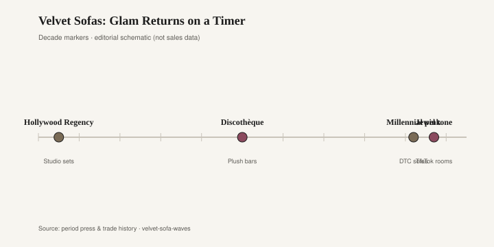
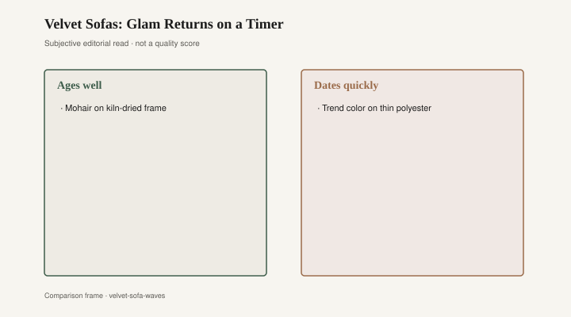

# Velvet Sofas: Glam Returns on a Timer

The sofa looked wet. That was the point of crushed velvet in the 1990s: a pile that changed direction when you sat, a swirl, jewel tones that belonged to a casino and a suburban basement and a formal living room that was not used on Tuesdays. Emerald, burgundy, a royal blue that photographed as ink. The cloth announced that the room had made a decision. Then people fled it for microfiber, then for the linen-look slipcover, then for velvet again. Cloth is the fastest date stamp a decent frame can wear. The frame, if it is a frame, can wait.

Crushed velvet was not a museum textile. It was a mill product that department stores and the big upholstery houses could put on a rolled-arm or a camelback and sell as glamour at a Saturday price. The crush hid a lot of ordinary foam. Texture is camouflage in every decade; the 1990s just made the camouflage shiny. I will not invent a sales ranking. You have seen the sofa. It is in a basement now, or it was recovered, or it went to the curb when the next owner said the word *dated* and meant the pile.

Jewel tones are the part that keeps returning. A deep green sofa is a useful object in a room that has too much gray wood. The 1990s version came with the crush and a skirt. The 2010s version came without the crush and with a photograph. Around the middle of that decade, emerald velvet became a catalog default: CB2, West Elm, and the direct-to-consumer cousins put a green sofa in a loft with a brass lamp and a fiddle-leaf fig. The fig is another essay. The sofa was the product. Jewel tone without crush reads as “done” in a feed. In a room it reads as a large green animal. Both readings can be true. Only one of them survives a dog.

<figure class="fffb-figure">
  
  <figcaption>Velvet reads luxury when the frame lasts longer than the hashtag.</figcaption>
</figure>

Performance velvet is the 2010s and 2020s answer to the stain the jewel tone invites. Polyester pile, a finish that claims a child and a red wine, sometimes a Crypton or Crypton-type treatment, sometimes an indoor-outdoor weave that left the patio and sat down in the living room. Crypton is a real chemistry and a brand name; I am not mocking a household that wants a sofa that can take a spill. I am naming the fashion. Once “performance” became the default swatch, a run of sofas photographed as the same matte pile in the same ten colors. Navy. Emerald. Camel. The 1990s jewels without the swirl. The cloth announced that you were a practical person with a design account. That announcement dates. Practical people will still need a washable sofa in 2032. They will not need this particular pile in this particular emerald.

Sunbrella and its cousins came inside the same way. A deck cloth that would not rot became a sofa cloth that would not blush. The selling point was the dog. The effect was a velvet that did not behave like velvet. It behaved like a uniform. Marks are not the enemy. A cotton or mohair pile that bruises when you sit is doing what pile does. A performance velvet that refuses a mark is doing what a catalog needs. If you want the bruise, say so at the mill. If you want the uniform, say that too. Do not call the uniform hospitality, or Hollywood Regency, or a cloud. Call it a cover.

Recover versus replace is the only adult question. If the bone is good — hardwood rails, a spring deck, corners that do not rack — recovering is the older economy. You pay a shop. You pick a cloth that is not this year’s emerald. You get the sofa back as a sofa. If the bone is foam on a plywood silhouette with legs that unscrew from inserts, recovering is a donation to a shape that was never meant to outlast the cloth. Replace that one, or live with it until the lease ends. Do not send a cardboard arm to an upholsterer and pretend you bought a Baker.

<figure class="fffb-figure">
  
  <figcaption>What tends to age well versus date quickly in Velvet Sofas: Glam Returns on a Timer.</figcaption>
</figure>

What ages: a frame you can recover; a wool or cotton pile that wears into itself; a leather that was leather; one pillow in a fashion cloth, which is a note and not the song. What dates: the crushed swirl of 1996, the performance emerald that matched a thousand rooms, the indoor-outdoor stripe that still looks as if it is waiting for a deck, a whole sofa in a cloth that exists to photograph as glamour. Glamour on a timer is still glamour. The timer is the problem you can plan for.

Bradley Brand Furniture, Warren, Arkansas, is a hardwood house. Company copy: lumber lineage dated 1902, no particleboard. [CITE NEEDED.] They are not an upholstery mill. The contrast still holds. A solid case piece does not wear a date in a pile. A sofa with a real frame can change its date. A foam animal in a costume cannot. Buy the frame if you can find it. Buy the cloth knowing you will argue with it.

I have sat on a 1990s crush that had gone bald at the headrest and still had a decent spring. I have sat on a 2016 emerald that looked new in the photograph and tired at the arm, the polyester shine that arrives when a pile is asked to be both jewel and wipe-clean. Both were velvet in the caption. The caption is a swatch name. It is not a provenance. CB2 and West Elm do not owe the 1990s a sequel. The 1990s do not owe them a joke. The frame, if it is a frame, does not owe either decade anything except another cloth.

The hangover is already at the curb on bulk-trash mornings: velvets that went bald, slipcovers in a velvet-look knit that stretched, performance sofas whose only remaining jewel is the listing word *velvet*. A few of those pieces had frames. Most did not. The ones that did will be recut. The ones that did not will become the next decade’s joke, the way crushed velvet became a joke and then a nostalgia and then a joke again. If you like velvet, ask whether you want the crush, the performance, or the old cotton pile that marks when you sit. Marks mean a person was in the room. A cloth that cannot take a mark and cannot take a new cloth is a costume with legs. Costumes come off. That was always the point of a good sofa.
