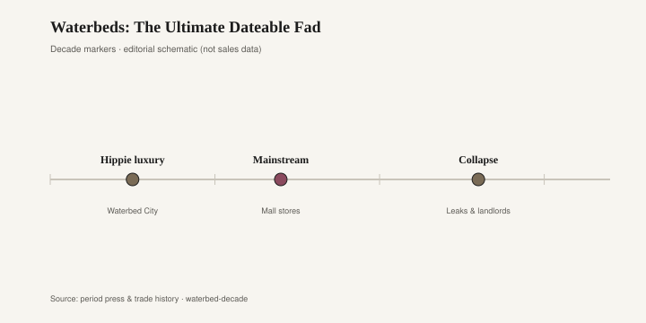
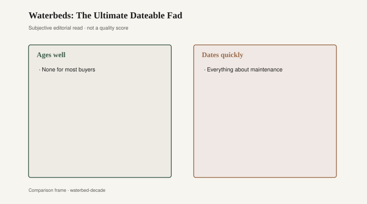

# Waterbeds: The Ultimate Dateable Fad

In the garage, under a tarp that has failed, sits a four-sided pedestal in dark pine or a printed oak grain. The drawer sticks. The middle is a cavity deep enough to hide a child. It is not a planter, though people try. It is a waterbed frame from the mid-1980s, bought in a strip-center shop that sold vinyl bladders, padded rails, conditioner bottles, and warranties that mentioned floor joists. For a decade the bedroom was a showroom for sensation you could finance. Then the water went down the drain on a Saturday. The wood did not.

Charles Hall (Charles Prior Hall in later write-ups) was a design student at San Francisco State when he turned flotation into a heated vinyl mattress. The late-1960s dates do not stack cleanly. A Cal State alumni inventions sheet and Rebecca Greenfield’s 2010 *Atlantic* piece put a master’s thesis presentation in 1968. A 2018 *New York Times* profile puts engineering-class experiments in 1967 — he got an A — and an eight-foot heated “Pleasure Pit” on view in 1968 at a Leavenworth Street gallery show titled “The Happy Happening.” A 2013 *Times* “Who Made That” column has him inviting his class to a Haight-Ashbury house to look at the thing. Treat the public object as 1968–70. Mark the exact thesis year [CITE NEEDED] if a registrar is in the audience.

The material path is less disputed. Hall tried a cornstarch gel and a starch-filled bag that stank and weighed hundreds of pounds. Water was lighter to explain if not to carry. Heat made the thing hospitable. He sold a lined, heated “Pleasure Bed” on a redwood frame; the *Times* 2018 piece puts an early price at $350. He patented “liquid support for human bodies” in 1971. Innerspace Environments, the company Hall and a partner built, opened stores across California — “more than 30” in the 2018 *Times* account [CITE NEEDED if you want a year-by-year store count]. That is the seed of a retail type.

<figure class="fffb-figure">
  
  <figcaption>Peak visibility versus practical ownership — a classic fad arc.</figcaption>
</figure>

By the mid-1970s and through the 1980s, the waterbed store was a place you could find in a strip center between a Radio Shack and a hair salon. Neon. Mirrors. A row of beds you were invited to lie down on, shoes off, while a salesperson talked about baffles and heaters and how this was not your cousin’s leak. Motionless — “waveless” — models used fiber or baffles to kill the slosh that had made the early beds a comic prop. The joke was always the wave. The industry spent a decade trying to become furniture. It succeeded just long enough to become a mall category, then a punchline, then an absence.

I will not invent a market-share number. Writers have thrown around peak figures for waterbeds as a slice of the mattress business in the 1980s; if you need a percentage, find a trade-journal table and cite it [CITE NEEDED]. What you do not need a table for is the memory of the stores. They had a smell: vinyl, carpet, a plug-in heater. They had a pitch: better sleep, fewer pressure points, a bedroom that was not your parents’ innerspring. They had a sexual reputation the ads both fled and harvested. Hall has said, in more than one interview, that he designed a serious sleep product. The culture sat on it anyway, poured a glass of wine, and made the bed a lifestyle. The bedroom became a showroom for sensation that could be financed. Mirrored ceilings were not required. They were not rare.

The frame was the furniture. Early Hall beds sat on serious wood; knockoffs sat on whatever would hold a ton of water. A filled waterbed is a structural event. Landlords wrote clauses. Second-floor apartments became negotiations. You did not move one casually. You drained it, which was a Saturday, and you hoped the vinyl had not been waiting to crack along a crease. The conditioner was not a joke. Dry vinyl splits. Split vinyl is a flood. The horror stories — collapsed ceilings, a slow leak into the downstairs lamp — are the folk literature of the product. Some of them happened. All of them sold motionless models and better linens.

Status was the point and the problem. A waterbed said you were modern about bodies. You had left the Puritan mattress. You had a heater and a warranty and a bedroom that was about sensation. That was a 1970s claim with 1980s financing. When the claim went out of fashion, the object could not retreat into “classic.” There is no classic waterbed in the way there is a classic four-poster. There is only a period. A hardwood bedstead — maple, oak, a mill piece of the sort Bradley Brand Furniture in Warren, Arkansas, still describes in company copy as solid hardwood since 1902, no particleboard [CITE NEEDED] — can take a new mattress when the fashion in sleep changes. A pedestal built around a bladder cannot. The cavity is the design. Empty, it is a relic.

By the 1990s the fad had collapsed. Innersprings improved. Pillow-tops arrived. Futons had already taken the student dollar. Memory foam was coming. The waterbed store could not become a mattress store fast enough, and the mattress store did not want the insurance. What leftover was the frame: those pine pedestals, sometimes with bookcase headboards, sometimes with a padded rail in a dusty velour. They are awkward as daybeds. They are worse as planter boxes, though people try. The bladder, once drained, is a sticky relic you do not donate. The heater looks like medical equipment and is worth nothing to the next tenant.

<figure class="fffb-figure">
  
  <figcaption>What tends to age well versus date quickly in Waterbeds: The Ultimate Dateable Fad.</figcaption>
</figure>

What ages, if anything ages, is the redwood Hall started with — a frame that was wood before it was a category — and the idea that a mattress might be more than coils. Heat, flotation, pressure relief: those problems did not vanish when the stores closed. They moved into other products that did not require a clause in the lease. What dates is everything that made the store a store: the neon, the vinyl smell, the padded rail, the bookcase headboard in fake oak, the sexual joke that would not leave the object alone. A fad is dateable when the object cannot shed the joke. The waterbed never could. The garage still has the boat-shaped hole to prove it.
