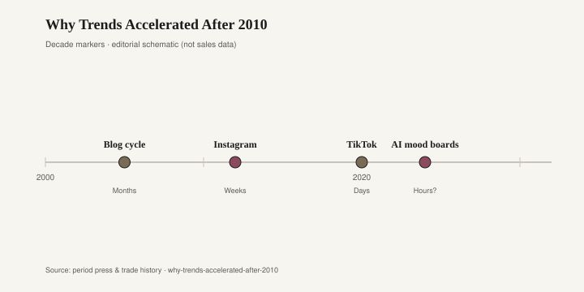

# Why Trends Accelerated After 2010

Furniture used to take a decade. Not because people were virtuous. Because the picture moved slowly, the factory moved slowly, and a dining set was a marriage you did not restage for a blog.

Mediterranean oak is the exhibit. In the 1970s and into the 1980s, American dining rooms filled with dark, carved, vaguely Spanish or Italian suites — trestle tables, high-back chairs, a hutch with a dark stain that photographed as seriousness. Builders and chains kept cutting versions of that look long after the first wave. The oak did not need a hashtag. It needed a payday and a truck. Families ate on it for years. Some of those suites are still in basements, too heavy to evict. That is what a furniture fad looked like when the distribution system was showrooms, Sunday circulars, and a neighbor's house. It lasted because replacing it hurt.

Then the phone got a camera, and the room became a weekly publication.

The iPhone arrived in 2007. By 2010 the smartphone was common enough that a living room could be photographed without a magazine budget. [CITE NEEDED] for the exact U.S. smartphone-penetration figure that year. Pinterest opened to the public that same year and turned other people's rooms into a private magazine you refreshed yourself. Instagram launched in October 2010; Facebook bought it in April 2012. Those two dates — 2010 and 2012 — are the hinge the title is pointing at. You could see a kitchen in Portland at breakfast and want its stools by lunch. You could not, in 1984, see a kitchen in Portland at all unless a shelter magazine had already spent months producing it.

TikTok is the later compression. Douyin in China in 2016, the international app and the Musical.ly merger in 2018. Furniture got a sound, a stitch, a dupe link. The Cloud sofa's cousins, the Amazon L-shape, the "get ready with me" but for a sectional — those are 2020s objects riding a 2010s pipe. The pipe was already built. TikTok only increased the frame rate.

<figure class="fffb-figure">
  
  <figcaption>Approximate fad half-life compression (editorial model).</figcaption>
</figure>

Do not read the figure's "months / weeks / days" labels as a study. They are an editorial sketch, not a stopwatch. Anyone who tells you "trends now last eleven days" is selling a slide. What you can say without inventing a half-life: the Mediterranean oak suite had years. A blog-era look in the late 2000s could ride a comment section for a season or two. A pinned look after 2010 could saturate a feed before the freight from the first order arrived. A TikTok look can feel exhausted while the foam is still curing. That is acceleration as experience, not as a fake statistic.

Why 2010, not 2007? The phone was necessary but not sufficient. You needed a place to put the pictures where strangers could sort them by want. Blogs had editors. Magazines had closings. Pinterest had a grid and no issue date. Instagram had a following count. Together they removed the lag that used to protect a sofa. The lag was not kindness. It was logistics: photography, printing, shipping a book, a buyer flying to High Point twice a year. After 2010 the photograph skipped the book.

Fashion already knew this speed. Apparel can cut a new SKU while a sofa is still waiting on a kiln. After 2010, furniture tried to borrow apparel's clock without borrowing apparel's weight. A dress can die in a season and leave a small bag of cotton. A sofa that dies in a season leaves a carcass. The acceleration is not only cultural. It is a waste problem wearing a taste problem's clothes.

Other 2010s machinery piled on. Houzz (2009) made renovation a browse. Target-style drops taught home shoppers to show up on a date. IKEA's room settings, already a lookbook, became room-tour content. Retailers learned to test a look as a pin before they committed a cutting ticket. That sounds efficient. It also means a look can be "over" in the feed while it is just arriving on a loading dock. The dock does not read Instagram.

A decade-scale furniture fad — Mediterranean oak, country pine, the first wave of leather sectionals in the 1990s — had time to become ordinary. Ordinary is how a look survives. The post-2010 look rarely gets to be ordinary. It gets to be famous, then embarrassing, then ironic, then a search term. The embarrassment arrives before the kids have grown up around the table.

If you want a brake, it is still physical. Measure the wall. Sit in the chair. Buy from a floor that expects you to keep the piece — bbfur is in that slower business — and ignore the save count. The feed will call that stubborn. The oak suite, for all its sins of taste, knew something the feed forgot: a dining table is not a story you owe the timeline. It is a surface that has to take a winter.

The acceleration is real. The numbers people hang on it are mostly costume. Keep the dates you can defend: smartphones in the pocket, Pinterest in 2010, Instagram in 2010 and 2012, TikTok after. Keep the furniture fact: a look that once had years now has to survive a camera that never clocks out. Leave the "X weeks" claims to the people who need a chart to finish a keynote. The oak is still in the basement. That is the citation.
