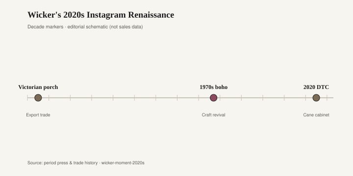

# Wicker's 2020s Instagram Renaissance

Lloyd Flanders, in Menominee, Michigan, treated wicker as a year-round argument long before the patio became a feed. Woven furniture, a frame that expected to be out in weather, a shop name the contract and casual trades still know. All-weather wicker — a resin weave over aluminum — is the later, honest cousin of rotting rattan: not trying to be a Victorian porch, trying to winter over. Then 2020 happened. People were home. The yard was the only restaurant. Instagram liked a woven chair in late light. The material, or the picture of the material, spiked.

CNBC, 17 May 2020, reported the outdoor spike with names attached. Overstock’s Ron Hilton said outdoor demand “exploded.” Frontgate’s Lindsay Foster talked chaises and fire pits. Bed Bath & Beyond reported boosts in the same direction. Frontgate’s pool floats were “up over 100 percent,” which is a company figure given to a reporter, not a census, and should be read as such (CNBC, 17 May 2020). I will not invent the rest of the percentages. The qualitative fact is enough: the patio became the spare room, and the spare room got furnished in a hurry. Wicker — resin, rattan, a mix the listing did not always sort — was an easy photograph of “outside.”

All-weather wicker is honest when the aluminum frame is decent and the weave is a replaceable idea. It is a costume when the weave is the entire identity and the frame is a tube that kinks. Lloyd Flanders when the weave is still tight belongs in the first sentence. The warehouse set that arrived in one box in June 2020 belongs in the second. Cheap resin remembers every winter. It chalks. It goes chalk-white and then dirty-white. It is furniture that was a click, delivered, assembled with a hex key, and then asked to be a room for two summers of a pandemic.

<figure class="fffb-figure">
  
  <figcaption>Timeline for Wicker's 2020s Instagram Renaissance.</figcaption>
</figure>

Indoor wicker is a different contract, and the 2020s renaissance mixed the two on purpose. A peacock leftover, a 2021 cane bed, a hanging chair in a corner that had never seen a porch — the feed treated weave as a texture, not a climate. Rattan is a climbing palm. Cane is its skin. Both want some humidity. In dry heat — forced air, a winter in Denver, a desert condo with the air conditioning at 68 — indoor wicker shrinks, bindings loosen, seats go slack and then pop. Victorian porches were often unheated; the furniture lived in weather that at least had moisture. A hanging egg chair in a Phoenix apartment is a different bet. People blame the cat. The cat is not the whole story. Dry air is.

The Instagram renaissance also brought indoor-outdoor confusion into the living room: resin wicker that could have stayed on the patio, sitting on a rug, shedding a chalk dust that is not dirt so much as the weave giving up. Resin that was specified for sun can still look wrong next to a sofa. It looks like it is waiting for a deck. If that is the room you want, fine. If you wanted a Heywood parlor and got a patio leftover, look at the underside. Aluminum and a plastic weave will tell you. A hardwood rail and a plant fiber will tell you something else.

What ages outdoors is a frame you can repair and a weave you can replace or live with as it silvers. Lloyd Flanders, the better aluminum and resin, teak that is teak, iron you can recoat. What ages indoors is a caned or woven seat on a frame built for holes, not for a staple gun. What dates is the 2020 package: a resin conversation set whose left-arm chair has a broken weave, an egg chair that was a thumbnail, indoor rattan asked to live in a house that never opens a window. The 2021 cane headboard from the same mood is a cousin; plastic sheet cane yellows the same way a cheap outdoor weave chalks. Different rooms, same print of a plant.

Status outdoors is louder than status in the dining room because the neighbors can see it. A 2020 fire pit and a woven sectional that could have been indoors said we are not going inside, and we have the delivery slot to prove it. When the spike ended, the signal stayed out there in the rain. Indoor wicker’s status was softer: we have texture, we have a vacation in the corner. Vacations end. Weave that was a plant will ask for humidity. Weave that was a resin will ask for nothing and then crack.

A hardwood shop is not, mostly, in the patio business. Bradley Brand Furniture in Warren, Arkansas, talks solid hardwood and no particleboard; it also claims the Bradley Lumber line back to 1902, which remains company copy until a primary record is attached [CITE NEEDED]. The quiet contrast is still useful. A maple case in a kitchen will outlast three generations of patio sets bought for the same house. That is not because indoor wood is virtuous. It is because the patio set was asked to arrive in time for the first warm Saturday. Indoor wicker that dies in dry heat was asked to photograph as a porch. Porches have weather. Weather includes moisture.

Behind a row of college-town rentals the remainder is already out by the bins: resin chairs with a broken weave, a hanging stand with no chair, a cane-look headboard that flexed in the dumpster. Hilton was not wrong that demand exploded. Foster was not wrong that chaises and fire pits moved. The hangover is not their problem. It is the alley’s. If you are buying wicker as furniture, buy the frame you can repair and the climate the fiber can stand. If you are buying a summer, buy a summer and do not call it an heirloom. Lloyd Flanders knew the difference. The 2020 feed did not always. Dry heat still does.
