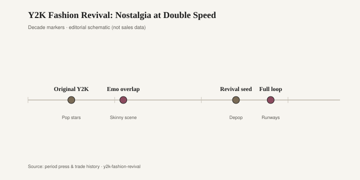
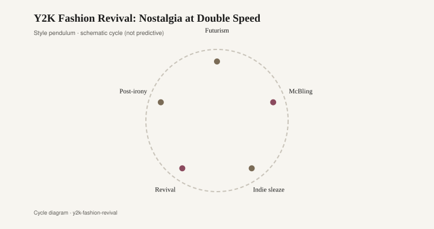

# Y2K Fashion Revival: Nostalgia at Double Speed

Y2K, as a fashion caption, is a short window wearing a long name. Roughly 1999 to 2004: the years when a pop star's midriff, a rhinestone, and a pair of tinted tiny sunglasses could stand in for a whole culture. The original moment was not nostalgic. It was trying to look like the future — metallic, a little cheap, a little space-age — while still shopping at a mall.

The tropes are a list people can recite. Low-rise denim. A baby tee. Butterfly clips in highlighted hair. A velour tracksuit from Juicy Couture. A Dior saddle bag or a bag that wanted to be one. Von Dutch. A frosted lip. Frosted tips, if you were a boy in a boy band. A heel with a clear strap. A hint of logo, a hint of logo's fake. Britney, Christina, Destiny's Child on a video set that looked like a spaceship designed by a department store. Paris Hilton treated the same clothes as a full-time job. The fabrics were stretch denim, velour, nylon, a lot of polyester satin, the occasional real silk charmeuse on a slip dress that had survived the 1990s.

There was an overlap with the emo and scene years that followed: skinny denim, a studded belt, more black than pink. That overlap matters because the revival later mixed the two closets. A 2022 teenager could wear a butterfly and a skinny from Hot Topic's archive in the same week.

Tom Ford's Gucci, just before the window, had already made satin and a visible hip into evening news. John Galliano's Dior, inside the window, made the saddle bag and the newspaper print into mall objects. Those houses were not "Y2K" as a hashtag. They were the expensive end of the same glitter. The cheap end was a rhinestone transfer on a baby tee from a junior department.

The first revival seeds showed on Depop and in a few lookbooks in the late 2010s. The full loop closed around 2021. Dua Lipa and Olivia Rodrigo wore the references without irony, or with just enough irony to keep the comments going. Blumarine under Nicola Brognano put a crystal butterfly on a low-rise and made the citation official. Diesel, Versace, and a rotating cast of TikTok brands sold a rhinestone and a tiny sunglass as if 2003 had a restock button. Miu Miu's short skirts and hipster waistbands did a more expensive version. The speed was the story. The original Y2K had about five years to invent itself. The revival compressed the look into a season, then another season, then a joke about how fast the joke had moved.

<figure class="fffb-figure">
  
  <figcaption>Timeline for Y2K Fashion Revival: Nostalgia at Double Speed.</figcaption>
</figure>

Nostalgia at double speed is not a mystery. The people who were twelve in 2003 were thirty in 2021, with credit cards and a willingness to pay for the poster they used to tear out of a magazine. The people who were twelve in 2021 had never lived it, so they received it as a costume with good lighting. Both groups could shop the same listing.

Rooms kept a parallel souvenir box. Lucite — the clear acrylic that made a 1970s cocktail table look like ice — came back on coffee tables and on chair legs, the same way a clear heel strap came back on a sandal. Blob furniture, the kind of poured, rounded seating that looks like a melted mint, rhymes with the era's plastic jewelry and its love of a shiny, slightly edible surface. The butterfly chair — the 1938 BKF by Jorge Ferrari Hardoy, Juan Kurchan, and Antonio Bonet, later made widely by Knoll — had already lived a dozen lives; the chrome frame and sling seat showed up in dorms and first apartments whenever the decade wanted a cheap modern silhouette. Chrome itself — a dining chair, a lamp stem, a table edge — is the furniture version of a tiny sunglass frame. It photographs as future even when it is fifty years old.

<figure class="fffb-figure">
  
  <figcaption>Style cycle schematic for Y2K Fashion Revival: Nostalgia at Double Speed.</figcaption>
</figure>

None of this needs a sneer. A lucite table can be handsome. A butterfly clip can be fun. The 2000s closet was often accused of being trashy; a lot of it was just young and shiny. The revival edited for the camera: less Ed Hardy, more Blumarine; less baggy velour, more a precise crop. What it kept was the willingness to look a little plastic.

If you are furnishing rather than dressing, the durable pieces from that vocabulary are the ones with a material, not a slogan. A well-made acrylic table. A chrome chair whose joints still tighten. A butterfly chair with a new leather sling. The dateable pieces are the ones that shout a year: a logo pillow, a blob in a novelty color that only existed because a feed needed it. Fashion will cycle the baby tee again before the acrylic yellows. That is the double speed. The room, heavier, gets to choose whether it wants to keep up.
