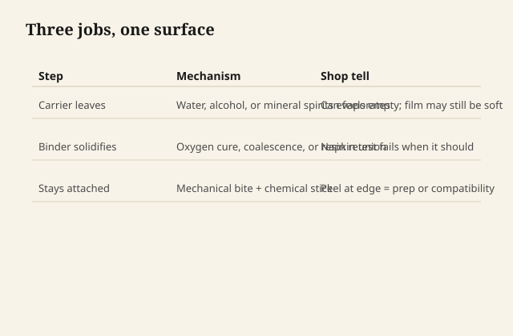
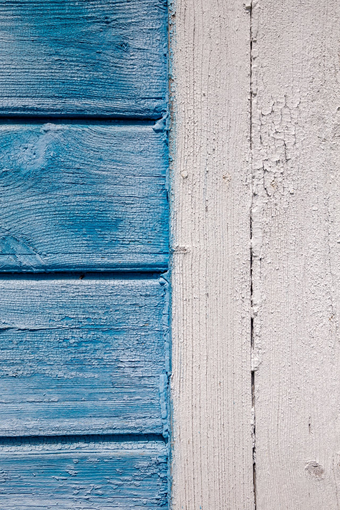

# What a finish actually is

A finish is not a shine. Shine is what light does after the finish has already
succeeded or failed.

A finish is a thin argument between wood and the room. It has to slow water,
slow dirt, slow the hand that will set a wet glass down without asking, and
still look like the wood you chose. If it only looks wet in the booth and
turns into a fingerprint museum by Thursday, it was a coating demonstration,
not a finish.

## Three jobs, one film

Every finish that earns a place on furniture does some mix of three jobs.

<figure class="ffc-figure">
  
  <figcaption><strong>Figure 1.</strong> A finish can occupy pores and build a film on top; adhesion and thickness decide whether it survives use.</figcaption>
</figure>

<figure class="ffc-figure ffc-photo">
  
  <figcaption><strong>Photo 2.</strong> A finish slows dirt and moisture on fiber like this; shine is what light does afterward. (<a href="https://commons.wikimedia.org/wiki/File:%D0%A4%D1%80%D0%B0%D0%B3%D0%BC%D0%B5%D0%BD%D1%82_%D1%86%D0%B5%D1%80%D0%BA%D0%B2%D0%B8._%D0%94%D0%BE%D1%88%D0%BA%D0%B8_%D0%BE%D0%B1%D0%B1%D0%B8%D0%B2%D0%BA%D0%B8.jpg">Wikimedia Commons — Wood plank fragment</a>)</figcaption>
</figure>
**It occupies the surface.** Oil-heavy systems sink into cell cavities and
the first few fibers. Film systems sit more on top. Most real cans do both
and then lie about the ratio.

**It becomes a solid.** Water and mineral spirits leave. That is evaporation,
and it is the easy part. The hard part is the binder turning from a liquid
or a dispersion into something that does not wipe off with a dinner napkin.
Oils do that by taking oxygen and crosslinking. Varnish and polyurethane do
it by the resin already being a polymer, then packing tighter as solvent
leaves, sometimes with more crosslinking after. Waterborne finishes do it
by polymer particles *coalescing* — knitting — once the water is gone and
the shop is warm enough. Shellac does it by the alcohol leaving and the
resin touching itself again. Milk paint does it by a protein film setting
as the lime chemistry goes from "this will brush" to "this will not
redissolve in the first splash."

**It stays attached.** Adhesion is not a vibe. It is mechanical bite into
sanded fiber, and it is chemical willingness to sit on whatever is already
there — extractives, old wax, a previous sealer, a handprint you cannot
see. Most "the finish failed" stories are adhesion stories wearing a color
costume.

## What the can is hiding

Open a can of "warm satin wipe-on." You have bought a **binder** (the stuff
that becomes the film), a **carrier** (water, alcohol, mineral spirits, or
a blend), and a pile of **helpers**: driers, coalescents, flatteners, UV
absorbers, defoamers, biocides, a tint that is not quite a stain.

The label sells the feeling. The SDS sells the lawyer. The shop has to sell
itself the third thing: which of those nouns is doing the work on *this*
board, in *this* humidity, under *this* schedule.

If you cannot name the binder, you are not choosing a finish. You are
choosing a sticker.

## Thickness is not virtue

A thick film hides sanding sins and then copies every move the wood makes
in winter. A thin oil leaves the pores looking honest and then asks you to
re-oil when the table gets used like a table. Neither is morally better.
They fail differently.

People chase "build" because build photographs well. Furniture lives in
hands. Hands find the edge where the film is fat, the pore where the oil
never kicked, the ring where a hot mug met a thermoplastic waterborne that
was still a little soft.

## The test that is not a sheen board

A sheen board tells you gloss. A **use board** tells you the finish.

Take the same species as the job. Sand it the way you will sand the job.
Run the whole schedule — not one heroic coat. Then do rude things that a
showroom never does: a wet glass for an hour, a dry palm, a fingernail at
the edge, a week of sitting. If you need a lab, you do not have a shop
problem yet. You have a sample problem.

The rest of this series is the chemistry behind that board. Not so you can
recite iodine values at dinner. So that when the film wrinkles, or blushes,
or refuses to knit in a cold garage, you do not buy a second can of the
same story.
