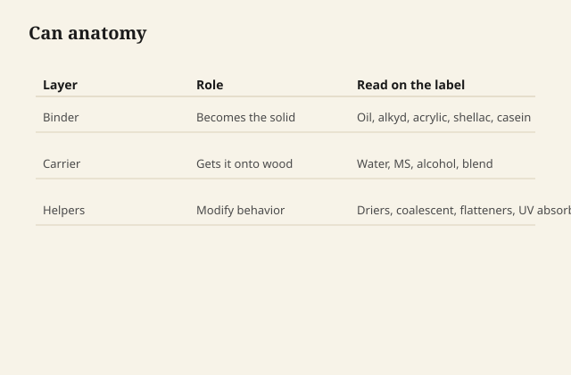
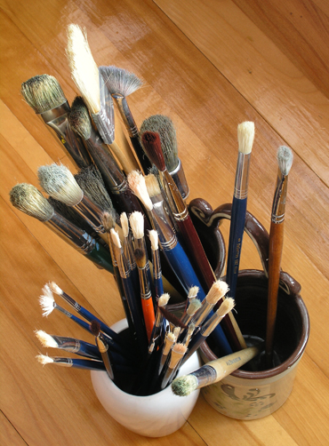

# Binder, solvent, additive

A finish can is a sentence. Most people read the adjective. The
sentence has three nouns.

<figure class="ffc-figure">
  
  <figcaption><strong>Figure 1.</strong> The label sells feeling; the SDS lists nouns — the shop must know which noun does the work on this board.</figcaption>
</figure>

<figure class="ffc-figure ffc-photo">
  
  <figcaption><strong>Figure 2.</strong> Brushes and pads move binder and carrier onto wood — tool cleanliness is part of chemistry. Photo: Wikimedia Commons, CC0.</figcaption>
</figure>

## Binder

The binder is the adult in the can. It is what remains after the
carrier leaves and the chemistry, if any, finishes. Oil, alkyd,
polyurethane, acrylic, shellac resin, casein. If two cans share a
binder family, they will fail in related ways even if one is
"antique maple" and the other is "crystal clear."

Binders differ in hardness, yellowing, solvent resistance, and how
they feel about the next coat. Shellac will redissolve in alcohol
forever. That is a repair gift and a bar-top curse. A crosslinked
polyurethane will not redissolve in the carrier it came in. That is
armor, and it is why a bad first coat is a divorce.

You do not need the molecular weight. You need to know whether the
solid you are leaving behind is thermoplastic (heat and solvent
still move it), thermoset-ish (it has crosslinked and will not
melt back into itself politely), or a wax/oil hybrid that never
pretended to be a truck bed liner.

## Solvent — say carrier if you are less romantic

The carrier's job is to make the binder brushable, sprayable, or
wipeable, then leave. Mineral spirits, water, ethanol, a coalescent
blend. The carrier is not the finish. People treat a strong smell
as proof of quality. Smell is proof of volatility and of which
solvent family you bought.

Water is a carrier with opinions. It swells fibers. It makes grain
stand up. It also makes a lot of shops safer to breathe in than a
gallon of slow solvent on a Sunday. Safer is not the same as
harmless, and it is not the same as "this film will form in a
forty-degree garage."

Alcohol under shellac is fast and honest. It also picks up water
from humid air and then the film blushes like it saw a ghost.

This series will tell you how commercial carriers behave. It will
not tell you how to distill, stretch, or cook a solvent at home.
If the can is too thick, the manufacturer already sold you a
reducer or told you which store-bought thinner belongs to that
system. Use that. Do not invent a still.

## Additive

Additives are why two polyurethanes from the same aisle are not
the same liquid.

**Driers** in oil and oil varnish hurry the oxygen reaction.
Commercial boiled linseed already has them. You do not mix your
own cobalt cocktail. You buy the can that is already a consumer
product and you respect the rag.

**Flatteners** are fine particles that break up gloss. They settle.
That is why the can says stir, and why the last third of a satin
can goes glossy if you got lazy.

**Coalescents** in waterborne finishes are the quiet solvents that
help particles knit. In a cold shop they are not optional
philosophy. They are the difference between a film and a powder
that looks like a film until you wipe it.

**Defoamers** fight the bubbles you hired when you shook the can.
**UV absorbers** matter on a porch more than in a drawer.
**Biocides** keep the waterborne can from growing a science fair.

You will not get a full additive list on the front label. You get
behavior. If a waterborne flashes off and still feels sandy, think
coalescence and temperature before you think "bad brand." If a
satin goes blotchy, think settled flattener before you think the
wood changed species overnight.

## How to read a can in the aisle

Ignore the lifestyle paragraph. Find the cleanup: water, mineral
spirits, alcohol. That names the carrier family. Find the binder
word: oil, polyurethane, acrylic, shellac, varnish, casein, "hybrid."
Hybrid means mutt; treat it as a film until it proves it is not.
Find recoat time and cure time. They are different clocks. Recoat
is "the next coat will still bite." Cure is "a wet glass is no
longer a dare."

If those three nouns are not on the can, they are on the tech
sheet. If they are on neither, you are buying a story. Stories
look fine on a pine board in fluorescent light. Furniture is not
that board.
