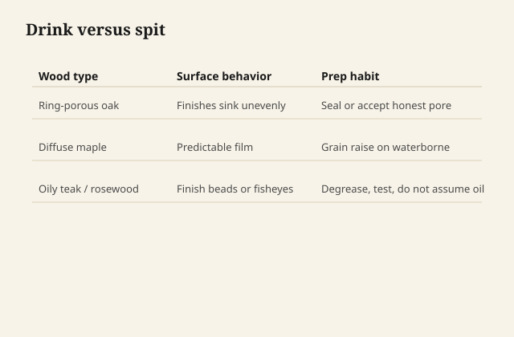
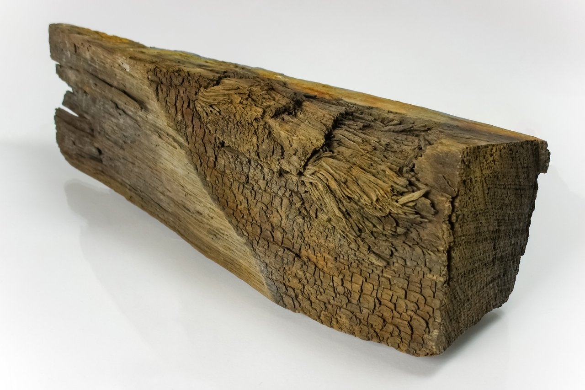

# Why some woods drink and some spit

Finish chemistry is half the can. The other half is the corpse you
are coating. Wood is not an inert beige. It is a stack of dead
plumbing with leftover food in the pipes.

## Pore and plane

Oak is a bunch of open vessels. A wiping oil disappears into
white oak end grain like a rumor. Maple is tight and shy; the same
oil sits on top and looks greasy if you leave it. Pine is earlywood
and latewood arguing in public; stain and thin oil will make that
argument louder.

<figure class="ffc-figure">
  
  <figcaption><strong>Figure 1.</strong> Ring-porous woods drink finish into vessels; diffuse-porous woods often need fewer coats.</figcaption>
</figure>

<figure class="ffc-figure ffc-photo">
  
  <figcaption><strong>Photo 2.</strong> Ring-porous oak moves finish into vessels; always test absorption on scrap from the same board. (<a href="https://commons.wikimedia.org/wiki/File:Piece_of_oak_wood_from_the_ship_Vasa_4.jpg">Wikimedia Commons — Piece of oak wood from the ship Vasa 4</a>)</figcaption>
</figure>
End grain is not "thirstier" in a poetic way. It is open pipe.
The same finish that looks like a whisper on a face grain will
look like a stain on a tabletop's cut edge unless you seal or
cut the first coats thinner and wipe harder.

This is why a finish schedule that only names "three coats" is
not a schedule. It is a hope that every surface of the piece is
the same wood in the same orientation. It never is.

## Extractives — the wood's own finish

A lot of woods come pre-finished with their own chemistry.

Teak, rosewood, cocobolo, teak's cousins, some cedars: oils and
waxes already in the fiber. Freshly sanded, they feel rich. An
hour later the surface is a film of the tree's own opinion, and
your varnish crawls or your waterborne craters. The wood is not
being difficult. It is contaminating the glue line between your
binder and the fiber.

Pine and cherry have resins and tannins that move with heat and
time. Cherry darkens with light; a finish that yellows on top of
that is a double story and you should decide if you want both.
Oak tannins plus some waterborne systems can stain-gray if the
formula is not meant for it. Walnut can bleed a pinkish tea into
a pale waterborne if you skip a sealer.

A wash coat of dewaxed shellac is not magic. It is a diplomat
that a lot of extractives will still talk through, but less
rudely. More on that in the shellac stage. The foundation point
is simpler: **if the wood is oily, the first act is not more
finish. It is a clean, freshly sanded surface and a sealer that
is allowed to be a sealer.**

## Moisture is a finish too

Wood at 6% and wood at 12% are not the same substrate. A film
applied on a wet week in a garage will sit on swollen fiber.
When the piece moves into a house with heat, the wood shrinks
and the film has extra area it does not know what to do with.
Checks, ridges, a "I don't know why it dulls in winter" story.

Penetrating oils are more forgiving of movement because there
is less skin to wrinkle. They are not forgiving of applying
over damp wood. Water in the cell and oil trying to occupy the
same cell is a crowd.

Waterborne finishes add water and then ask it to leave. If the
shop is already humid, leaving is a negotiation. Grain raise
gets worse. Knit gets worse. You will blame the brand.

## The sanding bruise

Crushed fiber from a dull grit or a skip in the sequence drinks
unevenly. The bruise looks like a shadow after stain and like a
dull patch after oil. People sand more. They make a bigger
bruise.

This is not chemistry in the can. It is chemistry of cellulose
that has been mashed and then asked to wet the same as its
neighbors. It will not.

## A working habit

Before a new species becomes a paying job, cut a offcut. Sand
it like the job. Wipe it with the carrier you plan to use —
mineral spirits, water, alcohol — and watch. If the rag comes
away colored, you have extractives. If the surface goes dull
and greasy ten minutes after sanding, you have oil moving. If
water beads like a freshly waxed car, someone already put a
finish or a wax on that "raw" board.

The wood will tell you whether it drinks or spits. Your job is
to stand there long enough to hear it, instead of covering the
sentence with a thicker coat.
