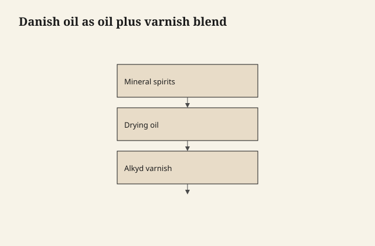

# Danish oil is a wiping varnish with a nickname

Danish oil is a marketing truce. The typical hardware can is
**linseed or another drying oil, a varnish resin, and mineral
spirits** in a ratio that wipes like oil and builds like a shy
film. Some brands lean oil. Some lean varnish. The word Danish
does not commit.

<figure class="ffc-figure">
  
  <figcaption><strong>Figure 1.</strong> Danish oil is usually a film binder in a wiping carrier — the rag is the same; the chemistry is not linseed alone.</figcaption>
</figure>

<figure class="ffc-figure ffc-photo">
  
  <figcaption><strong>Figure 2.</strong> End grain shows rays and pores — the finish lands on this anatomy. Photo: Wikimedia Commons, CC BY-SA 4.0.</figcaption>
</figure>

That is not an insult. A good wiping varnish is one of the
most useful things a small shop can own. The insult is
pretending you have "just oil" when you have already bought
a film.

## Why the blend exists

Pure oil is slow and thin-protected. Pure varnish, brushed
full strength, shows every lap and every dust bunny. Thin the
varnish, add oil for wetting and a longer open time, wipe it
like you are staining, and you get a surface that looks
hand-done and still has a little armor.

The oil fraction helps the first coat sink and pop grain.
The varnish fraction is why a Danish-oiled table survives a
week of mail and coffee cups better than raw BLO. The solvent
is why you can wipe the excess before it becomes a pudding.

## How to tell which mutt you bought

Wipe a coat on scrap. After a day, scratch it with a
fingernail at the edge.

If the mark is a dull line in wood and more of the same
liquid hides it, you are oil-heavy. If the mark is a white
skin, you are varnish-heavy. If the surface is still tacky
the next evening, you left too much, or the shop is cold, or
the can is old and the driers have lived their life in the
tin.

Smell and cleanup still matter. Mineral spirits cleanup is
the usual. A water cleanup "Danish" is a different animal —
probably a waterborne pretending to be a tradition. Treat it
as waterborne.

## Practice that respects the mutt

Sand as if you are oiling, because every scratch will show;
the film is not thick enough to bury 120. Flood the first
coat. Wait. Wipe dry — dry, not "artistically moist." Let it
go tack-free. Scuff with a worn fine grit or a pad if the
surface feels nibby. Repeat. Three coats is a common honest
number. Twelve coats is how you accidentally build a varnish
you then have to repair like varnish.

Recoat clocks on the can are about the solvent leaving and
the oil starting to set. They are not a dare to put a fourth
wet coat on a still-soft third. If your rag is picking up
color or a gummy film, you are recoating too early or you
never wiped.

## Repair is the reason people stay

A true oil-heavy Danish oil will take a scuff and a new wipe
in a way that a thick poly will not. A varnish-heavy Danish
will not. So the nickname "oil" sets a client expectation
you may not be able to keep.

Say it out loud: "This is a thin wiping varnish. You can
refresh it if we do not build it into a skin. If you want
mustard-proof, we are in a different family."

## The fire is still oil's fire

The oil fraction is still a drying oil. The rags still heat.
The varnish fraction does not save you from the pile by the
heater. Hang them. The fence in draft 05 is not only for
pure linseed.

## A naming habit that would save a decade

In my notes I write **wiping varnish** when the can has
resin, and **oil** when it does not. I let "Danish" live on
the receipt. The piece does not care what country the
marketing department rented. It cares whether the binder
can take a wet glass on a Saturday.
