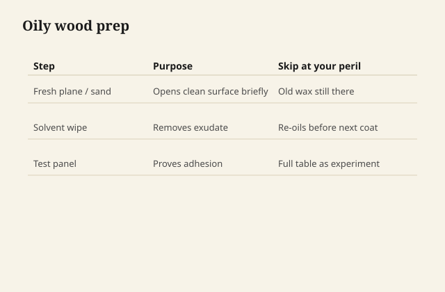

# Oil on teak, rosewood, and other greasy citizens

Some woods arrive with their own finish already moving.
Teak is the famous one. Rosewood, cocobolo, ebony in some
lots, teak's cousins, a few exotic "boating woods" that
get sold to furniture people: they sweat. You sand, the
surface is pale and open, and twenty minutes later it is
lunch meat again — a thin film of the tree's own oil and
wax.

<figure class="ffc-figure">
  
  <figcaption><strong>Figure 1.</strong> Natural oils in teak and rosewood fight adhesion — degrease, seal, test, never assume the first coat stuck.</figcaption>
</figure>

<figure class="ffc-figure ffc-photo">
  
  <figcaption><strong>Figure 2.</strong> End grain shows rays and pores — the finish lands on this anatomy. Photo: Wikimedia Commons, CC BY-SA 4.0.</figcaption>
</figure>

Your drying oil is then trying to polymerize in a crowd.
Your varnish is trying to stick to a greased plate. Your
waterborne is trying to wet a surface that looks like a
freshly waxed hood.

## This is not a character flaw in the tree

Those extractives are why teak boats lived. They are why
a rosewood box smells like money. They are also why a
"simple oil finish" on a teak mid-century piece can look
blotchy and never quite harden.

You are not going to solvent-extract a dining table in a
lab. You are going to work with a freshly sanded surface
and a first product that can tolerate a little grease.

## A shop sequence that stays shop-safe

Sand to the grit the job wants. Vacuum. Then, promptly —
not after lunch — wipe with the **commercial cleaner or
solvent the finish system names**. For a lot of oil and
varnish work that is mineral spirits on a clean rag,
turned often, until the rag shows less color. You are not
building a still. You are not heating a bath. You are
degreasing a surface the way the tech sheet already
allows.

Let the wood flash off. The surface should look dry, not
wet-greasy. Then get the first coat on while the extractives
are still in retreat. Delay is how the tree wins.

If the first coat crawls, stop. Do not pile more. A
**dewaxed shellac wash coat** — a commercial flake or a
canned dewaxed, cut thin — is the diplomat a lot of these
jobs need before oil or waterborne. Shellac can have its
own feelings about oil underneath; this is a sealer on
fresh wood, not a stack of mysteries.

## Oil on oily wood is a redundancy, not a plan

People oil teak because "teak oil" is a product category.
Many teak oils are wiping varnishes with pigment. They can
look fine on outdoor furniture that will be ignored. On
an interior table, ask what you are adding that the wood
did not already bring.

Sometimes the answer is UV and a little film for a dining
surface. Sometimes the answer is: clean, sand, wax, and
leave the species alone. A rosewood box with a heavy oil
is how you mute the thing you paid for.

## Glue and finish both fail here

This is a finishing series, but the same grease ruins glue
lines. If you are repairing a teak chair and then finishing
it, the glue-up wants the same freshly sanded, degreased
honesty. A beautiful oil film on a joint that never stuck
is a very shiny chair on the floor.

## Outdoor teak is a different contract

Outdoor teak that goes gray is doing a UV and weather job.
Oil will darken it and then the sun will eat the oil and
you will be on a yearly schedule. That can be what someone
wants. It is maintenance, not a cure. A film finish on
outdoor teak is a different family and a different failure
(peel, chalk). Do not promise interior dining-table
behavior on a bench that lives in rain.

## The test board is not optional on these species

A maple test board does not speak teak. Cut the offcut.
Run the degrease. Run the first coat. Wait a day. Put a
glass on it. If it stays tacky, you have not failed as a
person. You have learned that this lot of wood wants a
sealer or a different binder. That lesson is cheaper than
a tabletop.
