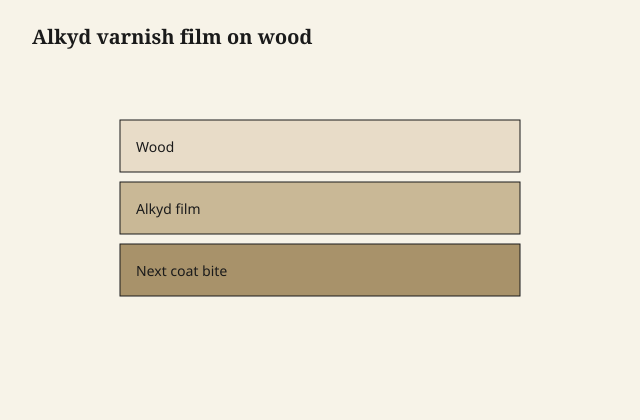

# Alkyd varnish — the shop standard that still works

Before every can learned to say polyurethane, the shop standard
was varnish, and a lot of that varnish was **alkyd**: a polyester
resin modified with drying oil, thinned with mineral spirits,
sometimes cooked with older resins in the factory so it brushes
like the twentieth century.

It amber. It smells like a shop. It levels better than a lot of
waterborne. It sands like a gentleman if you wait. It is not
romantic and it is not obsolete.

## Oil length — the number nobody prints and everybody feels

Varnish people talk about **oil length**: how much drying oil
relative to hard resin. A short-oil varnish is harder, faster,
more furniture-in-a-house. A long-oil varnish is more flexible,
slower, closer to spar, happier on something that moves and
sees weather.

<figure class="ffc-figure">
  
  <figcaption><strong>Figure 1.</strong> Alkyd is the shop workhorse: build coats amber slowly and sand between.</figcaption>
</figure>
You will not get a number on a consumer lid. You will get
behavior. If a "varnish" stays slightly soft and yellows like a
butterscotch candy, it is living long-oil. If it knocks back
with steel wool into a hard satin and feels like a table, it is
living shorter. Spar is a later draft. The point here is that
"varnish" is a family, not a sheen.

## What the alkyd is doing

The oil fraction still wants oxygen. The alkyd polymer is
already a chain. Together they make a film that crosslinks as
it cures, more than a pure thermoplastic, less than a
catalyzed production finish. Recoat windows matter because
the next coat bites best while the film can still dissolve a
little into itself. Wait a month and you are coating a
crosslinked plastic with a new plastic — scuff or do not
bother.

That is why an alkyd table finished in October and "just one
more coat" in March needs sanding, not faith.

## Brushing without a religion

A good alkyd wants a brush that can hold and release, a
room that is not a dust museum, and a coat that is not
prideful. Tip off. Do not overwork the flash. The solvent
is leaving; you cannot brush it back into being liquid
forever.

Wipe-on alkyd is just alkyd with more thinner — often sold
as Danish oil or wiping varnish. Same binder, different
thickness per pass. See draft 16.

Thinning: use the reducer the can names. We are not
improvising a solvent blend in a jar.

## Amber is a feature until it is not

Alkyd warms pale maple. It also turns a gray-painted
Scandinavian job slightly nicotine if you use it as the
clear on top of white. People then invent a mystery stain
in the wood. It was the varnish, doing what oil-modified
films do in light and time.

If the design is cold and pale, alkyd is the wrong
romance. Waterborne or a non-yellowing system is the
adult.

## Where alkyd still wins a small shop

Chairs. Table aprons. Anything with inside corners a spray
gun hates. Repair of older varnish pieces that want to be
themselves, not converted to a plastic they never were.
A shop without a waterborne learning curve this month.

It loses on low-odor apartments, on "crystal white oak,
no amber," and on turnaround times that assume a
waterborne recoat clock.

## Shop air

Mineral spirits is not a party trick. Moving air, a
cartridge that matches the solvent family, lids on cans,
rags that had oil in them treated as oil rags. Alkyd is
ordinary. Ordinary is how people get casual. Casual is
how a Saturday project owns the house until Monday.
