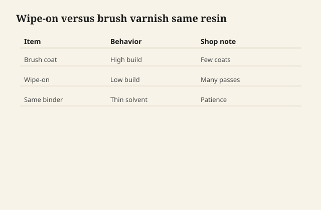

# Wipe-on varnish is just thin varnish

There is no separate molecule called wipe-on. There is
varnish (alkyd, PU, a blend) and there is more carrier, so
a rag can spread a coat that would sag on a vertical if
you brushed it full strength.

<figure class="ffc-figure">
  
  <figcaption><strong>Figure 1.</strong> Wipe-on is the same binder thinned — patience builds mils without runs; impatience builds dust nibs anyway.</figcaption>
</figure>

<figure class="ffc-figure ffc-photo">
  
  <figcaption><strong>Figure 2.</strong> End grain shows rays and pores — the finish lands on this anatomy. Photo: Wikimedia Commons, CC BY-SA 4.0.</figcaption>
</figure>

You can buy it in a can that says wipe-on. You can make
it by thinning the varnish you already have **with the
reducer that can names**. Those are the same idea. The
second one is not "formulating." It is using the product
as the tech sheet already allows. If the sheet does not
allow it, you buy the wipe-on can.

## Why shops reach for the rag

No brush marks if you are honest. Easy inside chairs.
Easy edges. A build that stays thin enough to look like
you oiled, until the fourth coat when you notice you
have a film.

That last sentence is the whole pedagogy. Wipe-on is how
people accidentally cross the penetrating/film fork
without updating the repair speech.

## The method is boring on purpose

Rag that does not shed. Wet the rag, not the floor.
Wipe with the grain as if you are staining. Tip off the
laps. Wait the recoat. Scuff dust nibs, do not grind
through on edges. Repeat.

Edges starve. Everyone forgets edges. The film is already
thin; on an arris it is a rumor. A light extra pass on
edges, not a drip, is the difference between a piece that
wears at the corner in a month and a piece that wears in
a year.

## Dust is smaller and somehow worse

A thin coat does not bury a hair. It embalms it. Wipe-on
people think they have escaped the dust problem because
they have escaped the brush. They have not. They have
made a finish that photographs every lint.

Work clean. Tack. Do the last coats when the shop has
settled. This is not mystique. It is housekeeping.

## Sheen

Wipe-on satin is easy to make patchy because flatteners
and thin coats are a bad marriage if you do not keep the
can stirred and your passes even. Gloss wipe-on shows
laps. A lot of people end satin-to-the-hand by rubbing
out a gloss film. That is older shopcraft and it still
works: build gloss, then dull it with a consistent
abrasive so the sheen is the rub, not the lottery of a
satin can.

## When wipe-on is the wrong tool

A table that must be mustard-proof in a week: you will
not build enough honest film in time, or you will pile
coats and wrinkle. A floor. A porch. A client who wants
a sprayed piano.

When wipe-on is the right tool: almost every chair, a
lot of casework, a table whose owner likes wood and will
accept a thin film, a repair on an old varnish piece
that wants to stay in the family.

## Rags

You have multiplied rags. Oil-modified wipe-on rags are
oil rags. The fire does not care that you were being
gentle. Hang them. The convenience of the method is not
a discount on the fence.
