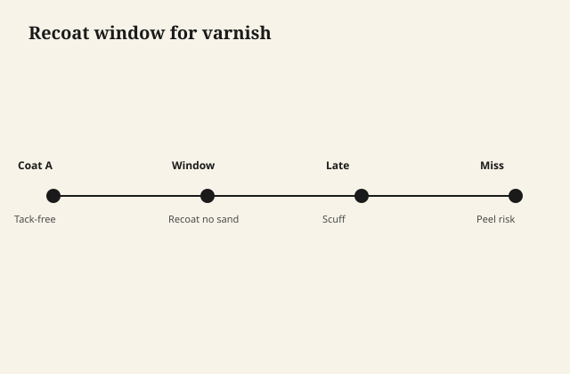

# Recoat windows, sanding dust, and intercoat adhesion

A finish does not fail all at once as often as it fails
**between coats**. The top looks fine. A fingernail at a
ding lifts a skin. Under the skin, last month's coat is
still there, uninvited to the wedding.

<figure class="ffc-figure">
  
  <figcaption><strong>Figure 1.</strong> Inside the window, chemical bite; outside it, mechanical tooth — miss both and the coat floats.</figcaption>
</figure>

<figure class="ffc-figure ffc-photo">
  
  <figcaption><strong>Figure 2.</strong> End grain shows rays and pores — the finish lands on this anatomy. Photo: Wikimedia Commons, CC BY-SA 4.0.</figcaption>
</figure>

That is intercoat adhesion. It is chemistry plus grit
plus a calendar.

## Two ways a new coat sticks

**Melt-in.** The carrier in the new coat softens the old
coat. They become one film. This is how shellac always
works with alcohol, how fresh oil varnish works with
mineral spirits in the window, how lacquers (commercial,
sprayed, not a home brew) melt into themselves.

**Bite.** The old coat is no longer interested in melting.
You scuff it so the new coat has a mechanical key, and
you hope the chemistry is not actively hostile (wax,
silicone, a soap film, a completely different binder).

Most consumer oil PU cans describe a window for melt-in
and then say sand after. Believe both halves.

## The window moves

Cold room: window opens late and stays gummy. Warm, thin
coat: window is short and you can miss it by going to
the hardware store for lunch and coming back to a film
that wants a scuff.

A window is not a dare to recarve a wet coat. If your
brush or rag is picking up pills, you are early. If water
beads on an oil finish you planned to melt into, you are
late or contaminated.

## Sanding dust is a release agent

You scuff. You make dust. You leave the dust because the
shop is "pretty clean." The new coat keys to dust, not
to film. It looks attached. A coin scratch later and the
coat lets go in a sheet the size of a playing card.

Vacuum. Tack with a cloth that is barely damp with the
right tack (dry on waterborne if the system hates extra
water; the system's tack cloth if they sell one). Do not
use a household dust cloth that is a silicone delivery
system. That is how you buy fish-eye.

## Wax and "I just polished it for you"

A client who pastes wax on a tired table and then asks
for a refresh has applied a release agent. New varnish
will crawl or will seem to stick and then let go. Wax
comes off with the cleaner that is meant for wax, then
time, then a test. If a drop of water still beads hard
after a degrease, you are not done.

I will not give you a solvent cocktail to invent. Use
the commercial wax remover or mineral spirits as the
system allows, change rags, and test.

## Waterborne over oil, oil over waterborne

Later draft. The short version for this one: a fully
cured, scuffed, dewaxed-shellac-sealed oil film can
sometimes take waterborne. A fresh oil film will not.
Oil over waterborne is often a wetting problem and a
yellowing problem. Do not stack because you have leftovers.

## The peel test that does not need a lab

On an offcut, run the schedule. Score a small hatch
with a knife. Press tape. Pull. If the film comes off
in chips between coats, your window or your dust or your
contamination is the story. If it comes off to wood, you
have a sealer or species problem. If it does not come
off, you may still have a sheen problem, but you do not
have an adhesion funeral yet.

Do this once per new product. It is cheaper than a
round table.
