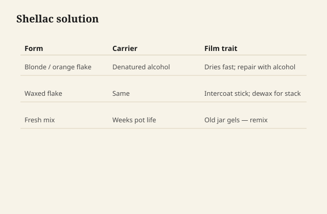
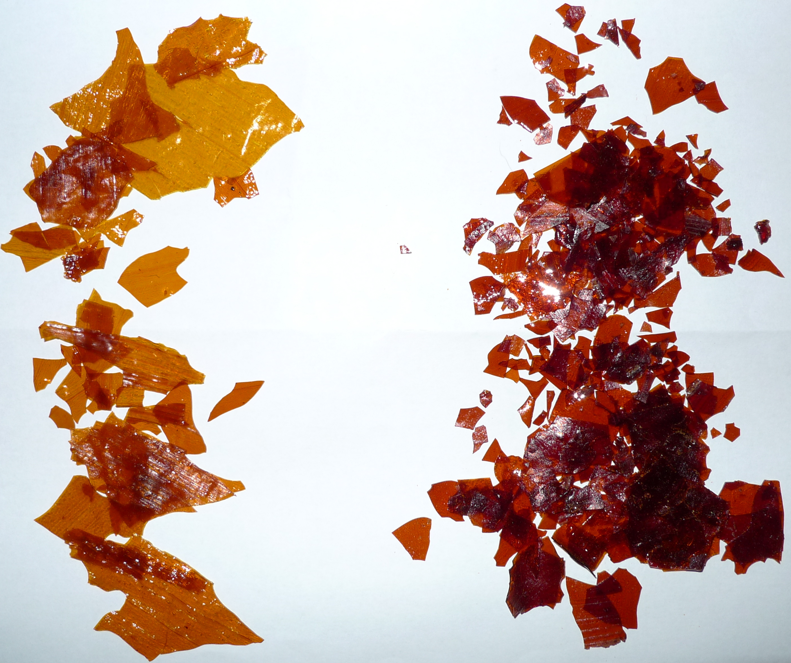

# Shellac is a bug resin. That is the whole romance.

Shellac is the secretion of *Kerria lacca*, harvested from
trees, refined into flakes or buttons, dissolved in alcohol.
It is not sap. It is not a plant varnish. It is not "all
natural" in the way a marketing sentence wants — the bug
did industrial chemistry first, and then a factory washed
and bleached and dewaxed.

<figure class="ffc-figure">
  
  <figcaption><strong>Figure 1.</strong> Shellac is a natural resin in alcohol — fast dry, reversible repair, honest limits on water and heat.</figcaption>
</figure>

<figure class="ffc-figure ffc-photo">
  
  <figcaption><strong>Figure 2.</strong> Shellac flake dissolves in alcohol — pound cut decides how much resin lands on the wood. Photo: Wikimedia Commons, CC BY-SA 2.0.</figcaption>
</figure>

What you brush is a solution, not an emulsion and not a
drying oil. The alcohol leaves. The resin touches itself
and is a film again. Heat it a little and it will melt.
Wet it with alcohol and it will melt. That reversibility
is the gift and the limit.

## Why shops kept it when everything else arrived

It dries in a time that feels like a decision, not a
weekend. It seals odors and some extractives. It sticks
to woods that spit. It sands like a dream when it is
dewaxed and thin. It undercoats almost anything if you
do the dewaxed part. A French polish is still the way a
certain kind of brown furniture looks like brown furniture.

It also rings under a wet glass, spots under a gin, and
softens on a radiator. The romance that skips those
sentences is how a bar top gets shellac and then a
lawyer.

## Orange, blonde, button, seed

Color is mostly refining and bleach, not a different
bug. Orange/amber shellac warms a room. Super blonde is
the pale one for maple and for sealing without a tea
stain. Buttonlac and seedlac are cruder, waxier, more
character, more fight under waterborne.

Buy a grade on purpose. "The brown flakes I found" is
how a blond oak job goes tobacco.

## The smell is the carrier

Denatured alcohol is the usual shop solvent. It is
fast, it is flammable, and it is not a cocktail. The
denaturant is there so you do not drink it. We will
not discuss making it drinkable, stretching it, or
distilling it. You buy the alcohol that is sold for
shellac and finishing, you keep the lid on, you do
not work next to a water heater's pilot.

The film, once the alcohol is gone, does not smell
like a bar. If it does, you are still in the leaving
stage or you used a finish that was not only shellac.

## Thermoplastic, forever

Shellac does not "crosslink into something else" the
way a drying oil or a catalyzed varnish does. A year
later, alcohol still knows it. That is why a French
polish can be repaired in a way PU cannot, and why a
perfume bottle and a hot plate are enemies.

If you need a film that forgets its solvent, leave
this family after the sealer coat.

## A first coat that teaches the material

Mix or buy a light cut. Wipe or brush one thin coat
on scrap maple and scrap walnut. Watch the flash. Sand
it. Feel the powder. That powder is the resin. If you
like the speed and the silk, you will find uses. If
you expected oil's wet look to last without more
coats, you will be confused — shellac can look dry
until you build or rub.

The chemistry is simple on purpose. The craft is
thickness, cut, and weather. Those are the next
drafts.
