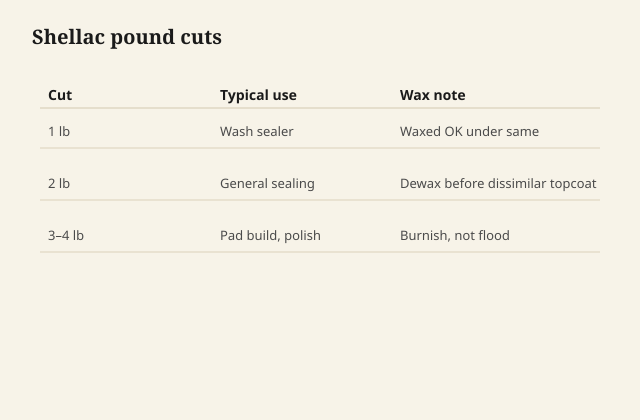

# Cuts, flakes, and why dewaxed exists

A **cut** is an old shop number: pounds of shellac resin
per gallon of alcohol. A one-pound cut is thin, a sealer,
a wash. A two-pound cut is a working finish coat for a
lot of hand work. A three-pound cut is thick, easy to
ridge, easy to trap alcohol, easy to look like you
know what you are doing until the panel flashes dull
in islands.

You do not need to invent a laboratory. Commercial
canned shellac is already a cut. The lid often lies
about freshness more than about ratio. Flakes you
dissolve yourself let you know the age of the resin,
which matters — shellac in a can can esterify with
the alcohol and then it never quite dries. Old canned
shellac is a famous trap. If a test drop on glass
stays tacky, the can is compost. Do not "fix" it with
a secret additive. Replace it.

## Flakes, and the jar

Flakes in a jar with the alcohol the supplier names,
leave it to dissolve, strain through cheesecloth if
you must. That is ordinary. Heating a closed jar on
the stove is not ordinary and is not in this series.
Patience dissolves shellac. Fire dissolves shops.

<figure class="ffc-figure">
  
  <figcaption><strong>Figure 1.</strong> Dewaxed sticks to the next coat; waxed resists waterborne and some varnishes.</figcaption>
</figure>
Label the jar with date and cut. Shellac you mixed is
still on a clock. Use it while it still dries to a
hard film on glass.

## Wax is in the bug's original package

Natural shellac carries wax. The wax makes a softer,
sometimes cloudier film, and it is a **release agent
under waterborne and under some other films**. You can
finish with waxy shellac as the last coat and it will
look like old furniture. You cannot reliably put a
modern waterborne or a lot of poly on top of that wax
and expect adhesion.

**Dewaxed** shellac is the diplomat. It is the sealer
under waterborne, the wash coat on oily woods, the
thing you mean when you say "shellac sealer" in a
shop that also owns acrylic.

If the can does not say dewaxed and you plan to put
anything else on top, look again. Buttonlac is not
dewaxed. A lot of orange flakes are not.

## Why a sealer is a different job than a finish

A sealer wants thin, even, sandable, compatible. A
finish wants build, rub, color. Using a three-pound
waxy orange as a sealer under a pale waterborne is
how you invent a streaky tea and a peel.

Wash coat: dewaxed, one-pound-ish, one pass, sand
smooth, proceed. That sentence has saved more stacks
than any brand loyalty.

## Freshness is chemistry

Shellac in alcohol is not a forever solution. It can
go into a state where the film stays soft. This is
one of the few finishes where **the age of the mixed
liquid** matters as much as the age of the wood.

A shop habit: small batches. Date. Glass test. No
romance about the vintage jar from a dead uncle unless
the glass test passes.

## What I buy when I do not want a poetry project

A name-brand dewaxed canned shellac, not expired, for
sealing. Flakes when I want a color and a French
polish and I will mix what I will use. I do not keep
a three-year-old cut "because shellac is traditional."
Tradition included throwing out the bad batch. We
kept the furniture, not the science project.
