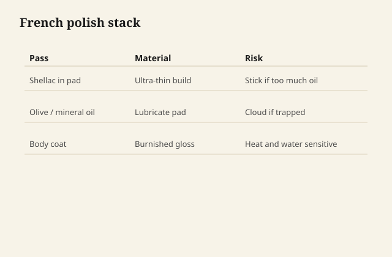

# French polish without the monastery

French polish is not a product. It is a way of putting
shellac on wood with a pad, alcohol, and a little oil
as a lubricant so the pad does not grab, until the
surface is a thin, deep, rubbed film that looks like
the wood is wet from the inside.

<figure class="ffc-figure">
  
  <figcaption><strong>Figure 1.</strong> French polish is many thin shellac passes with a lubricated pad — a film so thin people argue if it is a film.</figcaption>
</figure>

<figure class="ffc-figure ffc-photo">
  
  <figcaption><strong>Figure 2.</strong> End grain shows rays and pores — the finish lands on this anatomy. Photo: Wikimedia Commons, CC BY-SA 4.0.</figcaption>
</figure>

It is also a way to spend a weekend learning humility.

## What is actually happening

Each pass lays a little resin and moves a little
resin that was already there. Alcohol is the mover.
The oil — typically a drying or a mineral oil in
tiny amount, the kind sold for this work — keeps the
pad sliding. Too much oil and you have a smear that
will not harden into the story you wanted. Too little
and the pad sticks and tears the film.

You are not brushing a coat and leaving. You are
burnishing a thermoplastic into itself. That is why
it repairs: the same pad, the same alcohol, the same
willingness.

## A working picture, not a secret society

Filled pores or not — a decision. Open-pore mahogany
French polish is a look. Filled is another. The
monastery argument about pumice and pore-filling is
real craft and it is also optional for a small box.

A rubber (the pad) that is linen or cotton around a
wool or cloth core, charged with a light cut, wrung
so it is not dripping. Circles, then figure-eights,
then with the grain as the alcohol gets hungrier.
Stop when the pad starts to drag. Let the alcohol
leave. Come back.

Spiriting off — a lighter, drier pad to pull leftover
lubricating oil from the surface — is a real step.
Skipping it is how a beautiful polish fingerprints
forever.

I will not turn this into a twenty-page rite. The
rite is repetition and stopping.

## What it is for

Musical instruments, boxes, brown antique work,
anyone who wants depth without a plastic sheet.
Tabletops that will see gin: only if you like
repairing rings, or you put a discreet modern film
in the field and polish the edges, which is a
compromise the monastery would not bless and a
dining room might.

## What it is not for

Kitchens. Radiators. A client who wants "that look"
and also "never think about it again." Exterior
anything. A first-time finish on a picnic table.

## Shop-safe, specifically

Alcohol and a lot of it, in rags, in a pad you might
set down "for a second." Lids. Air. No open flame.
The lubricating oil on rags, if it is a drying oil,
is the same family of rag fire as linseed. Mineral
oil rags are less of a heat story and more of a
disposal story — they still do not go in a wadded
pile next to the heater as a lifestyle.

We are not cooking shellac into a varnish. We are
not running alcohol through anything but a pad and
a jar.

## The honest time budget

A small panel can look like magic in an afternoon
after you already know how. The first tabletop is a
week of learning where you tore it. Price the
learning on a box, not on a client's dining table,
unless they are paying for an education.
