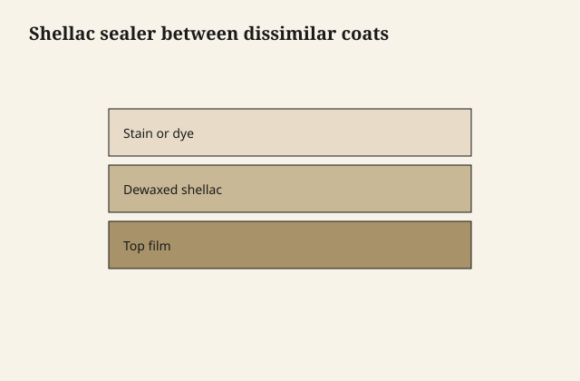

# Shellac as the diplomat

A lot of finishing problems are two countries that
will not share a border. Shellac, dewaxed and thin,
is the embassy.

<figure class="ffc-figure">
  
  <figcaption><strong>Figure 1.</strong> Shellac isolates incompatible layers when dewaxed and cured — it is a diplomat, not a universal miracle.</figcaption>
</figure>

<figure class="ffc-figure ffc-photo">
  
  <figcaption><strong>Figure 2.</strong> End grain shows rays and pores — the finish lands on this anatomy. Photo: Wikimedia Commons, CC BY-SA 4.0.</figcaption>
</figure>

## What it will talk to

**Oily woods** after a degrease: a wash coat so the
next film is not sitting on teak's lunch.

**Odorous woods and smoke**: shellac is an old odor
sealer. It is not a miracle on a fire-sale sofa, but
on a cedar chest or a musty drawer it is a known
move.

**Knots and resin in pine**: a shellac spot-seal
before a waterborne or a paint, so the knot does not
bleed tea through a pale film. It fails sometimes.
It fails less than hoping.

**Stain that would otherwise lift**: a light dewaxed
coat can lock a water dye or a stain before a
waterborne topcoat that would pull it. Test. Some
stains still move.

**The jump from oil-ish to waterborne**: a fully
cured, clean, scuffed oil or wiping-varnish film,
then dewaxed shellac, then waterborne, is a stack
shops actually run. A fresh oily film and then
shellac is a stack shops regret.

## What it will not fix

Wax on top of the old table. Shellac over wax is a
short story with a peel at the end. Silicone. A
finish that is still shedding solvent. A client who
wants a flexible exterior film.

Waxy shellac under waterborne: the wax is the
opposite of diplomacy. It is a polite letter that
says do not stick.

## How thin "diplomat" is

You should still see wood like you see it through
clean glass, not through honey. Sand it as soon as
it will powder. If you are building a visible amber
layer, you have started a shellac finish and you
should own that color.

## Compatibility is a test, not a slogan

"Shellac sticks to everything and everything sticks
to shellac" is a shop proverb with holes. It does
not stick to wax. Everything does not include every
waterborne on every waxy cut. The proverb is useful
as a first hypothesis. The offcut is the vote.

## When the diplomat should leave

Once the next country has a sound first coat, you
do not keep adding embassy. Extra shellac under a
thick PU is just another intercoat. One wash, sand,
proceed. If the topcoat crawls, the problem is
usually still contamination or oil not cured, not a
need for more shellac.

## Alcohol and the finishes already there

A diplomat coat will melt existing shellac. It will
not melt PU. It may wrinkle a fresh varnish if you
flood it. Apply like you mean to seal, not like you
are washing a car. The alcohol is a solvent for the
resin you are applying; it is also a solvent for
some of what is underneath. That is the craft of
the first pass: wet enough to lay resin, not so
wet you lift a stain or a dye you wanted to keep.

If a dye moves, you went too wet or you needed a
different lock-down. Stop and test. Do not "add
more alcohol to even it out." That is how a halo
becomes a continent.
