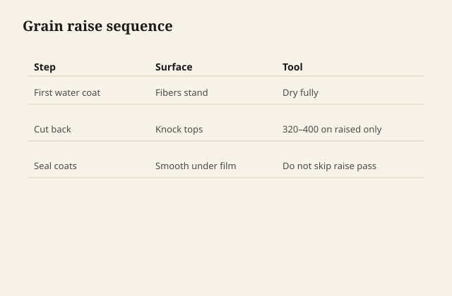

# Grain raise is swelling. Sanding is the apology.

Water hits compressed fibers and they stand up
like they remembered they were straw. That is
grain raise. It is not the sandpaper being
immoral. It is cellulose doing work in the
presence of the carrier you chose.

<figure class="ffc-figure">
  
  <figcaption><strong>Figure 1.</strong> Water swells cellulose — first coat raises grain; cutting back once beats fighting raised fibers under clear.</figcaption>
</figure>

<figure class="ffc-figure ffc-photo">
  
  <figcaption><strong>Figure 2.</strong> End grain shows rays and pores — the finish lands on this anatomy. Photo: Wikimedia Commons, CC BY-SA 4.0.</figcaption>
</figure>

Oil finishes raise grain less because they are
not a water event. Waterborne, water dyes, and
milk paint all pay this tax.

## The move that works

Sand the piece as you meant to. Then **raise the
grain on purpose** before the finish that matters:
a damp cloth, distilled water if your tap is a
mineral show, let it dry fully, sand the whiskers
with a finer grit than the last structural grit —
you are cutting hairs, not recarving the surface.

Then the first waterborne coat raises less, or
raises a remainder you can knock back after it
films.

People skip the pre-raise because it feels like
doing the job twice. They sand a fuzzy first
coat instead, cut through on edges, and invent
a blotch.

## Why the first coat feels like 150-grit

The film locks some whiskers standing. You are
sanding a composite of resin and hair. Use a
light hand. You want powder and a smooth field,
not a trip back to bare wood on the arrises.

Vacuum. Waterborne dust is fine and it loves to
sit and become nibs in coat two.

## Species have opinions

Oak's big rays and pores make a raised surface
that looks rustic if you leave it and dirty if
you do not sand. Maple shows every scratch you
made chasing whiskers. Pine raises in the
earlywood first and looks corrugated until you
are honest with the block.

A dye that is water, then a waterborne, is two
raises. Pre-raise becomes non-optional.

## "Just sand more before you start"

That can make it worse. Over-sanded, burnished
maple sheds less fiber and then the water finds
the places you did not burnish and makes a
map. Even grit, even pressure, then a
deliberate raise, is cleaner than polishing the
wood into a panic.

## A waterborne sealer coat

Some systems sell a sealer that is a little
easier to sand. Some people use a dewaxed
shellac wash, then waterborne, and the raise
is mostly in the shellac step — alcohol is not
water, but you still scuff. Test. Shellac under
waterborne is a diplomat move (draft 22), not
an automatic grain-raise eraser.

## End grain is a different tax

End grain drinks the water and then stands
up like a brush. A tabletop's cut edge can
look fuzzy after a waterborne while the
field looks fine. Pre-raise the edges too.
Sand them by hand. If you only pre-raise
the field, the edge will write the first
coat for you.

## The apology

You will still sand after coat one. That is
not failure. That is the apology the fiber is
owed. Plan it in the schedule so you do not
sand at midnight angry and cut a hole in a
tabletop that was almost done. The raise is
not a defect in the can. It is wood meeting
water. You knew the carrier when you bought
it.
