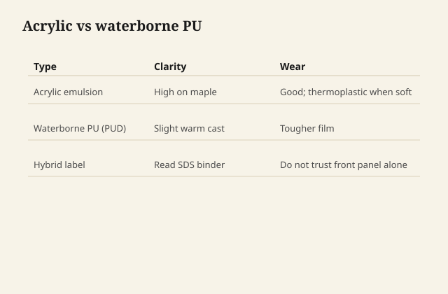

# Acrylic waterborne vs waterborne polyurethane

Both arrive as particles in water. Both have to
knit. The binder inside the particle is the
fork.

## Acrylic

Acrylic dispersions can be very clear, very
non-yellowing, a little more thermoplastic,
sometimes a little more "plastic" in the hand
at a given build. They can be excellent on
work that must stay pale. They can block less
against alcohol and heat than a good PU
dispersion, depending on the formula — cans
vary more than nouns.

<figure class="ffc-figure">
  
  <figcaption><strong>Figure 1.</strong> Acrylic stays clear and softer; PUD reads tougher and can amber slightly.</figcaption>
</figure>
A lot of "water-based polycrylic" living-room
cans are acrylic or acrylic-forward hybrids
wearing a word that sounds like polyurethane.

## Polyurethane dispersion (PUD)

The urethane linkage is there for abrasion and
a tougher feel. Waterborne PU can still stay
paler than oil PU. It can feel closer to a
real table. It can also cost more and sand a
little differently — some are gummy if you
scuff too early.

Floor waterbornes are often PU or PU-acrylic
hybrids because floors are abrasion with a
lawyer attached.

## Hybrids

Most things you can buy are hybrids. The
label picks the word that sells. Your sample
board picks the truth: yellowing or not,
scratch white or not, heat print or not,
alcohol wipe or not.

I care less about the noun than about a
weekend of rude tests on the same species.

## What does not change

Grain raise. MFFT. Foam if you shake. Recoat
clocks that are short and cure clocks that
are not. Incompatibility with wax and with
fresh oil. The need to scuff if you are
outside the melt window — and many
waterbornes do not melt into themselves the
way lacquer does; they bite.

## When I reach for which, in practice

Pale oak or maple, low amber, a piece that
will not see a bar: a good acrylic or a pale
hybrid is enough and sometimes prettier.

Dining table, chairs, a desk that will be
used like a desk: I want the PU-forward can,
or a hybrid that survived the backpack test.

Over milk paint when I want to keep chalk
alive: sometimes I do not want either, or I
want a very thin, very matte acrylic so the
paint still reads as paint. See the milk-
paint topcoat draft.

## A weekend of rude tests that actually decide

Same species as the job. Same last grit. Same
weather.

- A wet glass for an hour, then a look at the
  ring in raking light.
- A fingernail at an unseen edge on day two
  and on day ten. Day two will lie.
- A dry palm: does it feel like a credit card
  or like a table?
- A drop of wine or a wipe of isopropyl on a
  corner you can hide. Acrylics often lose
  this one earlier. PUDs often do not. Hybrids
  surprise you, which is why the noun is not
  the test.
- A week in a window if yellowing is the
  fear. Oil PU will usually show first.
  Waterborne acrylic should barely shrug.
  If your "PU" yellows like an alkyd, you
  bought a hybrid with an oil story, or you
  put it over an oil stain.

Write the results on the back of the board.
The next job will try to make you remember
in the aisle.

## Sanding feel as a tell

Acrylics often powder more cleanly when they
are ready. Some PUDs go gummy if you scuff
in the short recoat window — they are still
knitting. Wait until the paper makes dust,
not cheese. That gummy feel is chemistry,
not a dull grit. Change the clock before
you change the brand.

## Do not mix leftover cans into a custom
binder

Acrylic plus PU in a jar because both were
half full is how you make a film with a
passport from nowhere. Use one system. The
sealer and the topcoat from the same card
are boring and they stick.

If a sealer is sold with a topcoat, that
pairing was tested for bite and for MFFT.
Your jar was tested for neither.
