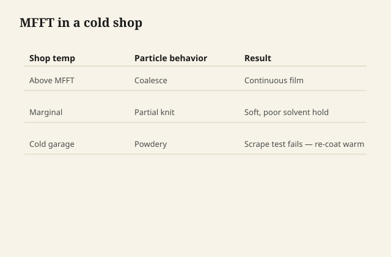

# Coalescent, cold shops, and the film that never knits

Every waterborne can has a temperature below
which the particles will not deform into a
film. The lab name is MFFT. The shop name is
"it felt dry and then it powdered."

<figure class="ffc-figure">
  
  <figcaption><strong>Figure 1.</strong> Below minimum film formation temperature, particles never knit — the dust you can scrape off was never a finish.</figcaption>
</figure>

<figure class="ffc-figure ffc-photo">
  
  <figcaption><strong>Figure 2.</strong> End grain shows rays and pores — the finish lands on this anatomy. Photo: Wikimedia Commons, CC BY-SA 4.0.</figcaption>
</figure>

Coalescents are the quiet solvents in the
formula that lower that temperature and help
the knit. They are already in the can. You
do not add a mystery cup of something from
under the sink. If the manufacturer sells
an additive for cold or dry weather, that
is a product. If they do not, you heat the
room or you wait.

## What cold looks like

A garage in March. The coat goes on, flashes
fast because the air is dry as well as cold,
and the particles freeze in place — not ice,
just immobility. The surface may look
continuous. Tape pulls it. A fingernail
scribes a white line that should not be
that easy. Edges crumble.

People add another coat. They are now
stacking powder.

## What dry heat looks like

A forced-air room that is warm but arid can
steal water so fast the particles never get
the packed, plasticized moment they need.
You get dry spray if you were spraying, or
a sandy brush coat if you were brushing.
Leveling dies. The fix is a slower
environment or a product meant for that
air — not a fan on high aimed at the panel.

## The thermometer is a finishing tool

If the can says 65–90°F, that is not a
suggestion for your comfort. The wood is a
heat sink. A cold tabletop in a warm room
is still a cold tabletop for the first
coat. Bring the piece up, not just the
thermostat for twenty minutes.

## Recoat too fast in the cold

The clock on the lid assumes the lab. In
the cold, "two hours" can be a wet coat
under a skin. You drag. You pill. You
swear. Wait for powder when you sand, not
for the clock.

## Repair of a non-film

If it never knit, you are not looking at a
rub-out. You are looking at a strip back
to a sound layer or to wood. Waterborne
that failed to coalesce does not become a
film by time alone the way a slightly soft
oil might. Time will not knit a powder.

Sand. Change the weather. Start the coat
that is allowed to be a film.

## A simple shop thermometer habit

I write the room temp and the wood temp
(cheap IR if I have it, a hand on the
top if I do not) on the schedule card.
If they disagree, the wood wins. If both
are under the can's number, I do not
open the can for a topcoat. I open a
window or I wait. A forced space heater
aimed at one corner of a table is how
you knit a stripe and powder the rest.

## Shop-safe line

Do not invent a coalescent from paint
thinner, alcohol, or a lacquer reducer.
Those are how you break the emulsion and
make cottage cheese in the can. The
emulsion is a crowd that was carefully
invited. Uninvited solvents crash the
party.

Heat, time, and the product as sold. That
is the whole cold-shop kit. The film that
never knits is not a brand betrayal. It
is a temperature you can measure.
