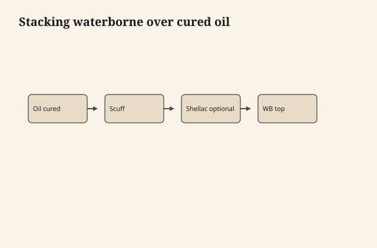

# Waterborne over oil — the honest sequence

People want oil's color and waterborne's
armor. The stack is possible. The stack is
also how a lot of tabletops let go in a
sheet the size of a placemat.

## The only sequence I will run

1. Oil or wiping varnish, **thin**, fully
   **cured** — not tack-free, cured. Weeks
   if it was honest oil. Less if it was a
   fast wiping varnish and you can prove it
   with a fingernail and a smell test.
2. Clean. No wax. No silicone. No oily rag
   leftover.
3. Scuff to dull. Dust off as if adhesion
   depends on it, because it does.
4. **Dewaxed** shellac wash if the oil is
   in the wood or you have any doubt. Sand
   dust.
5. Waterborne, thin first coat, look for
   crawl. If it crawls, stop. You are not
   sealed or not cured.
6. Build the waterborne as itself.

<figure class="ffc-figure">
  
  <figcaption><strong>Figure 1.</strong> Oil must cure; scuff for bite; dewaxed shellac if the stack is picky.</figcaption>
</figure>
If that sounds long, it is longer than a
bad peel, which is also long.

## What I will not run

Waterborne over a same-day BLO wipe.
Waterborne over salad oil. Waterborne over
a teak that is still sweating. Waterborne
over paste wax "to deepen it." Waterborne
tinted as a stain over raw oily rosewood
with no sealer.

Oil over waterborne as a "refresh" is a
different disappointment: it may wet
unevenly, it may never quite dry on a
sealed film, and it will yellow a pale
job you paid waterborne prices to avoid.
If you want oil later, you wanted oil
first, or you want to strip.

## Why the peel is so convincing

The waterborne looks perfect. It is a skin
on a greased or oily interface. A ding
breaks the skin. Moisture walks in. The
sheet lets go. The client sees "water-based
failed." The interface failed.

## Color honesty

Oil underneath will still amber. A pale
waterborne on top does not bleach an oil
color; it roofs it. If the point of
waterborne was no amber, do not put a
yellow sweater under a clear raincoat and
call the outfit white.

A dye, then dewaxed shellac, then
waterborne, is how a lot of pale-but-rich
jobs actually happen. Oil is not required
for color.

## How you know the oil is actually done

A fingernail at an unseen edge does not
print. A clean rag with a little mineral
spirits — if the oil system allows that
cleaner — does not come away orange with
unset binder. The piece does not still
smell like a wet rag after a closed night
in a room. Smell is crude and it is also
honest.

If you are guessing, you are early. Early
is the whole peel.

## A shorter honest alternative

If the client wants oil color *and* a
deadline, dye or a water stain, lock with
dewaxed shellac, then waterborne. You get
warmth without a polymerizing fat under
the emulsion. You also get a stack you can
finish in a week of weather instead of a
month of hope.

If they want oil feel *and* armor, they
want two surfaces or they want hardwax
and a maintenance speech. The hybrid
stack is the expensive way to get a
maybe.

## The test that earns the job

Offcut. Full time. Not a two-hour demo.
Tape, glass, fingernail. If you cannot wait
the cure on a sample, you cannot wait it
on a table, and you should pick one family
and stay there.

One family is not a moral loss. It is how
furniture stays furniture. The honest
sequence exists so that when you do cross
the fork, you can say why the sheet will
not let go. If you cannot say why, do not
cross.
