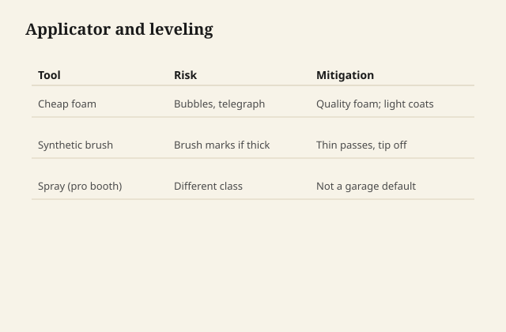

# Foam, leveling, and the cheap applicator

Waterborne shows how you applied it. Oil
varnish will often flow out and forgive a
sinner. Waterborne will embalm the sin and
call it orange peel, lap, or bubble.

## Foam

Shaking the can is the usual first mistake.
The surfactant package that keeps particles
apart is happy to keep air apart too. You
brush a cappuccino.

<figure class="ffc-figure">
  
  <figcaption><strong>Figure 1.</strong> Foam injects air; quality synthetic brush or spray for level film.</figcaption>
</figure>
Stir. Wait if you already shook. Pour out
what you need so you are not whipping the
gallon every pass.

A cheap foam brush is a bubble factory on
some formulas and a perfectly good tool on
others. Test. If the foam brush leaves a
chain of pinholes, it is not a bargain.

## Leveling

Leveling needs wetness and time. A coat
that is too thin in dry air flashes into
texture. A coat that is too thick sags on
verticals and skins on flats. The can's
spread-rate is a real number.

Tip off once. Do not keep brushing as it
tacks. You are not "improving" a waterborne
that has started to lock. You are leaving
tracks.

Some systems like a spray. If you do not
have a setup that is legal and kind to the
house, you do not have spray. A good
synthetic brush made for waterborne, or a
pad the brand sells, is the small-shop
path.

## The cheap applicator, item by item

**Foam brush:** fine on flats, sheds on
spindles, bubbles on some PUDs.

**Lambswool pad:** can leave lint that
becomes fossils.

**T-shirt rag:** can work for a wiping
waterborne if the product is meant to be
wiped. Most waterborne table finishes are
not wiping varnishes. You will starve edges
and lap the field.

**Roller:** orange peel unless the nap and
the product were made for each other. A
foam roller can be right for a big flat
and wrong for a last coat you wanted to
look like furniture.

**The brush you used for oil last year:**
even after a wash, it can carry enough
contaminant to crater a waterborne. Keep
tribes of brushes.

## Pinholes over oak

Pores hold air. A fast waterborne skins.
The air leaves later and leaves a hole.
A sealer coat, a pore fill if you wanted
fill, or a slower first coat is the
conversation. More topcoat on a field of
holes is how you glaze the holes, not
how you fill them.

## Cleanup

Water, before the film knits on the
brush. A brush with knit polymer in the
heel is a sculpture. Do not wash the
brush in the yard. The water is carrying
polymer. A shop sink that goes to a
treatment plant is the ordinary path;
dumping a gallon of rinse into a creek
is not a finish technique.

The cheap applicator is cheap until it
writes a defect you have to sand for an
hour. Then it was the most expensive
stick in the drawer.
