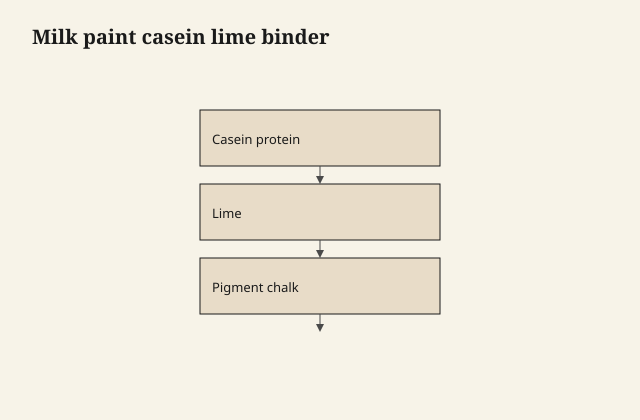
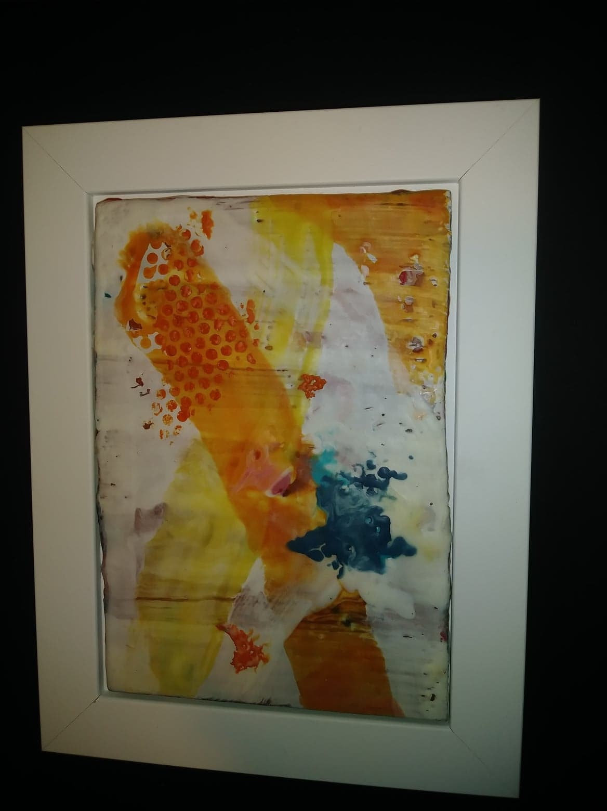

# Milk paint is casein and lime, not nostalgia

Real milk paint is a **protein binder**. Casein —
the same family of milk protein that makes
cheese possible — plus **hydrated lime** (calcium
hydroxide, the builder's lime sold for this
craft), pigment, and water. The lime raises the
pH so the casein will dissolve and brush. As
the paint dries and the lime takes carbon
dioxide from the air, the protein film becomes
much less interested in redissolving in the
first splash.

<figure class="ffc-figure">
  
  <figcaption><strong>Figure 1.</strong> Real milk paint sets by protein chemistry — chalky matte unless the can quietly became acrylic latex.</figcaption>
</figure>

<figure class="ffc-figure ffc-photo">
  
  <figcaption><strong>Figure 2.</strong> Matte coat on wood — read the hand before you promise chalk. Photo: Wikimedia Commons, CC BY-SA 4.0 (encaustic panel, illustrative).</figcaption>
</figure>

That is chemistry, not a farmhouse brand
story. The farmhouse look is a side effect of
a matte, high-pigment, low-binder film.

## What is in the other can

A lot of "milk paint" in the last decade is
**acrylic** wearing a chalky pigment load. It
opens ready-made. It sticks to more things.
It cleans up like a craft paint. It can be
fine. It is not casein chemistry.

If the powder needs mixing and smells a
little like wet stone and kitchen, you may
be in the old family. If the can is a
premixed pastel that says milk and also
says acrylic on the back, you are in the
new family. Finish choices after — bonding,
chip, topcoat — split on that fork.

This series means **casein milk paint** when
it says milk paint, and will say acrylic
when it means the impostor.

## Mixing, without a lab

The powder wants a waiting period after
water. Lumps are un-dissolved binder and
they leave craters. Mix, wait, mix again.
Strain if you must. You are not adding extra
lime from a garden bag to "make it tougher."
The ratio in a reputable powder is the
ratio. Extra lime is a caustic you did not
need and a paint that may go brittle or
harsh on the skin.

Lime is not a toy. It is an alkali. Gloves
are ordinary. Eyes are not a mixing bowl.
This is shop-safe because it is the same
respect a mason already has, not because
milk paint is cute.

## What the film is like

Matte. Chalky. Breathable compared to a
plastic enamel. A little fragile on a slick
substrate. Beautiful on raw or well-scuffed
wood, especially when you wanted the wood
to telegraph.

It is not a stain. It hides. If you wanted
grain, you wanted a wash of it, or a
different product.

## Color is pigment, and pigment settles

Stir through the job. A milk paint that
sits will give you a binder-rich top and a
pigment-rich bottom and a chair that is two
colors. This is not "the handmade look."
This is a can you did not stir.

## Why it chips, later

See draft 35. The short chemistry: a brittle
protein film on a smooth, sealed, or
flexing surface will lose mechanical key.
Sometimes you want that. Sometimes you
wanted a kitchen island and you are now
owning a distressed accident.

Choose the substrate and the bonding coat
before you choose the Instagram.
