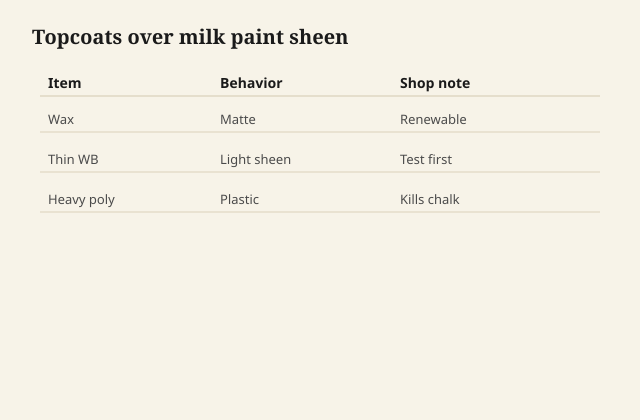

# Topcoating milk paint without killing the chalk

Casein dries to a chalk that is the reason
people bought it. A clear coat is how the
chalk survives fingers, and also how the
chalk dies into a satin plastic if you
pick the wrong clear or too much of it.

## What the paint needs

A dining surface needs something. A
picture frame in a hallway might not. A
kitchen chair arm needs something. A
decorative chippy cabinet that will be
looked at can live with wax or with
almost nothing if the client likes
powder on their hands. Ask. Do not assume
topcoat is virtue.

<figure class="ffc-figure">
  
  <figcaption><strong>Figure 1.</strong> Wax keeps chalk; heavy poly fills pores and kills the point.</figcaption>
</figure>
## Wax

A paste wax on fully dry milk paint
deepens color a little, keeps the matte,
and is repairable. It is also the enemy
of any later waterborne or varnish if
someone changes their mind. Heat prints
it. It is honest for low-use pieces.

Apply thin. Buff. The paint must be dry
enough that you are not grinding pigment
into the rag in sheets.

## Oil

An oil or wiping varnish will warm and
darken milk paint a lot. Some colors go
from farmhouse to antique shop in one
wipe. That can be the point. Do a sample.
Oil also starts the rag-fire clock. And
it can make a protein film a bit more
flexible, or it can sit on top and stay
tacky if the paint was already sealed or
too fresh.

I treat oil as a color decision, not as
"protection" in the PU sense.

## Waterborne clear

A matte or flat waterborne, thin, is the
modern way to keep the look and gain
wipeability. Gloss waterborne on milk
paint is how you kill the chalk and
reveal every lap in the paint.

Dewaxed shellac as a lock-down before
waterborne can help if the pigment is
loose, but shellac itself warms and adds
a faint glass. Test.

Build less than you would on bare wood.
The paint already is a film. You are
roofs, not a second house.

## Oil PU

It will amber the paint and make it look
like a 90s redo of a 1820 idea. Sometimes
that is what a table needs to survive.
Say the words yellow and plastic before
you pour.

## What not to do

Do not put a heavy film on a milk paint
you wanted to chip. You have locked the
theater in or you have made the chip
happen in sheets with a skin attached.

Do not topcoat the same day the casein
is still cool and damp to the cheek.
The lime and the protein are still
working. Give them the night, or the
week the powder's sheet asked for.

## The look is a stack

Chalk is pigment at the surface. Every
clear coat is a little veil over that
pigment. The thinnest veil that survives
the use is the one that still looks like
milk paint. Everything thicker is a
different finish that happens to have
casein underneath.
