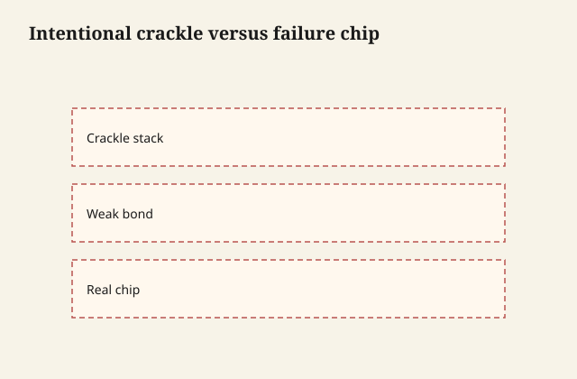

# Chip and crackle: defect, history, or theater

A milk-paint chip is a mechanical failure
of a brittle film. History made that
failure slowly: chairs hit doorframes,
seasons moved the wood, a hundred washings
cut the arris. Theater makes it in an
afternoon with sandpaper and a story.

Both are valid if you name them. The
damage is when theater is sold as history,
or when a defect is sold as theater after
the client wanted a clean cabinet.

## Why casein chips

Low binder relative to pigment. Poor key
on slick. Movement under a film that does
not stretch like an acrylic enamel. Edges
and high spots first, because that is
where hands and wood movement
concentrate.

<figure class="ffc-figure">
  
  <figcaption><strong>Figure 1.</strong> Theater crackle is a product stack; accidental chip is adhesion or brittleness.</figcaption>
</figure>
A bonding additive reduces chip. A
flexible topcoat can reduce the little
chips and invent a bigger peel if the
interface was already weak. Chip is not
one knob.

## Crackle

Crackle is a film that shrank or dried
in a skin while the underside was
different — too thick, too fast, a
layer that did not agree. There are
commercial crackle media. They are
products. This series will not mix a
hide-glue-and-hope recipe into a
performance coating. If you want
crackle, buy the system that is sold
for it and test, or accept the crackle
you got as a defect and sand.

Old glue-size crackle on chairs is
history. It is also a conservation
problem if you then flood it with a
shrinking modern film.

## History has dirt in the wound

Real wear collects dark in the break.
The wood or the undercoat shows in a
way that matches use: rungs, pulls,
the front of a drawer, not a perfect
X on a panel that no elbow ever found.

If your sandpaper pattern does not
match a body, it reads as theater.
Some clients want that. Draw it with
them. Do not "distress" a piece
uniformly like a factory box and call
it inherited.

## Defect

A kitchen island that chips onto food
is a defect. A chair that sheds onto
black pants is a defect. A crackle
that lets water under a sink paint is
a defect. Topcoat, or a different
paint family, or a different client
expectation.

## How to make theater without lying
to the piece

Wear happens where a body happens.
Chair rungs. The pull side of a drawer.
The front arris of a writing arm. A
high-spot on a molded edge that a
hand finds in the dark.

Sand those, through the casein, to the
undercoat or the wood, then stop. A
little dirt in the break — a glaze,
not a mop of stain — is how history
looks if you must fake it. A perfectly
even sand-through on every corner of
a box that sat in a closet is how a
warehouse looks.

Do not beat the piece with chains.
That is a different television show.
The protein already wants to fail at
the right places if you skipped
bonding. Let it. Then decide if you
need to stop it with a topcoat.

## Conservation vs the redo

If the crackle is old and the piece
is the thing, a consolidating
reversible approach belongs to
someone who does that work. Flooding
a shrinking modern waterborne into
historical crackle can pull islands
off. That is not "protecting it."

If the piece is a $40 dresser and
the crackle is last week's thick
coat, sand and start thinner. Do not
call a defect a patina to avoid a
redo.

## How I write the invoice

"Casein on scuffed raw wood, no
bonding, wax only — will wear and may
chip at edges, that is the look" is a
sentence.

"Casein with bonding primer and matte
waterborne — should not chip in
ordinary use; if it does, it is a
callback" is a different sentence.

The chemistry will follow the
sentence you actually built, not the
one you posted.
