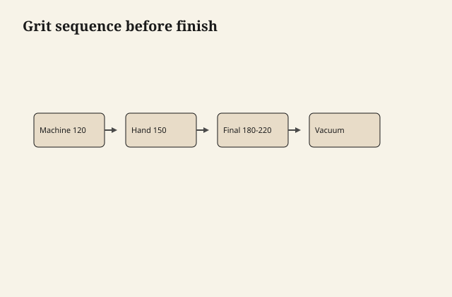
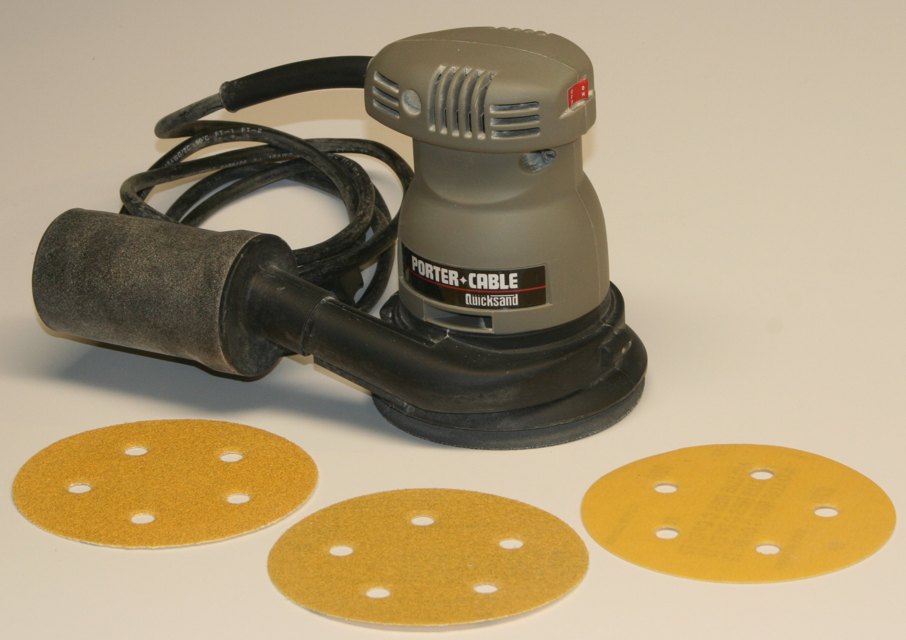

# Sanding decides the film before the can opens

A finish cannot un-scratch. It can hide a
scratch under build, and then the scratch
is a valley that collects stain and oil
and looks like a stripe in low sun. Or
it can magnify a scratch because you
chose a thin oil and a raking light.

<figure class="ffc-figure">
  
  <figcaption><strong>Figure 1.</strong> The finish only hides sanding you already chose to keep — skip grits and the film telegraphs them.</figcaption>
</figure>

<figure class="ffc-figure ffc-photo">
  
  <figcaption><strong>Figure 2.</strong> The sander decides what the finish is allowed to hide. Photo: Wikimedia Commons, CC BY 2.0.</figcaption>
</figure>

Sanding is not "prep" in the sense of a
chore before the art. Sanding is the
shape of the art.

## Grit is a decision about the binder

Oil and wiping varnish want a finer last
grit than a built film, because they
leave the surface you cut. A 120 finish
sand under oil is a 120 photograph
forever. Under a filled, built PU you
might start the film earlier and let
build bury, at the cost of plastic.

I last-sand most furniture to 180 or 220
for oil and thin films, and I do not
chase 400 on open-pore oak unless I am
trying to burnish it into blotch. Maple
can take a higher last grit. Pine looks
polished and then drinks stain in the
earlywood anyway.

There is no universal last number. There
is a last number for this species and
this finish.

## The skip that leaves a ghost

80 to 220 without the middle is how you
leave 80-grit valleys with 220 polish on
the hills. The finish finds the valleys.
People sand more at 220 and make shiny
bowls in the field.

Every grit must erase the previous. That
is boring and it is the whole skill. A
raking light and a pencil scribble are
the cheap tools. When the scribble is
gone, the previous grit is gone.

## Edges

Machines hate edges. People hate
hand-sanding edges. Finishes fail on
edges first because the film is thin
there and because the arris was rounded
into a different grit than the field.
Hand the edges. Same last grit, lighter
pressure. A rolled edge that is 80 under
a 220 field will take stain like a
marker.

## Dust is a layer

Dust on the surface becomes a release
agent or a nib. Dust in the air becomes
a last coat of grit. Vacuum the piece
and the bench. Let the room settle.
Tack with something that is not a
silicone furniture cloth from under the
sink.

Waterborne dust after scuffing is
especially fine. It will hide in pores
and then sit in coat two as gray
freckles.

## The bruise

A dull grit or a held-still sander
crushes fiber. The bruise looks like a
shadow after any penetrating color. You
cannot sand a bruise out by pressing
harder with the same disc. Change the
paper. Cut, do not polish mush.

## Lead, again

If the piece is old and painted, sanding
is a lead question before it is a grit
question. Test. The fence in draft 05
is the first sanding instruction.

## A finish schedule that names grit

"Three coats of wiping varnish" is not a
schedule. "180 last, raise grain if
waterborne, 220 knock-back after coat
one, 320 scuff between film coats, do
not cut edges" is a schedule. Write the
grit on the same card as the can. Future
you, sanding a repair, will need both.
