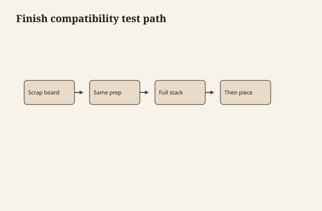

# Compatibility in prose, not a poster

Charts lie by being square. Finishes are
not square. Here is the same information
as sentences you can take to a bench.

<figure class="ffc-figure">
  
  <figcaption><strong>Figure 1.</strong> When in doubt, isolate with dewaxed shellac or strip to a known layer — prose beats a universal chart, but tests beat prose.</figcaption>
</figure>

<figure class="ffc-figure ffc-photo">
  
  <figcaption><strong>Figure 2.</strong> End grain shows rays and pores — the finish lands on this anatomy. Photo: Wikimedia Commons, CC BY-SA 4.0.</figcaption>
</figure>

## Oil, then oil

Yes. After cure or after tack-free,
depending on how oily you are. Wipe off.
This is the family that repairs by adding
more of itself.

## Oil, then wiping varnish or oil PU

Yes, if the oil is not a puddle and has
cured enough that the varnish is not
sitting on wet fat. A same-day BLO flood
under PU is a wrinkle and a peel waiting.

## Oil, then waterborne

Only the long sequence in draft 29.
Cured, clean, scuff, usually dewaxed
shellac, then waterborne. Not a
weekend stack.

## Oil, then shellac

Possible as a lock if the oil is thin
and not still wet. Possible as a mess
if you flood alcohol onto gummy oil.
Test. Diplomat, not a bath.

## Wiping varnish / alkyd / oil PU, then
more of the same

Yes, inside the recoat window by melt-in,
outside it by scuff. Same binder family
is the easy life.

## Those films, then waterborne

Treat like oil-to-waterborne. The film
is more of a skin, so scuff and diplomat
matter more. Wax on an old varnish is
the usual silent killer.

## Waterborne, then waterborne

Yes, same system. Scuff if the can says
so. Do not mix random acrylic leftovers
into a PU can.

## Waterborne, then oil

Usually a bad idea for color and for
wetting. The waterborne has sealed the
wood. Oil sits on top, yellows, may
stay soft. If you wanted oil's look,
start over or stay in waterborne tints.

## Shellac, then almost anything dewaxed
allowed

Dewaxed shellac under waterborne, under
oil varnish, under PU — common. Waxy
shellac under those — common failure.
Shellac under itself — always, it melts.

## Shellac as the last film, then a
"protective" oil PU later

You can, with scuff, and you will lose
repair-by-alcohol. You have changed
families. Do it on purpose.

## Milk paint, then wax or matte
waterborne or oil

See drafts 34–35. Milk paint, then
nothing, is a look and a powder.

## Wax, then anything

No — not until the wax is gone. Wax is
a finish. It is also a release agent.
People put wax on because the table
looked tired, then hire you to "just
add a coat." The coat is now a
negotiation with yesterday.

## Silicone polish, then anything

The darkest compatibility paragraph.
Silicone walks, it craters, it comes
back after sanding. Commercial de-
waxers and a lot of patience, then a
test. If the test still fish-eyes, the
job may be a paint, a shellac lock and
pray, or a refusal. We are not mixing
anti-silicone potions from raw
chemistry. If a finish line sells an
additive for fish-eye, that is their
product and their problem to stand
behind.

## Catalyzed production finishes

Leave them in their shops. Over them,
you are on a sealed, often slick, often
unknown skin. Adhesion testers and a
refinisher who recognizes the film.
Do not assume milk paint or oil will
civilize a factory conversion varnish.

## The only poster I trust

A row of offcuts with the stack written
on the back and a date. The prose above
is the hypothesis. The offcut is the
chart.
