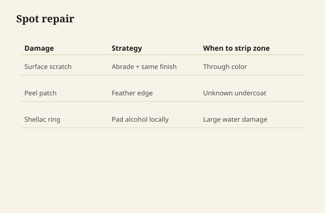

# Repair without stripping the whole piece

Strip is a tool, not a personality. Most
furniture wants a local honesty: clean,
identify, scuff, match the family, blend,
stop.

## Identify before you "just oil it"

A white ring in shellac is not the same
as a white ring in PU. Alcohol-and-pad
can live in the first and do nothing
useful in the second. An oil table that
looks dry wants oil. A PU table that
looks dry wants a cleaner, then maybe a
polish, then maybe a scuff-and-coat of
the same film.

<figure class="ffc-figure">
  
  <figcaption><strong>Figure 1.</strong> Identify binder; feather edge; patch in family; blend sheen last.</figcaption>
</figure>
The hidden-spot tests: alcohol on a
cotton swab (shellac moves), a fingernail
at an existing ding (film vs penetrate),
water bead (wax).

## Clean like it is the finish

A lot of "dead" film is dirt and old
polish. A proper cleaner — the kind
sold for furniture restoration, not a
kitchen degreaser as a dare — then a
dry, then a judgment. You may be done.
That is a good day.

## Rings

Moisture under or in a film. On oil and
hardwax, a light oil refresh after the
moisture has left the wood can hide a
mild one. On shellac, a careful
re-amalgamate or a rub. On PU, you are
often cutting back the field to a sound
level and recoating a panel, not a
spot, because spots in a skin halo.

Do not put a hot iron and a cotton
cloth on a mystery finish because a
forum said so. Heat plus unknown film
plus residual moisture is how you print
a bigger oval. If a conservator method
exists for a known shellac, it is
gentle and tested. If you do not know,
do not invent heat.

## Scratches

In penetrating families: scuff, color if
the wood is light in the scratch, then
the same oil. In films: color the wood
if needed (a tiny dye or a commercial
touch-up, not a kitchen concoction),
then fill with the same kind of film if
you can, then rub the sheen to match.
A scratch-cover marker is theater for
a landlord photo. It is not a repair.

## Chips of milk paint

If theater: stop at clean edges. If
defect: feather, bond if the substrate
is slick, paint, topcoat, and accept
that a perfect invisible is rare in a
chalky paint.

## When strip is the repair

Peel in sheets. Unknown stacked failures.
Silicone that will not die. Alligator
varnish that is no longer a film. Lead
paint that cannot be safely sanded in
the house — and then strip is a
containment job or a specialist, not a
rented heat gun in a nursery.

Commercial strippers: use a product
sold for furniture, in air, with the
gloves and the waste path on the sheet.
This series will not walk methylene
chloride. It will not walk a homemade
lye bath. Lye is how people cook wood
and themselves.

## Matching sheen is the last 40%

A chemically perfect repair that is
glossier than the field is a spotlight.
Rub the repair and a little of the
neighborhood to the same dull. The eye
forgives color before it forgives sheen.
