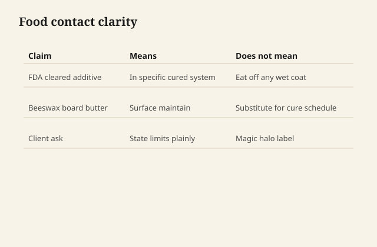
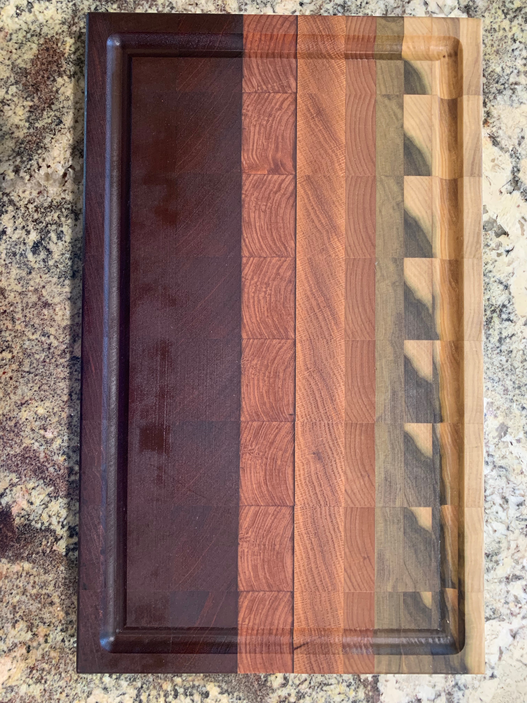

# "Food safe" is a sentence, not a halo

Those two words sell salad bowls and
children's tables. They do not mean
what a parent hears.

<figure class="ffc-figure">
  
  <figcaption><strong>Figure 1.</strong> Food-safe is a regulatory sentence about cured film — not a license for uncured polyurethane on a cutting board.</figcaption>
</figure>

<figure class="ffc-figure ffc-photo">
  
  <figcaption><strong>Figure 2.</strong> End grain shows rays and pores — the finish lands on this anatomy. Photo: Wikimedia Commons, CC BY-SA 4.0.</figcaption>
</figure>

## What a serious sentence sounds like

A finish can be **intended for food
contact once fully cured**, according
to the manufacturer, for a use they
named: a serving bowl, a counter that
sees plates, a toy that might be
mouthed. That is a claim with a
clock (cure) and a use (what kind of
food, wet or dry, cut or served).

A finish can be **made of materials
that have a history in food-adjacent
objects** — raw drying oils, certain
waxes, shellac grades used on candy
and pills in other industries. History
is not a lab result on *your* cure
and *your* thickness.

A finish can be **"non-toxic when
dry"** in the weak sense that it is
not intended as poison. That is not
the same as "let a toddler gum the
table tomorrow."

## What I will not bless

An oily bowl wiped at 4 p.m. and
filled with salad at 6. The oil is
still a chemical reaction. The salad
is a solvent of sorts — oil, acid,
time.

A cutting board with a film finish
that will be sliced through, so the
knife is now eating film and wood
and lunch together. Cutting boards
want penetrating oils or waxes that
are meant to be refreshed, or they
want to be bare wood with a wash
habit. They do not want a
polyurethane skin.

A "food safe" waterborne that is
still smelling of coalescent. Smell
is not a legal test, but it is a
shop test that you are not at the
clock you were sold.

## Mineral oil

Food-grade mineral oil on a board is
a common, honest, non-polymerizing
choice. It stays oil. It will need
re-oiling forever. It is not a
furniture finish for a dining table
that must resist a wet glass. Do not
confuse the board and the table.

## Children's furniture

Toys that will be mouthed want a
product whose manufacturer will say
the toy sentence, and a cure they
name, and a film that does not chip
into food. Milk paint's chalk is a
poor toy finish unless the maker
of that paint will stand behind it
and you topcoat with something they
allow.

Lead on old painted chairs is a
food-contact problem in the worst
way. Test. Do not sand a crib into
dust and then argue about oil.

## The serving table vs the plate

A dining table is usually **food-
adjacent**, not a cutting surface.
A fully cured consumer finish of
almost any family in this series
is how people eat dinner. The risk
you are managing is a wet glass and
a mustard jar, not a regulatory
category for a canning line.

Be precise with clients. "Once this
has cured for the days on the card,
you can eat at it" is true for a
table. "This oil is food safe so
the baby can chew the apron" is a
different claim and often a false
one.

## No kitchen chemistry

We will not recipe a homemade "beeswax
and mystery oil edible finish" beyond
saying: buy food-grade products sold
for boards, or buy a furniture finish
and keep it on furniture. Mixing
candle wax, essential oils, and a
vitamin E capsule is a craft blog,
not a contact surface.

The halo is marketing. The sentence
is cure, use, and a manufacturer who
will still be there if you ask.
