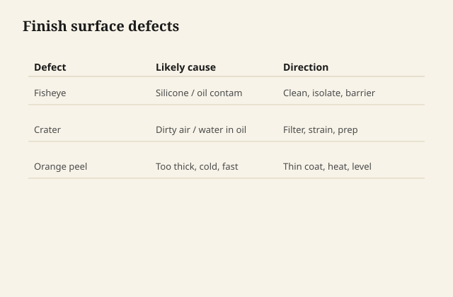

# Fish-eye, crater, orange peel — reading the film

The film writes what happened. Learning
to read it is cheaper than buying a
fourth can.

## Fish-eye

A crater with a dot of calm in the
middle, or a circle that refuses to
wet. Classic silicone. Also wax,
oil from skin, the tree's own grease,
a contaminated tack cloth.

<figure class="ffc-figure">
  
  <figcaption><strong>Figure 1.</strong> Fisheye is contamination; orange peel is flow; crater is dirt or solvent pop.</figcaption>
</figure>
If you see one, you will see more.
Stop building. A second coat locks
the craters under glass.

Clean with the system's cleaner,
change rags, sand a fresh surface,
test a corner. If it still eyes,
you may need a different first
product (dewaxed shellac as a lock
on some jobs) or a refusal. Brand
"fish-eye killer" additives exist
for some spray lacquers in real
shops. They are not a license to
mix solvents at home until the
crater surrenders.

## Crater vs pinhole

A pinhole is often a pore burping
air through a fast skin — oak,
waterborne, a hot dry day. A crater
is wetting. If you fill pinholes
with more of the same fast coat,
you glaze them. A slower sealer or
a fill, then build, is the path.

## Orange peel

The surface of an orange: texture
from a coat that could not level.
Spray too dry, waterborne too fast,
a roller nap, a cold thick oil.
The read is "application and
weather," not "bad polyurethane."

If there is thickness to give, you
can sand it flat and recarry a
better coat. If the peel is the
whole film, you are cutting back.

## Crawling

The finish pulls back from an area
like water on a waxed hood. Same
family as fish-eye, bigger. Do not
keep brushing it "to make it stay."
It will not stay. Find the
contaminant.

## Blush

Milk in a fast solvent film —
shellac and lacquers, humid air.
Draft 23. Do not confuse with wax
bloom (hazy, often cold, often on
oiled or waxed work) or with a
waterborne that never knit (powders,
scratches white too easily).

## Wrinkle

Skin over wet. Oil and oil varnish,
too thick, too little air. Cut it
off. Do not sand a gummy wrinkle
into a smear and then seal it.

## Alligator / crackle

An old film that shrank or a new
film that was hostile to the one
under it. Sometimes movement. If
the islands lift, the repair is
not more topcoat. The repair is
back to a sound country.

## White scratch in a film

You have a skin. The scratch is
through gloss or through the film
to a lighter layer or to wood.
This is how you know you are not
in penetrating country anymore,
even if the can said oil.

## Soft, days later

Wrong oil (mineral, salad), cold,
too thick, old shellac cut that
will not dry, a waterborne below
MFFT that feels dry and acts like
chalk. Smell, fingernail, glass-
drop test. The diagnosis is a
clock or a wrong binder, not a
need for a harder brand of the
same mistake.

## Write what you see

"Cratered on the leaf, fine on
the apron" is a contamination map
(hands, polish). "Peeled everywhere
in sheets" is an interface.
"Powder on the edges in a garage
in March" is MFFT. The film is
trying to be specific. Meet it
there.
