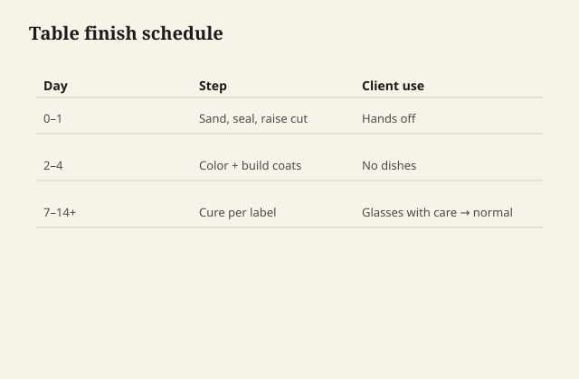
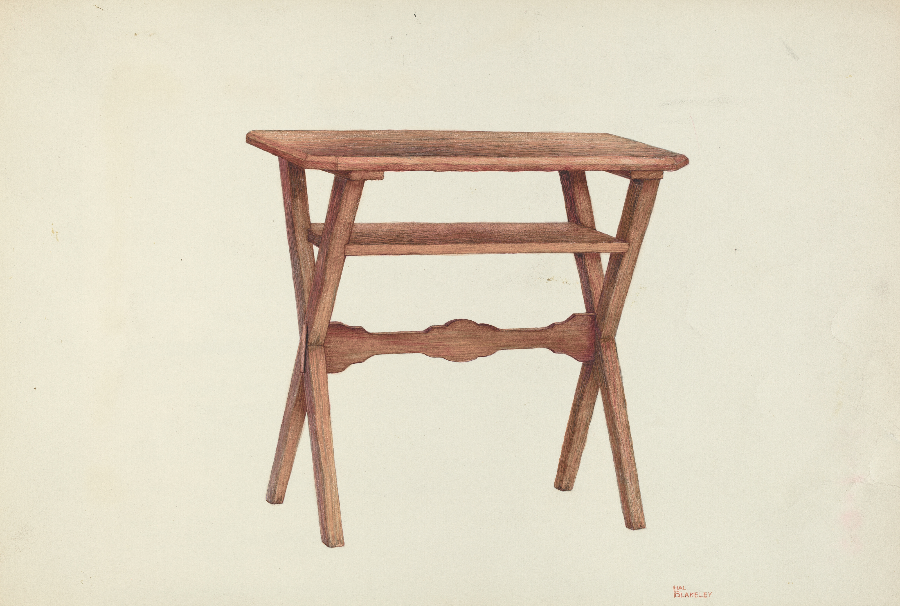

# A staged dining-table schedule

A table is where every family in this
series gets asked to be something it
is not. Here are three schedules I
will actually run, staged so you can
see the clocks. Not because they are
the only tables, because they are
the common arguments.

<figure class="ffc-figure">
  
  <figcaption><strong>Figure 1.</strong> A table schedule names dry times and use limits — delivery before cure is a refund waiting to happen.</figcaption>
</figure>

<figure class="ffc-figure ffc-photo">
  
  <figcaption><strong>Figure 2.</strong> A table finish schedule is measured in cure days, not showroom sheen. Photo: Wikimedia Commons, CC0 (NGA Open Access).</figcaption>
</figure>

## A. The wood-feeling table (hardwax
or honest wiping oil)

**Stage 0.** Last sand 180–220, raking
light, edges by hand. Vacuum. If the
species is oily, degrease as the
system allows, then do not go to
lunch.

**Stage 1.** First wipe, thin, off
the rag like you are undoing it.
Hang rags. Night of air.

**Stage 2.** Second wipe if tack-free.
Stop building at two or three. You
are not chasing armor.

**Stage 3.** Days of cure. No vase,
no runner. A glass test on the
underside or an offcut.

**Stage 4.** Delivery speech: coasters
are not an insult. Refresh in a year
or when it looks hungry. The card in
the drawer names the product.

This table will dent. It will also
look like wood when it dents. That
is the point.

## B. The mustard table (waterborne
PU or hybrid, pale wood)

**Stage 0.** Sand. Water-raise. Knock
whiskers. If you stained or dyed,
lock with dewaxed shellac, sand
dust.

**Stage 1.** First waterborne, thin,
watch for crawl. If it crawls, you
are not clean. Sand nibs when it
powders, not when the clock dares
you.

**Stage 2.** Two or three more coats
in weather the can would recognize.
Scuff between if the system wants
bite. Do not cut edges to wood.

**Stage 3.** Cure longer than the
recoat. A week of gentle, then a
backpack test on the offcut before
you promise mustard.

**Stage 4.** No oil refresh, ever,
as a personality. Clean, and years
later a whole-field scuff and coat
if the film dulls.

This table will look a little more
like a film. Say so in the shop,
not in the complaint email.

## C. The brown heirloom (shellac
sealer, oil varnish or wiping
varnish build)

**Stage 0.** Identify what is already
there if this is a refinish. Lead
test if paint is in the story.
Wax off.

**Stage 1.** Dewaxed shellac wash if
you need a diplomat or a color
lock. Sand silk.

**Stage 2.** Wiping varnish or a
brushed alkyd in thin coats, window
then scuff. Rub the last coat to
the sheen a hand wants.

**Stage 3.** Cure. This film will
amber. The sample you showed should
already have been a week old.

**Stage 4.** Maintenance is film
maintenance. A wet glass is a
coaster conversation, not a
shellac-as-the-field conversation
unless they asked for rings as a
lifestyle.

## What I will not stage as one
table

Oil on Monday, waterborne on
Tuesday, wax on Wednesday, milk
paint on the legs because a reel
said so. A table can have painted
legs and a clear top. That is two
schedules that meet at a tape
line, each done as itself.

## The stage that is not optional

The offcut, through the same
stages, rude tests included. If
you skip it, the dining table
*is* the offcut, and the family
is the critic. They are harsher
than you are.
